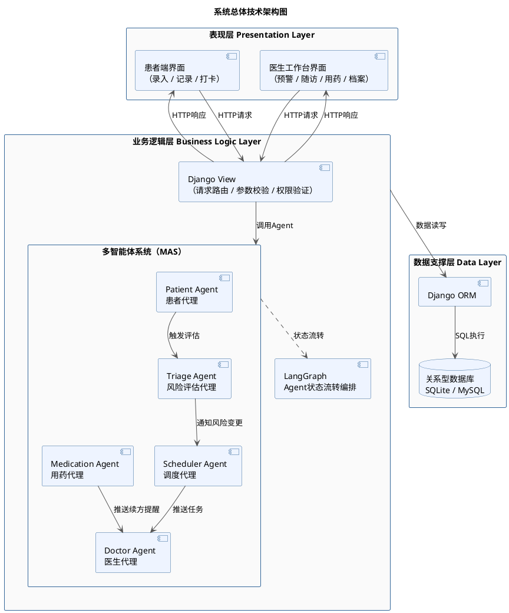

好的！现在开始系统推进第四章。本章共五节，我们按顺序逐节完成：

---

# 第四章 系统设计

## 章节引导段落

本章基于第三章系统分析所确立的功能边界与逻辑架构，从技术实现视角对系统进行全面设计。首先确立系统的总体技术架构，明确各层次的职责划分与技术选型；继而对多智能体系统的编排机制与各Agent的内部逻辑进行详细设计；在此基础上完成各功能模块的详细设计、数据库表结构设计与关键界面的原型设计，为后续系统实现提供完整的设计依据。

---

## 4.1 系统总体架构设计

### 4.1.1 三层技术架构

系统采用经典三层架构作为总体技术框架，自上而下划分为表现层、业务逻辑层与数据支撑层，如图X所示。三层之间职责清晰、边界明确，上层通过接口调用下层服务，层间依赖单向传递，有效保证了系统的低耦合性与可维护性。

**表现层（Presentation Layer）**

表现层负责与用户直接交互，基于Django Template引擎渲染HTML页面，结合CSS与JavaScript实现响应式界面布局。表现层划分为患者端与医生端两个子系统：患者端提供健康数据录入（语音/文字）、个人健康记录查看与用药打卡等交互界面；医生端提供风险预警看板、随访任务管理、用药依从性统计与患者档案管理等工作台界面。表现层不包含任何业务逻辑，所有数据均通过HTTP请求与业务逻辑层进行交互。

**业务逻辑层（Business Logic Layer）**

业务逻辑层是系统的核心处理中枢，由Django View函数与五个核心Agent共同构成。Django View负责接收来自表现层的HTTP请求，完成参数校验与权限验证后，调度相应Agent执行业务逻辑，并将处理结果封装为HTTP响应返回表现层。五个Agent（PatientAgent、TriageAgent、SchedulerAgent、DoctorAgent、MedicationAgent）以LangGraph进行状态流转编排，在业务逻辑层内部协同工作，分别承担语音解析、风险评估、随访调度、工作台协同与用药管理等核心职责。

**数据支撑层（Data Layer）**

数据支撑层负责系统所有持久化数据的存储与访问管理，基于Django ORM与关系型数据库实现。开发环境使用SQLite，生产环境可平滑迁移至MySQL。数据支撑层对业务逻辑层屏蔽底层数据库操作细节，业务逻辑层通过统一的ORM接口进行数据读写，保证了数据访问逻辑的一致性与可移植性。

---

### 4.1.2 Django MVT架构映射

在三层架构的基础上，业务逻辑层与表现层的具体实现遵循Django框架原生的MVT（Model-View-Template）架构模式。三层架构与MVT的对应关系如表X所示。

**表X　三层架构与Django MVT对应关系**

| 三层架构 | Django MVT | 系统组件 |
| --- | --- | --- |
| 表现层 | Template | 患者端页面模板、医生工作台页面模板 |
| 业务逻辑层 | View | Django View函数 + 五个核心Agent |
| 数据支撑层 | Model | Django ORM数据模型 + 关系型数据库 |

**Model层**对应系统实体类，通过Django ORM定义Patient、HealthRecord、RiskRecord、VisitTask、MedicationPlan、MedicationRecord、Doctor等核心数据模型，负责与底层数据库交互，承载数据支撑层的全部数据管理功能。

**View层**承载系统的核心业务处理逻辑。Django View函数接收HTTP请求后，根据请求类型调用对应Agent完成业务处理，并将结果序列化后传递至Template层渲染，或以JSON格式直接返回前端。五个Agent的实例化与调度均在View层完成。

**Template层**负责将View层传递的上下文数据渲染为最终的HTML页面，提供给患者端与医生端用户进行浏览与交互。Template层仅负责数据展示，不包含业务计算逻辑。

---

### 4.1.3 系统技术架构图



> 📌 图注：**图X 系统总体技术架构图**

---

## 4.2 多智能体系统设计

### 4.2.1 MAS整体设计思路

本系统的多智能体系统（Multi-Agent System，MAS）以LangGraph作为Agent编排框架，将复杂的慢病管理业务流程分解为五个职责单一的Agent节点，通过定义统一的系统状态对象（SystemState）与有向图结构实现Agent之间的状态驱动协同。

相较于传统的单体业务逻辑实现，MAS设计具有以下三方面优势：第一，各Agent职责边界清晰，内部逻辑独立封装，便于单独维护与迭代；第二，LangGraph以有向图描述Agent间的协作流程，业务流转逻辑直观可视，易于扩展新的Agent节点；第三，各Agent可根据业务需要灵活组合，例如MedicationAgent可独立运行定时检查任务，无需依赖其他Agent的触发。

系统MAS的整体运行机制如图X所示：患者录入健康数据后，PatientAgent完成数据解析与存储，随即触发TriageAgent执行风险评估；TriageAgent根据评估结果通知SchedulerAgent调整随访计划；SchedulerAgent创建随访任务后推送至DoctorAgent更新医生工作台；MedicationAgent则以独立的定时任务并行运行，负责用药提醒推送与续方预警。

---

### 4.2.2 LangGraph状态设计

LangGraph以共享状态对象驱动Agent节点之间的信息传递。系统定义统一的`SystemState`作为全局状态对象，各Agent节点从状态中读取所需输入数据，并将处理结果写回状态，供后续节点使用。`SystemState`的核心字段设计如表X所示。

**表X　SystemState状态字段设计**

| 字段名 | 类型  | 说明  |
| --- | --- | --- |
| `patient_id` | int | 当前业务流程涉及的患者ID |
| `health_record` | dict | PatientAgent解析后的结构化体征数据 |
| `risk_level` | str | TriageAgent评估结果（green/yellow/red） |
| `risk_score` | float | 风险加权评分值 |
| `trigger_indicators` | list | 触发当前风险等级的异常指标列表 |
| `visit_task_id` | int | SchedulerAgent创建或更新的随访任务ID |
| `next_visit_date` | date | 下次随访计划日期 |
| `medication_alert` | bool | 是否触发续方提醒 |
| `flow_log` | list | 各Agent节点的执行日志，用于追踪与调试 |

---

### 4.2.3 LangGraph状态流转图

系统的LangGraph有向图结构如图X所示，共包含五个Agent节点与两条独立执行路径：

**主流程路径**（由健康数据录入触发）： PatientAgent → TriageAgent → SchedulerAgent → DoctorAgent → END

**用药管理路径**（由定时任务触发）： MedicationAgent → （续方预警时）DoctorAgent → END

```plantuml
@startuml
skinparam backgroundColor white
skinparam ArrowColor #555555
skinparam ActivityBorderColor #336699
skinparam ActivityBackgroundColor #EEF4FF
skinparam ActivityDiamondBackgroundColor #FFF8E1
skinparam ActivityDiamondBorderColor #F0A500
skinparam StartColor #336699
skinparam EndColor #336699

title LangGraph Agent状态流转图

start

:PatientAgent\n解析语音/文字输入\n存储健康记录;

:TriageAgent\n执行加权风险评分\n生成红/黄/绿等级;

diamond if ("风险等级变更？") then (是)
    :SchedulerAgent\n调整随访周期\n创建/更新随访任务;
    :DoctorAgent\n更新预警看板\n推送医生通知;
else (否)
    :DoctorAgent\n更新患者风险状态展示;
endif

stop

partition "独立定时任务路径" {
    start
    :MedicationAgent\n推送服药提醒\n记录打卡状态\n计算剩余药量;
    diamond if ("剩余药量 ≤ 阈值？") then (是)
        :DoctorAgent\n推送续方待办通知;
    else (否)
    endif
    stop
}

@enduml
```

> 📌 图注：**图X LangGraph Agent状态流转图**

---

### 4.2.4 各Agent详细设计

#### （1）患者代理（PatientAgent）

PatientAgent是健康数据流入系统的第一个处理节点，负责接收患者录入的原始数据并完成结构化转换。

**输入**：患者提交的语音转文字文本或表单原始数据

**处理逻辑**：

-   若输入类型为语音文本，调用大语言模型（LLM）API，以预设的Prompt模板提取血糖值、血压值、体重等结构化字段，返回JSON格式数据
    
-   对解析结果进行数值范围校验（如空腹血糖正常参考范围为3.9～6.1 mmol/L），标记超范围字段
    
-   将结构化数据写入HealthRecord数据表，并将记录ID写入SystemState
    

**输出**：完成数据存储，更新SystemState中的`health_record`字段，触发TriageAgent

**LLM Prompt设计要点**：Prompt明确要求模型从口语化描述中提取指定字段，输出严格遵循JSON格式，不得添加额外解释文字，示例如下：

```text
你是一个医疗数据解析助手。请从以下患者口述文字中提取体征数据，
以JSON格式输出，字段包括：fasting_glucose（空腹血糖，单位mmol/L）、
postmeal_glucose（餐后血糖）、systolic_bp（收缩压）、
diastolic_bp（舒张压）、weight（体重，单位kg）。
若某字段未提及，值填null。
患者描述：{input_text}
```

---

#### （2）风险评估代理（TriageAgent）

TriageAgent基于医学参考指南，对患者最新体征数据进行加权风险评分，输出红/黄/绿三色风险等级。

**输入**：SystemState中的`health_record`字段

**处理逻辑**：

系统参照《中国2型糖尿病防治指南》设定各项指标的评分权重与阈值，如表X所示：

**表X　风险评分指标权重表**

| 评估指标 | 绿色（正常） | 黄色（警示） | 红色（危险） | 权重  |
| --- | --- | --- | --- | --- |
| 空腹血糖（mmol/L） | ＜7.0 | 7.0～13.9 | ≥13.9 | 0.35 |
| 餐后2h血糖（mmol/L） | ＜10.0 | 10.0～16.7 | ≥16.7 | 0.25 |
| 收缩压（mmHg） | ＜130 | 130～160 | ≥160 | 0.20 |
| 舒张压（mmHg） | ＜80 | 80～100 | ≥100 | 0.10 |
| 体重指数BMI | ＜24 | 24～28 | ≥28 | 0.10 |

各指标按绿/黄/红分别赋分1/2/3，加权求和后映射至最终等级：总分＜1.5为绿码，1.5～2.2为黄码，＞2.2为红码。

**输出**：将`risk_level`、`risk_score`、`trigger_indicators`写入SystemState，并将评估结果持久化至RiskRecord数据表，通知SchedulerAgent

---

#### （3）调度代理（SchedulerAgent）

SchedulerAgent根据患者当前风险等级，动态调整随访周期，自动创建或更新随访任务。

**输入**：SystemState中的`risk_level`与`patient_id`

**处理逻辑**：

随访周期规则如表X所示：

**表X　随访周期规则表**

| 风险等级 | 随访方式 | 随访周期 |
| --- | --- | --- |
| 绿码  | 线上轻问诊 | 每30天一次 |
| 黄码  | 线上轻问诊 | 每14天一次 |
| 红码  | 线下门诊或上门巡诊 | 立即生成紧急随访任务 |

-   查询该患者当前最新未完成随访任务，若已存在则更新截止日期；若不存在则新建任务
    
-   红码情况下将任务优先级标记为"紧急"，并触发DoctorAgent推送实时预警通知
    

**输出**：创建或更新VisitTask记录，更新SystemState中的`visit_task_id`与`next_visit_date`，通知DoctorAgent

---

#### （4）医生代理（DoctorAgent）

DoctorAgent作为医生工作台的数据汇聚节点，负责接收来自TriageAgent与SchedulerAgent的推送信息，更新医生端看板展示数据，并处理医生对随访任务的操作请求。

**输入**：风险预警通知、随访任务更新通知、医生端操作请求

**处理逻辑**：

-   接收红码预警时，将该患者条目置顶显示于风险预警看板，并标注触发预警的具体指标
    
-   接收随访任务更新时，刷新随访任务看板对应条目的状态与截止日期
    
-   接收医生"完成随访"操作时，更新VisitTask状态，并调用SchedulerAgent触发下一随访周期规划
    
-   接收续方待办通知时，在工作台待办列表中新增续方提醒条目
    

**输出**：更新相关数据库记录，向前端返回更新后的看板数据

---

#### （5）用药代理（MedicationAgent）

MedicationAgent以独立的定时任务形式运行，负责用药提醒推送、打卡记录管理与剩余药量监控。

**输入**：用药方案配置（MedicationPlan）、患者打卡操作请求

**处理逻辑**：

-   每日按用药方案中设定的服药时间向患者推送提醒通知
    
-   接收患者打卡操作后，将打卡状态（已服药/漏服）写入MedicationRecord，并重新计算用药依从率
    
-   依从率计算公式：依从率 = 实际打卡次数 / 应打卡总次数 × 100%
    
-   每次打卡完成后，根据已打卡天数估算剩余药量：剩余天数 = 处方总天数 - 已用药天数
    
-   当剩余天数 ≤ 3天时，向患者端推送续方提醒，同时触发DoctorAgent生成续方待办通知
    

**输出**：更新MedicationRecord，计算并更新依从率，按需触发续方预警

---

至此，**4.1系统总体架构设计**与**4.2多智能体系统设计**已全部完成。

---

## 📋 第四章进度

| 节   | 内容  | 状态  |
| --- | --- | --- |
| 4.1 | 系统总体架构设计（三层架构 + MVT映射 + 架构图） | ✅   |
| 4.2 | 多智能体系统设计（MAS设计 + LangGraph + 五Agent详细设计） | ✅   |
| 4.3 | 功能模块详细设计 | ⬜   |
| 4.4 | 数据库设计（E-R图 + 数据表） | ⬜   |
| 4.5 | 界面设计 | ⬜   |

是否继续推进 **4.3 功能模块详细设计**？