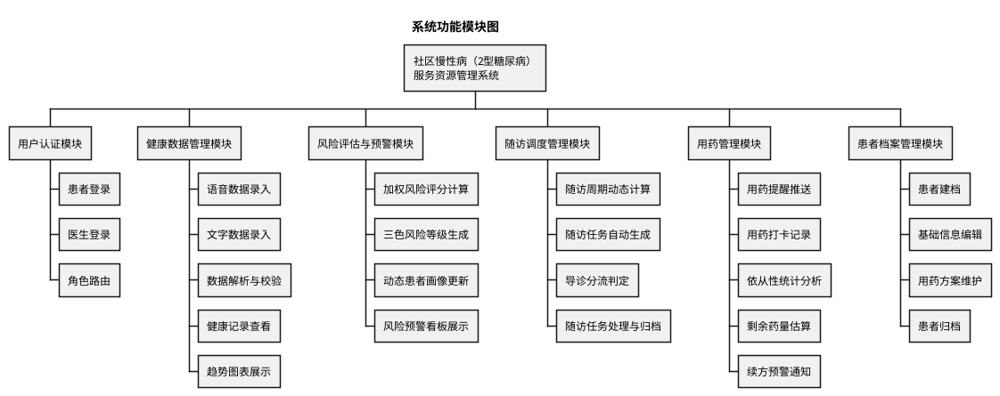
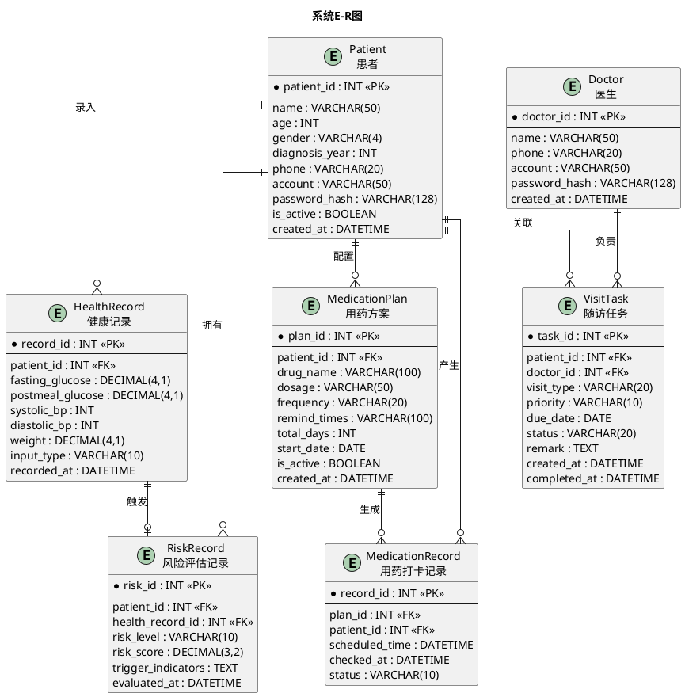

## 4.3 功能模块详细设计

### 4.3.1 系统功能模块划分

基于第三章需求分析所确定的功能边界，系统按照"高内聚、低耦合"原则，将全部功能划分为六个核心模块，各模块与五个Agent之间形成清晰的职责映射关系。系统功能模块结构如图X所示。

> 📌 图注：**图X 系统功能模块图**

系统功能模块与Agent之间的对应关系如表X所示，每个Agent承载一至两个功能模块的核心业务逻辑，模块之间通过LangGraph状态流转机制实现协同。

**表X　功能模块与Agent对应关系**

| 功能模块 | 对应Agent | 协作关系 |
| --- | --- | --- |
| 健康数据管理模块 | PatientAgent | 数据存储后触发风险评估与预警模块 |
| 风险评估与预警模块 | TriageAgent | 评估完成后触发随访调度管理模块 |
| 随访调度管理模块 | SchedulerAgent | 任务生成后推送至医生工作台 |
| 医生工作台（预警/随访/档案） | DoctorAgent | 汇聚多模块推送，响应医生操作 |
| 用药管理模块 | MedicationAgent | 独立定时运行，续方预警时通知DoctorAgent |

---

### 4.3.2 用户认证模块

用户认证模块是系统所有功能的入口，承担身份验证与角色分流两项核心职责。患者与社区医生共享同一登录入口页面，用户输入账号与密码后，系统在后端通过Django内置的认证框架对密码哈希值进行比对验证。验证通过后，系统根据数据库中存储的角色标识判断当前用户身份，将患者路由至患者端首页，将社区医生路由至医生工作台首页。认证信息通过Django Session机制维持登录状态，用户在会话有效期内无需重复登录。为保障账号安全，系统在同一会话内对连续登录失败次数进行累计，达到上限后临时锁定该账号并提示用户稍后重试。

该模块的设计较为轻量，未引入独立的Agent处理，由Django View直接完成认证逻辑与路由跳转，符合模块本身职责简单、不涉及多步业务协同的特点。

---

### 4.3.3 健康数据管理模块

健康数据管理模块由PatientAgent驱动，面向患者提供体征数据的录入、解析、存储与历史查看功能，是整条业务链路的数据源头。

在数据录入环节，模块提供语音录入与文字录入两种方式供患者选择。语音录入场景下，患者点击录音按钮后以自然口语描述当日测量结果，系统先通过浏览器端Web Speech API将语音转化为文字，再由PatientAgent调用大语言模型对口语化文本进行语义解析，从中提取空腹血糖、餐后血糖、收缩压、舒张压及体重等指标字段，输出为标准化的JSON结构。解析完成后，系统将结果回填至前端表单供患者核对，患者确认无误后方可提交。文字录入场景下，患者直接在前端表单中逐字段输入数值，系统在提交时对数据格式与数值合理性进行校验，例如空腹血糖的合理输入范围设定为1.0至35.0 mmol/L，超出此范围的数值将被标记为异常并提示患者检查。两种录入方式最终均生成同一结构的HealthRecord记录写入数据库，确保后续风险评估环节的数据格式统一。

在健康记录查看环节，患者可在个人健康记录页面浏览历史体征数据的变化趋势。系统以折线图形式展示近7日或近30日的血糖波动曲线与血压变化趋势，页面顶部同步展示患者当前风险等级标识与最近一次评估时间，使患者能够直观感知自身血糖管理状况。此外，页面下方以列表形式展示每日用药打卡记录，方便患者回顾近期服药情况。

数据存储完成后，PatientAgent自动将本次新增记录的ID写入LangGraph全局状态对象SystemState，触发下游TriageAgent执行风险评估，实现数据录入与风险评估环节的无缝衔接。

---

### 4.3.4 风险评估与预警模块

风险评估与预警模块由TriageAgent驱动，是系统智能化管理的核心环节，负责将患者的原始体征数据转化为可量化的风险等级与预警信息。

TriageAgent在接收到PatientAgent写入SystemState的最新健康记录后启动评估流程。评估模型采用加权评分法，参照《中国2型糖尿病防治指南（2020年版）》中推荐的控制目标，将空腹血糖、餐后2小时血糖、收缩压、舒张压及体重指数BMI共五项指标纳入评估体系。每项指标按照其实际数值所处区间赋予1分（绿色/正常）、2分（黄色/警示）或3分（红色/危险），随后按照预设权重进行加权求和，得到综合风险评分。该评分经过阈值映射后，最终生成绿码、黄码、红码三种风险等级，分别对应"血糖控制良好、可维持当前方案""部分指标偏离目标、需加强监测"和"多项指标严重超标、需紧急干预"三种临床含义。

在每次评估完成后，TriageAgent将风险等级、评分值与触发预警的具体异常指标列表持久化至RiskRecord数据表，同时更新该患者在系统中的动态画像数据。动态患者画像以近30日为时间窗口，综合计算空腹血糖达标率（空腹血糖＜7.0 mmol/L的天数占比）与血糖波动幅度（标准差），作为医生评估患者长期管理效果的辅助参考。

在预警展示环节，医生工作台的风险预警看板以红、黄、绿三色分区列表形式实时呈现所有在管患者的风险状态。红码患者置顶显示并附带醒目标识，医生点击患者条目即可查看最新体征数据、异常指标详情及动态画像摘要，为后续干预决策提供充分的信息支撑。

评估完成后，TriageAgent将风险等级写入SystemState并通知SchedulerAgent：若风险等级较上一次发生变更，则触发SchedulerAgent重新计算随访周期；若等级未变化，则仅更新DoctorAgent的看板展示数据，不产生额外调度动作。

---

### 4.3.5 随访调度管理模块

随访调度管理模块由SchedulerAgent驱动，承担随访周期动态计算、任务自动生成与导诊分流三项核心职责，是连接风险评估结果与医生实际随访行为的关键桥梁。

SchedulerAgent在接收到TriageAgent的风险等级变更通知后启动调度流程。调度的核心逻辑围绕一套基于风险等级的周期映射规则展开：绿码患者的随访周期设定为30天，采用线上轻问诊方式；黄码患者缩短至14天，同样以线上方式为主；红码患者则由系统立即生成紧急随访任务，建议采用线下门诊或上门巡诊方式，并将任务优先级标记为"紧急"。这套规则的具体参数以集中配置的方式存储于系统设置中，社区医生可根据实际管理经验灵活调整，无需修改代码逻辑。

在任务生成环节，SchedulerAgent首先查询该患者当前是否存在未完成的随访任务。若存在，则根据最新风险等级更新任务的截止日期与随访方式；若不存在，则以当前日期为起点，按照周期映射规则计算下次随访日期，创建新的VisitTask记录并指派给该患者的责任医生。任务创建完成后，SchedulerAgent通过SystemState将任务信息推送至DoctorAgent，DoctorAgent随即更新医生工作台的随访任务看板。

在医生端的随访任务处理环节，社区医生可在任务看板中按紧急程度与截止日期排序查看待办任务，点击具体任务条目后可查阅该患者的近期健康数据摘要与系统自动生成的随访建议。随访完成后，医生在任务详情页填写随访备注并将任务标记为"已完成"，系统随即将该任务归档，同时SchedulerAgent根据患者当前最新风险等级自动规划下一随访周期，确保随访管理形成持续闭环。

---

### 4.3.6 用药管理模块

用药管理模块由MedicationAgent驱动，面向患者端提供用药提醒与打卡功能，面向医生端提供依从性统计与续方预警功能，是保障患者长期用药规范性的重要支撑模块。

在用药提醒环节，MedicationAgent以独立定时任务的形式持续运行，按照每位患者用药方案中配置的服药时间节点向患者端推送提醒通知。通知内容包含当次应服药品名称、剂量规格与服药时间，确保患者获得明确的服药指引。患者收到提醒后可在打卡界面选择"已服药"或"跳过"以记录本次服药情况，系统将打卡状态与实际操作时间写入MedicationRecord数据表。

在依从性统计环节，MedicationAgent根据每位患者在指定时间窗口内的打卡记录，按照"实际打卡次数除以应打卡总次数"的公式计算用药依从率，并统计漏服次数与漏服时间分布。医生在工作台选择目标患者后，可查看以图表形式呈现的依从性统计结果，包括依从率柱状图、漏服时段分布热力图以及近期打卡明细列表，为评估患者用药行为、判断是否需要调整治疗方案提供数据支撑。

在续方预警环节，MedicationAgent在每次打卡完成后同步估算患者当前药品的剩余可用天数。估算逻辑以用药方案的处方总天数为基准，减去自方案起始日至当前日期的已用药天数。当剩余天数降至预设阈值（默认为3天）及以下时，系统同时向患者端推送续方提醒通知与向医生工作台生成续方待办条目。医生确认续方后，系统将该药品方案的起始日期重置，剩余天数恢复至处方总天数，续方待办自动关闭，整个续方流程形成完整闭环。

---

### 4.3.7 患者档案管理模块

患者档案管理模块面向社区医生，提供患者建档、信息维护与用药方案配置功能，是系统所有业务数据的基础来源。

在患者建档环节，社区医生通过档案管理页面的新增表单录入患者的基础信息，包括姓名、年龄、性别、确诊年份、联系方式等字段，同时为患者配置初始用药方案，填写药品名称、剂量规格、每日服药频次与提醒时间。表单提交后，系统在Patient数据表中创建患者记录并自动生成登录账号，将初始密码以短信形式发送至患者预留手机号，完成患者的系统入驻。建档完成的同时，MedicationAgent根据新建的用药方案自动初始化提醒任务配置，确保患者从入驻第一天起即可接收服药提醒。

在信息维护环节，社区医生可在患者列表中选择目标患者，进入详情页修改基础信息或调整用药方案。用药方案的变更涉及药品增减、剂量调整或服药时间变更，保存后系统同步更新MedicationAgent的提醒配置，保证后续推送的提醒内容与最新方案一致。

在患者归档环节，对于因转诊、迁出或其他原因不再纳入社区管理的患者，社区医生可将其标记为归档状态。归档后该患者的全部历史健康记录、评估记录与随访记录均予以保留，但系统不再为该患者执行风险评估与随访调度，MedicationAgent同步停止对该患者的用药提醒推送，释放相应的系统资源。

---

## 4.4 数据库设计

### 4.4.1 E-R模型设计

基于第三章用例分析中识别的七个实体类，数据库设计以关系型数据库为基础，通过Django ORM进行实体建模与表结构映射。系统的实体关系（E-R）模型如图X所示。

> 📌 图注：**图X 系统E-R图**

系统共包含七个实体，实体之间的关联关系如下：Patient实体处于模型的核心位置，与HealthRecord、RiskRecord、VisitTask、MedicationPlan及MedicationRecord五个实体均构成一对多关系，反映了一位患者在整个管理周期内持续产生多条健康记录、评估记录、随访任务与用药记录的业务实际。Doctor实体与VisitTask构成一对多关系，表达一位社区医生负责管理多条随访任务的职责分工。MedicationPlan与MedicationRecord之间为一对多关系，一份用药方案在执行周期内按服药频次持续生成打卡记录。HealthRecord与RiskRecord之间为一对一关系，每条健康记录触发一次风险评估，生成唯一对应的评估记录。

---

### 4.4.2 数据表结构设计

以下对各数据表的字段定义、数据类型、约束条件及业务含义进行详细说明。

**表X　Patient（患者表）**

| 字段名 | 数据类型 | 约束  | 说明  |
| --- | --- | --- | --- |
| patient\_id | INT | PK, AUTO\_INCREMENT | 患者唯一标识 |
| name | VARCHAR(50) | NOT NULL | 患者姓名 |
| age | INT | NOT NULL | 患者年龄 |
| gender | VARCHAR(4) | NOT NULL | 性别（男/女） |
| diagnosis\_year | INT | NOT NULL | 确诊2型糖尿病年份 |
| phone | VARCHAR(20) | NOT NULL | 联系电话 |
| account | VARCHAR(50) | UNIQUE, NOT NULL | 登录账号 |
| password\_hash | VARCHAR(128) | NOT NULL | 密码哈希值 |
| is\_active | BOOLEAN | DEFAULT TRUE | 在管状态（TRUE在管/FALSE归档） |
| created\_at | DATETIME | AUTO\_NOW\_ADD | 建档时间 |

Patient表是系统的基础主表，存储所有在管与归档患者的基础信息。`is_active`字段用于标识患者的管理状态，归档患者的`is_active`值置为FALSE，系统在执行风险评估与随访调度时仅查询`is_active`为TRUE的记录，确保已归档患者不再参与日常管理流程。`password_hash`字段存储经过Django内置PBKDF2算法加密后的密码哈希值，系统任何环节均不存储明文密码。

---

**表X　Doctor（医生表）**

| 字段名 | 数据类型 | 约束  | 说明  |
| --- | --- | --- | --- |
| doctor\_id | INT | PK, AUTO\_INCREMENT | 医生唯一标识 |
| name | VARCHAR(50) | NOT NULL | 医生姓名 |
| phone | VARCHAR(20) | NOT NULL | 联系电话 |
| account | VARCHAR(50) | UNIQUE, NOT NULL | 登录账号 |
| password\_hash | VARCHAR(128) | NOT NULL | 密码哈希值 |
| created\_at | DATETIME | AUTO\_NOW\_ADD | 账号创建时间 |

Doctor表存储社区医生的基础信息与登录凭证，结构较为简洁。在当前版本的系统中，医生与患者之间的归属关系通过VisitTask表中的`doctor_id`外键间接体现，暂未设置独立的分组管理机制，后续版本可根据社区卫生服务中心的实际组织架构扩展团队管理功能。

---

**表X　HealthRecord（健康记录表）**

| 字段名 | 数据类型 | 约束  | 说明  |
| --- | --- | --- | --- |
| record\_id | INT | PK, AUTO\_INCREMENT | 记录唯一标识 |
| patient\_id | INT | FK → Patient, NOT NULL | 所属患者ID |
| fasting\_glucose | DECIMAL(4,1) | NULL | 空腹血糖（mmol/L） |
| postmeal\_glucose | DECIMAL(4,1) | NULL | 餐后2h血糖（mmol/L） |
| systolic\_bp | INT | NULL | 收缩压（mmHg） |
| diastolic\_bp | INT | NULL | 舒张压（mmHg） |
| weight | DECIMAL(4,1) | NULL | 体重（kg） |
| input\_type | VARCHAR(10) | NOT NULL | 录入方式（voice/text） |
| recorded\_at | DATETIME | NOT NULL | 数据录入时间 |

HealthRecord表存储患者每次录入的体征数据，是系统数据量增长最快的业务表。各体征字段允许为NULL，原因在于患者单次录入时可能仅测量部分指标（例如仅测量血糖而未测量血压），系统允许部分字段留空以降低录入门槛，TriageAgent在评估时自动跳过缺失字段，仅对有值指标进行评分。`input_type`字段记录数据来源方式，便于后续分析语音录入与文字录入的使用比例。

---

**表X　RiskRecord（风险评估记录表）**

| 字段名 | 数据类型 | 约束  | 说明  |
| --- | --- | --- | --- |
| risk\_id | INT | PK, AUTO\_INCREMENT | 评估记录唯一标识 |
| patient\_id | INT | FK → Patient, NOT NULL | 所属患者ID |
| health\_record\_id | INT | FK → HealthRecord, NOT NULL | 关联的健康记录ID |
| risk\_level | VARCHAR(10) | NOT NULL | 风险等级（green/yellow/red） |
| risk\_score | DECIMAL(3,2) | NOT NULL | 加权风险评分值 |
| trigger\_indicators | TEXT | NULL | 触发预警的异常指标JSON列表 |
| evaluated\_at | DATETIME | AUTO\_NOW\_ADD | 评估时间 |

RiskRecord表与HealthRecord表通过`health_record_id`外键形成一对一关联，确保每条评估结果均可溯源至具体的体征数据记录。`trigger_indicators`字段以JSON字符串格式存储触发当前风险等级的异常指标名称与实际数值，例如`[{"indicator": "fasting_glucose", "value": 14.2, "threshold": 13.9}]`，便于医生端在预警看板中直接展示预警成因而无需反复关联查询。

---

**表X　VisitTask（随访任务表）**

| 字段名 | 数据类型 | 约束  | 说明  |
| --- | --- | --- | --- |
| task\_id | INT | PK, AUTO\_INCREMENT | 任务唯一标识 |
| patient\_id | INT | FK → Patient, NOT NULL | 所属患者ID |
| doctor\_id | INT | FK → Doctor, NOT NULL | 负责医生ID |
| visit\_type | VARCHAR(20) | NOT NULL | 随访方式（online/offline/home） |
| priority | VARCHAR(10) | DEFAULT 'normal' | 优先级（normal/urgent） |
| due\_date | DATE | NOT NULL | 任务截止日期 |
| status | VARCHAR(20) | DEFAULT 'pending' | 任务状态（pending/completed/deferred） |
| remark | TEXT | NULL | 随访备注 |
| created\_at | DATETIME | AUTO\_NOW\_ADD | 任务创建时间 |
| completed\_at | DATETIME | NULL | 任务完成时间 |

VisitTask表存储由SchedulerAgent自动生成的随访任务信息。`visit_type`字段记录系统建议的随访方式，对应导诊分流逻辑中"线上轻问诊""线下门诊""上门巡诊"三种模式。`priority`字段标识任务紧急程度，红码患者触发的随访任务自动标记为"urgent"，在医生工作台看板中置顶排序。`status`字段记录任务的生命周期状态，从创建时的"pending"到医生处理后的"completed"或"deferred"，SchedulerAgent在任务完成后根据患者当前风险等级自动创建下一周期任务，形成连续的随访管理闭环。

---

**表X　MedicationPlan（用药方案表）**

| 字段名 | 数据类型 | 约束  | 说明  |
| --- | --- | --- | --- |
| plan\_id | INT | PK, AUTO\_INCREMENT | 方案唯一标识 |
| patient\_id | INT | FK → Patient, NOT NULL | 所属患者ID |
| drug\_name | VARCHAR(100) | NOT NULL | 药品名称 |
| dosage | VARCHAR(50) | NOT NULL | 剂量规格（如"500mg"） |
| frequency | VARCHAR(20) | NOT NULL | 每日服药频次（如"每日2次"） |
| remind\_times | VARCHAR(100) | NOT NULL | 提醒时间点（如"08:00,20:00"） |
| total\_days | INT | NOT NULL | 处方总天数 |
| start\_date | DATE | NOT NULL | 方案起始日期 |
| is\_active | BOOLEAN | DEFAULT TRUE | 方案是否生效 |
| created\_at | DATETIME | AUTO\_NOW\_ADD | 方案创建时间 |

MedicationPlan表存储由社区医生为患者配置的用药方案，一位患者可同时拥有多条生效方案（例如同时服用二甲双胍与格列美脲）。`remind_times`字段以逗号分隔的时间字符串形式存储每日提醒时间节点，MedicationAgent定时任务读取该字段后按时推送提醒通知。`start_date`与`total_days`共同用于计算剩余药量：剩余天数等于`start_date`加`total_days`所得终止日期与当前日期之差。医生续方后系统将`start_date`重置为当日，`total_days`恢复至处方总天数，实现续方周期的无缝衔接。

---

**表X　MedicationRecord（用药打卡记录表）**

| 字段名 | 数据类型 | 约束  | 说明  |
| --- | --- | --- | --- |
| record\_id | INT | PK, AUTO\_INCREMENT | 打卡记录唯一标识 |
| plan\_id | INT | FK → MedicationPlan, NOT NULL | 所属用药方案ID |
| patient\_id | INT | FK → Patient, NOT NULL | 所属患者ID |
| scheduled\_time | DATETIME | NOT NULL | 计划服药时间 |
| checked\_at | DATETIME | NULL | 实际打卡时间 |
| status | VARCHAR(10) | NOT NULL | 打卡状态（taken/missed/skipped） |

MedicationRecord表记录每次用药提醒对应的打卡结果，与MedicationPlan表通过`plan_id`外键关联。`scheduled_time`为该次提醒的计划时间，`checked_at`为患者实际完成打卡的时间，两者之差可用于分析患者服药时间的准时程度。`status`字段设有三种状态值："taken"表示患者按时服药，"skipped"表示患者主动选择跳过，"missed"表示在设定的打卡有效窗口期内患者未做任何操作，由MedicationAgent自动标记。MedicationAgent以该表的记录为数据来源，计算依从率并识别高频漏服时段，为医生端的依从性统计提供底层数据支撑。

---

## 📋 第四章进度

| 节   | 内容  | 状态  |
| --- | --- | --- |
| 4.1 | 系统总体架构设计 | ✅   |
| 4.2 | 多智能体系统设计 | ✅   |
| 4.3 | 功能模块详细设计（含系统功能模块图） | ✅   |
| 4.4 | 数据库设计（E-R图 + 7张数据表） | ✅   |
| 4.5 | 界面设计（暂放） | ⏸️  |

**第四章4.3与4.4已全部完成。** 请问接下来是继续推进第五章系统实现，还是回头补写第一章或第二章？