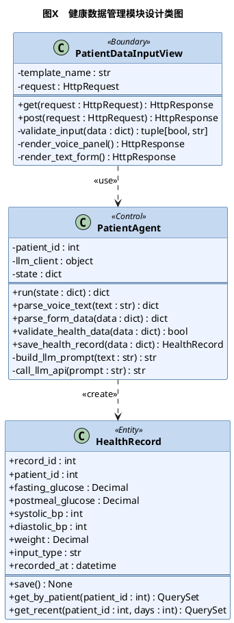
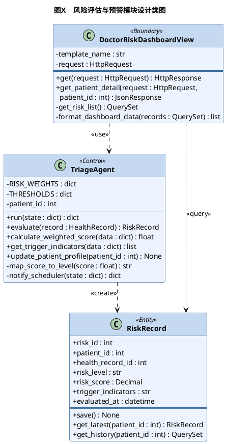
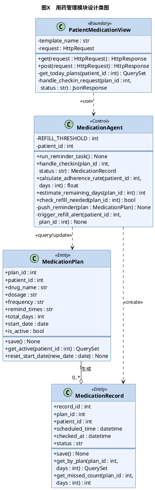

## 4.3.8 设计类图

设计类是分析类向代码实现过渡的关键桥梁。相较于第三章用例分析中识别的分析类，设计类在保持边界类（Boundary）、控制类（Control）、实体类（Entity）三层逻辑分层不变的前提下，进一步细化了每个类的具体属性名称与数据类型、方法签名与参数列表，以及类间的依赖与关联关系，使其直接对应Django框架下的View函数、Agent模块与ORM数据模型，为第五章的代码实现提供精确的类职责划分依据。本节选取健康数据管理模块、风险评估与预警模块、用药管理模块三个核心模块，分别绘制设计类图加以说明。

---

### （1）健康数据管理模块设计类图

健康数据管理模块的设计类图如图X所示，涉及边界类`PatientDataInputView`、控制类`PatientAgent`与实体类`HealthRecord`三个核心设计类。

> 📌 图注：**图X 健康数据管理模块设计类图**

`PatientDataInputView`作为边界类，对应Django中处理`/patient/input/`路由的视图，`get()`方法负责渲染录入表单页面，`post()`方法接收前端提交的数据并完成初步格式校验，校验通过后将数据交由`PatientAgent`进行解析处理。`PatientAgent`作为核心控制类，其`run()`方法是LangGraph节点的标准入口，接收全局状态字典并返回更新后的状态；`parse_voice_text()`与`parse_form_data()`分别对应语音与文字两种录入方式的数据处理路径，前者通过`call_llm_api()`调用大语言模型完成口语化文本的结构化解析，后者则对表单键值对进行直接映射；`save_health_record()`在数据验证通过后调用`HealthRecord`的`save()`方法完成数据持久化。`HealthRecord`作为实体类，直接对应Django ORM中的同名数据模型，`get_recent()`方法支持按时间窗口查询历史记录，为趋势图表展示提供数据来源。

---

### （2）风险评估与预警模块设计类图

风险评估与预警模块的设计类图如图X所示，涉及边界类`DoctorRiskDashboardView`、控制类`TriageAgent`与实体类`RiskRecord`三个核心设计类。

> 📌 图注：**图X 风险评估与预警模块设计类图**

`DoctorRiskDashboardView`作为边界类，对应医生端风险预警看板页面的视图处理逻辑，`get()`方法通过调用`get_risk_list()`查询所有在管患者的最新风险记录并渲染看板页面，`get_patient_detail()`以`JsonResponse`格式返回指定患者的详细风险信息，供前端异步渲染患者详情弹窗。`TriageAgent`是本模块的核心控制类，`RISK_WEIGHTS`与`THRESHOLDS`以类属性形式集中存储权重配置与阈值参数，支持在不修改业务逻辑代码的前提下灵活调整评估规则；`calculate_weighted_score()`实现加权评分的核心计算逻辑，`get_trigger_indicators()`识别并返回超出正常阈值的异常指标列表，`map_score_to_level()`完成评分值到风险等级的映射；`notify_scheduler()`在评估完成后更新SystemState并触发下游SchedulerAgent节点，实现多Agent之间的链式调用。`RiskRecord`的`get_latest()`方法按患者ID查询最新评估记录，是看板页面展示实时风险状态的主要数据入口。

---

### （3）用药管理模块设计类图

用药管理模块的设计类图如图X所示，涉及边界类`PatientMedicationView`、控制类`MedicationAgent`与实体类`MedicationPlan`、`MedicationRecord`四个核心设计类。

> 📌 图注：**图X 用药管理模块设计类图**

`PatientMedicationView`作为边界类，`get()`方法通过`get_today_plans()`查询当日有效用药方案并渲染打卡界面，`handle_checkin_request()`接收前端传递的方案ID与打卡状态参数，委托`MedicationAgent`完成打卡业务处理并返回JSON响应。`MedicationAgent`的`run_reminder_task()`方法作为独立定时任务的执行入口，遍历所有活跃用药方案并在到达提醒时间时调用`push_reminder()`推送通知；`handle_checkin()`接收打卡操作后创建`MedicationRecord`记录，并同步调用`estimate_remaining_days()`重新估算剩余天数，若`check_refill_needed()`返回True则立即触发`trigger_refill_alert()`向医生端发送续方预警。`REFILL_THRESHOLD`以类属性形式定义续方提醒阈值，默认值为3天，社区医生可通过修改配置文件调整该参数而无需改动业务逻辑。`MedicationPlan`与`MedicationRecord`之间通过`plan_id`外键形成一对多聚合关系，`MedicationRecord`的`get_missed_count()`方法支持按天数范围统计漏服次数，是医生端依从性统计图表的底层数据计算入口。

---

## 补充：4.4 数据库设计开篇——选型说明

在正式进入表结构设计之前，有必要就系统的数据库技术选型作出说明。本系统的业务数据在结构特征上具有以下三个显著特点：其一，患者、医生、健康记录、随访任务等核心数据之间存在明确的外键约束关系，数据的完整性与一致性需要由数据库层面的关系约束加以保障；其二，各实体的字段结构固定，不存在动态扩展字段的业务需求；其三，系统涉及跨表的事务性操作（例如续方处理时需要同时更新`MedicationPlan`与`MedicationRecord`两张表），对ACID事务支持有明确要求。基于上述特点，系统选用**关系型数据库**作为持久化存储方案，并通过Django ORM进行统一的数据访问管理，开发阶段使用SQLite以简化环境配置，系统上线后可通过修改Django的`DATABASES`配置项平滑迁移至MySQL，无需改动任何业务代码。

---

## 📋 第四章最新进度

| 节   | 内容  | 状态  |
| --- | --- | --- |
| 4.1 | 系统总体架构设计 | ✅   |
| 4.2 | 多智能体系统设计 | ✅   |
| 4.3.1～4.3.7 | 功能模块详细设计 | ✅   |
| **4.3.8** | **设计类图（3个核心模块）** | ✅ 刚完成 |
| 4.4 | 数据库设计（补充选型说明 + E-R图 + 7张数据表） | ✅   |
| 4.5 | 界面设计原型图（5张） | ⏸️ 待完成 |

**面向对象演进链条已完整**：分析类 → 设计类 → 数据库表结构，三个阶段环环相扣。

是否现在继续完成 **4.5 界面设计**，还是先推进 **第五章系统实现**？