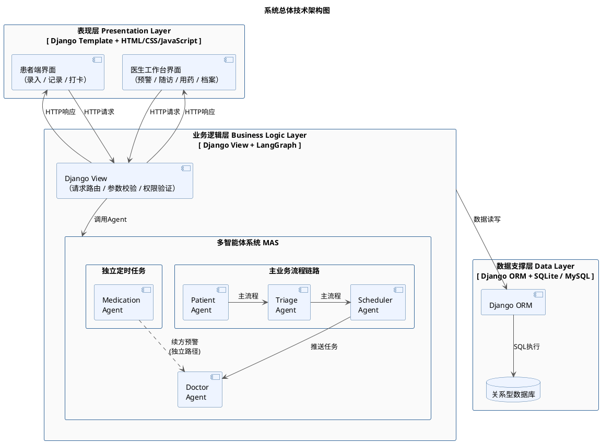
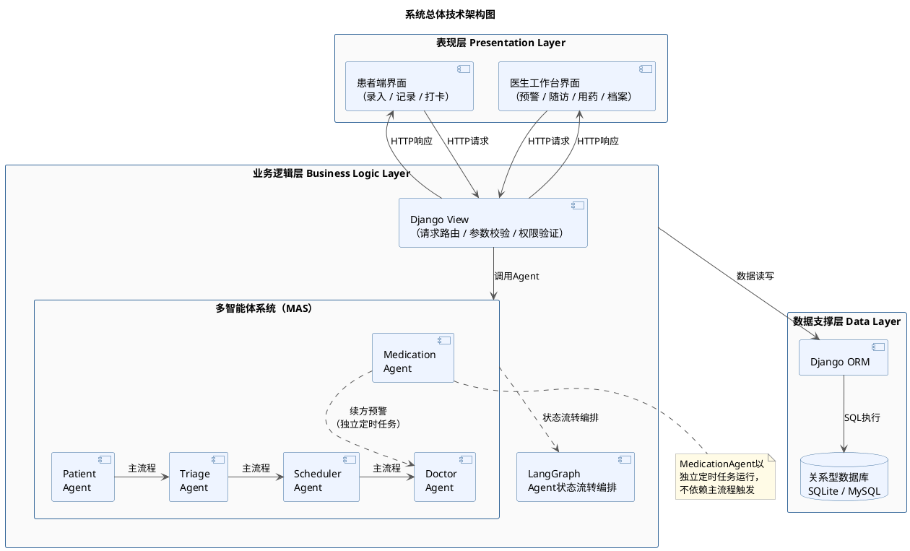

好的，以下按B1→B2→C1→C2→C3→C4的顺序逐条给出修正文本与替换位置。

---

## 🟡 B1：4.3.x中重复内容改为引用4.2.4

4.2.4各Agent详细设计中已包含完整的参数表格（权重表、周期表、阈值），4.3.x功能模块详细设计中再次完整叙述同一逻辑，造成内容冗余。修正方式为保留4.2.4的表格与完整描述，将4.3.x中的对应段落精简为引用式表述。

---

### B1-① 替换位置：4.3.4 风险评估与预警模块，第二段

> 替换"TriageAgent在接收到PatientAgent写入SystemState的最新健康记录后启动评估流程。评估模型采用加权评分法……最终生成绿码、黄码、红码三种风险等级，分别对应……三种临床含义。"整段

**替换为**：

TriageAgent在接收到PatientAgent写入SystemState的最新健康记录后启动评估流程。评估模型采用加权评分法，将空腹血糖、餐后2小时血糖、收缩压、舒张压及体重指数BMI共五项指标纳入评估体系，各项指标的评分区间、权重配置与等级映射规则详见4.2.4节TriageAgent详细设计中的表X（风险评分指标权重表）。最终评分经过阈值映射后生成绿码、黄码、红码三种风险等级，分别对应"血糖控制良好、可维持当前方案""部分指标偏离目标、需加强监测"和"多项指标严重超标、需紧急干预"三种临床含义。

---

### B1-② 替换位置：4.3.5 随访调度管理模块，第二段

> 替换"SchedulerAgent在接收到TriageAgent的风险等级变更通知后启动调度流程。调度的核心逻辑围绕一套基于风险等级的周期映射规则展开：绿码患者的随访周期设定为30天……无需修改代码逻辑。"整段

**替换为**：

SchedulerAgent在接收到TriageAgent的风险等级变更通知后启动调度流程。调度的核心逻辑围绕一套基于风险等级的周期映射规则展开，不同风险等级对应的随访方式与周期设定详见4.2.4节SchedulerAgent详细设计中的表X（随访周期规则表）。该规则的具体参数以集中配置的方式存储于系统设置中，社区医生可根据实际管理经验灵活调整，无需修改代码逻辑。

---

### B1-③ 替换位置：4.3.6 用药管理模块，第三段

> 替换"在续方预警环节，MedicationAgent在每次打卡完成后同步估算患者当前药品的剩余可用天数。估算逻辑以用药方案的处方总天数为基准，减去自方案起始日至当前日期的已用药天数。当剩余天数降至预设阈值（默认为3天）及以下时……"整段

**替换为**：

在续方预警环节，MedicationAgent在每次打卡完成后同步估算患者当前药品的剩余可用天数，估算逻辑与续方阈值设定详见4.2.4节MedicationAgent详细设计。当剩余天数降至预设阈值及以下时，系统同时向患者端推送续方提醒通知与向医生工作台生成续方待办条目。医生确认续方后，系统将该药品方案的起始日期重置，剩余天数恢复至处方总天数，续方待办自动关闭，整个续方流程形成完整闭环。

---

## 🟡 B2：设计类图说明补充ORM自动字段省略声明

---

### B2 替换位置：4.3.8 设计类图开篇段落末尾

> 在"本节选取健康数据管理模块、风险评估与预警模块、用药管理模块三个核心模块，分别绘制设计类图加以说明。"之后，追加一句

**追加内容**：

需要说明的是，各实体类中由Django ORM自动管理的时间戳字段（如`created_at`等通过`auto_now_add=True`配置的字段）在设计类图中予以省略，此类字段的完整定义详见4.4.2节数据表结构设计。

---

## 🟢 C1：4.1.1段首增加架构演进衔接语句

---

### C1 替换位置：4.1.1 三层技术架构，第一段

> 替换"系统采用经典三层架构作为总体技术框架……有效保证了系统的低耦合性与可维护性。"整段

**替换为**：

系统总体技术架构遵循从逻辑分层到技术实现的演进路径。第三章系统分析阶段确立了B-C-E三层逻辑架构，将系统划分为边界层、控制层与实体层；在此基础上，本章进一步完成技术选型与框架映射，将B-C-E逻辑架构演化为基于Django MVT的三层技术实现方案。系统自上而下划分为表现层、业务逻辑层与数据支撑层，如图X所示。三层之间职责清晰、边界明确，上层通过接口调用下层服务，层间依赖单向传递，有效保证了系统的低耦合性与可维护性。表X展示了B-C-E逻辑架构向技术架构的对应映射关系。

**表X　B-C-E逻辑架构与技术架构映射**

| B-C-E逻辑层 | 技术架构层 | Django MVT | 核心技术组件 |
| --- | --- | --- | --- |
| 边界层（Boundary） | 表现层 | Template | HTML模板 + CSS + JavaScript |
| 控制层（Control） | 业务逻辑层 | View | Django View + 五个核心Agent + LangGraph |
| 实体层（Entity） | 数据支撑层 | Model | Django ORM + SQLite/MySQL |

这一映射关系确保了分析阶段的逻辑抽象与设计阶段的技术实现之间保持严格对应，使后续的编码开发能够直接依据B-C-E架构中的类划分进行组织。

---

## 🟢 C2：数据库选型说明增加对比排除语句

---

### C2 替换位置：4.4 数据库设计开篇选型说明段落

> 替换整段选型说明（即之前补充的4.4开头段落）

**替换为**：

在正式进入表结构设计之前，有必要就系统的数据库技术选型作出说明。本系统的业务数据在结构特征上具有以下三个显著特点：其一，患者、医生、健康记录、随访任务等核心数据之间存在明确的外键约束关系，数据的完整性与一致性需要由数据库层面的关系约束加以保障；其二，各实体的字段结构固定，不存在动态扩展字段的业务需求；其三，系统涉及跨表的事务性操作（例如续方处理时需要同时更新MedicationPlan与MedicationRecord两张表），对ACID事务支持有明确要求。相较于MongoDB等文档型数据库在灵活模式（Schema-Free）与海量非结构化数据存储方面的优势，本系统更侧重于数据间的强关联约束与事务一致性保障，关系型数据库在这两方面具有天然的适配性。基于上述分析，系统选用关系型数据库作为持久化存储方案，并通过Django ORM进行统一的数据访问管理。开发阶段使用SQLite以简化环境配置，系统上线后可通过修改Django的`DATABASES`配置项平滑迁移至MySQL，无需改动任何业务代码。

---

## 🟢 C3：SystemState字段表补充说明

---

### C3 替换位置：4.2.2 LangGraph状态设计，表格下方

> 在"表X SystemState状态字段设计"之后追加一段说明

**追加内容**：

上表仅列出与Agent链式调用直接相关的核心状态字段。各Agent在实际运行过程中若需获取患者姓名、责任医生姓名等基础档案信息，可通过`patient_id`经Django ORM关联查询Patient与Doctor数据模型获取，此类可查询的关联信息不纳入SystemState，以保持状态对象的轻量化与职责聚焦。

---

## 🟢 C4：技术架构图区分主流程与定时任务路径

---

### C4 替换位置：4.1.3 系统技术架构图PlantUML代码

> 替换整段PlantUML代码

> 📌 图注：**图X 系统总体技术架构图**

**对应文字微调**（追加在架构图说明段落末尾）：

图中以实线箭头标注主业务流程的链式调用路径（PatientAgent → TriageAgent → SchedulerAgent → DoctorAgent），以虚线箭头标注MedicationAgent独立定时任务路径向DoctorAgent发送续方预警的单向通知关系，两条路径在图中清晰区分，与4.2.3节的状态流转图保持一致。

---

## 📋 B类 + C类修正完成清单

| 编号  | 修正内容 | 状态  |
| --- | --- | --- |
| B1-① | 4.3.4风险评估模块重复内容改为引用4.2.4 | ✅   |
| B1-② | 4.3.5随访调度模块重复内容改为引用4.2.4 | ✅   |
| B1-③ | 4.3.6用药管理模块重复内容改为引用4.2.4 | ✅   |
| B2  | 设计类图开篇补充ORM自动字段省略声明 | ✅   |
| C1  | 4.1.1段首增加B-C-E→技术架构演进映射表 | ✅   |
| C2  | 数据库选型段落增加与MongoDB的对比排除 | ✅   |
| C3  | SystemState字段表后补充关联查询说明 | ✅   |
| C4  | 技术架构图区分主流程实线与定时任务虚线 | ✅   |

---

**至此，第四章4.1～4.4的全部A类、B类、C类问题均已修正完毕。** 现在是否推进第五章系统实现，还是先完成4.5界面设计？

好的，以下逐条给出B类与C类的修正文本，每条标注替换位置与替换范围。

---

## 🟡 B1：4.3.x重复内容改为引用4.2.4

4.2.4各Agent详细设计中已包含完整的参数表格（风险评分权重表、随访周期规则表、续方阈值），4.3.4～4.3.6中对相同内容进行了二次展开描述，造成冗余。修正策略为：4.2.4保留完整表格与计算逻辑，4.3.x改为简要概述+引用。

---

### B1-① 替换位置：4.3.4 风险评估与预警模块——第二段

> 替换"TriageAgent在接收到PatientAgent写入SystemState的最新健康记录后启动评估流程。评估模型采用加权评分法……最终生成绿码、黄码、红码三种风险等级，分别对应……三种临床含义。"整段

TriageAgent在接收到PatientAgent写入SystemState的最新健康记录后启动评估流程。评估模型采用加权评分法，将空腹血糖、餐后2小时血糖、收缩压、舒张压及体重指数BMI共五项指标纳入评估体系，各项指标的权重配置与阈值划分详见4.2.4节TriageAgent详细设计中的风险评分指标权重表（表X）。每项指标按照其实际数值所处区间赋予1至3分，经加权求和与阈值映射后，最终生成绿码、黄码、红码三种风险等级，分别对应"血糖控制良好、可维持当前方案""部分指标偏离目标、需加强监测"和"多项指标严重超标、需紧急干预"三种临床含义。

---

### B1-② 替换位置：4.3.5 随访调度管理模块——第二段

> 替换"SchedulerAgent在接收到TriageAgent的风险等级变更通知后启动调度流程。调度的核心逻辑围绕一套基于风险等级的周期映射规则展开：绿码患者的随访周期设定为30天……无需修改代码逻辑。"整段

SchedulerAgent在接收到TriageAgent的风险等级变更通知后启动调度流程。调度的核心逻辑围绕一套基于风险等级的周期映射规则展开，各等级对应的随访方式与周期天数详见4.2.4节SchedulerAgent详细设计中的随访周期规则表（表X）。绿码患者以线上轻问诊方式每30天随访一次，黄码患者缩短至14天，红码患者则由系统立即生成紧急随访任务并建议线下门诊或上门巡诊。这套规则的具体参数以集中配置的方式存储于系统设置中，社区医生可根据实际管理经验灵活调整，无需修改代码逻辑。

---

### B1-③ 替换位置：4.3.6 用药管理模块——第三段（续方预警环节）

> 替换"在续方预警环节，MedicationAgent在每次打卡完成后同步估算……整个续方流程形成完整闭环。"整段

在续方预警环节，MedicationAgent在每次打卡完成后同步估算患者当前药品的剩余可用天数。估算逻辑以用药方案的处方总天数为基准，减去自方案起始日至当前日期的已用药天数。当剩余天数降至预设阈值及以下时（默认阈值为3天，具体参数详见4.2.4节MedicationAgent详细设计），系统同时向患者端推送续方提醒通知与向医生工作台生成续方待办条目。医生确认续方后，系统将该药品方案的起始日期重置，剩余天数恢复至处方总天数，续方待办自动关闭，整个续方流程形成完整闭环。

---

## 🟡 B2：设计类图说明补充ORM自动字段省略说明

---

### B2 替换位置：4.3.8 开头引导段落

> 替换"设计类是分析类向代码实现过渡的关键桥梁……为第五章的代码实现提供精确的类职责划分依据。本节选取……"整段

设计类是分析类向代码实现过渡的关键桥梁。相较于第三章用例分析中识别的分析类，设计类在保持边界类（Boundary）、控制类（Control）、实体类（Entity）三层逻辑分层不变的前提下，进一步细化了每个类的具体属性名称与数据类型、方法签名与参数列表，以及类间的依赖与关联关系，使其直接对应Django框架下的View函数、Agent模块与ORM数据模型，为第五章的代码实现提供精确的类职责划分依据。

需要说明的是，各实体设计类中由Django ORM自动管理的时间戳字段（如通过`auto_now_add=True`配置的`created_at`等）在设计类图中予以省略，以保持类图聚焦于业务属性与方法的表达；上述自动管理字段的完整定义详见4.4.2节数据表结构设计。

本节选取健康数据管理模块、风险评估与预警模块、用药管理模块三个核心模块，分别绘制设计类图加以说明。

---

## 🟢 C1：4.1.1段首增加架构演进衔接语句

---

### C1 替换位置：4.1.1 三层技术架构——第一段

> 替换"系统采用经典三层架构作为总体技术框架……有效保证了系统的低耦合性与可维护性。"整段

系统总体技术架构遵循从逻辑分层到技术实现的演进路径：在第三章系统分析阶段确立的B-C-E三层逻辑架构明确了边界层、控制层与实体层的职责分工，经过本章的技术选型与框架映射后，最终演化为基于Django MVT的三层技术实现方案。系统自上而下划分为表现层、业务逻辑层与数据支撑层，如图X所示。三层之间职责清晰、边界明确，上层通过接口调用下层服务，层间依赖单向传递，有效保证了系统的低耦合性与可维护性。

---

## 🟢 C2：数据库选型说明增加对比排除语句

---

### C2 替换位置：4.4 数据库设计开篇选型说明段落

> 替换整段选型说明（即我们此前补充的段落）

在正式进入表结构设计之前，有必要就系统的数据库技术选型作出说明。本系统的业务数据在结构特征上具有以下三个显著特点：其一，患者、医生、健康记录、随访任务等核心数据之间存在明确的外键约束关系，数据的完整性与一致性需要由数据库层面的关系约束加以保障；其二，各实体的字段结构固定，不存在动态扩展字段的业务需求；其三，系统涉及跨表的事务性操作（例如续方处理时需要同时更新`MedicationPlan`与`MedicationRecord`两张表），对ACID事务支持有明确要求。相较于MongoDB等文档型数据库在灵活模式与水平扩展方面的优势，本系统的数据结构稳定、关系明确，关系型数据库在强外键约束与事务一致性方面更能满足上述业务特点。因此，系统选用关系型数据库作为持久化存储方案，并通过Django ORM进行统一的数据访问管理，开发阶段使用SQLite以简化环境配置，系统上线后可通过修改Django的`DATABASES`配置项平滑迁移至MySQL，无需改动任何业务代码。

---

## 🟢 C3：SystemState补充patient\_name字段（可选优化）

---

### C3 替换位置：4.2.2 SystemState状态字段设计表

> 在表格的`patient_id`行下方增加一行

**表X　SystemState状态字段设计（修正后完整版）**

| 字段名 | 类型  | 说明  |
| --- | --- | --- |
| `patient_id` | int | 当前业务流程涉及的患者ID |
| `patient_name` | str | 患者姓名（冗余缓存，避免Agent内重复查库） |
| `health_record` | dict | PatientAgent解析后的结构化体征数据 |
| `risk_level` | str | TriageAgent评估结果（green/yellow/red） |
| `risk_score` | float | 风险加权评分值 |
| `trigger_indicators` | list | 触发当前风险等级的异常指标列表 |
| `visit_task_id` | int | SchedulerAgent创建或更新的随访任务ID |
| `next_visit_date` | date | 下次随访计划日期 |
| `medication_alert` | bool | 是否触发续方提醒 |
| `flow_log` | list | 各Agent节点的执行日志，用于追踪与调试 |

> 在表格下方的说明文字中补充一句：

`patient_name`字段在PatientAgent初始化阶段从Patient数据表一次性读取并写入SystemState，供后续DoctorAgent在生成预警通知与随访任务时直接引用，避免多个Agent在执行过程中重复查询Patient表。

---

## 🟢 C4：技术架构图优化Agent间双路径区分

---

### C4 替换位置：4.1.3 系统技术架构图的PlantUML代码块

> 替换整段PlantUML

> 📌 图注：**图X 系统总体技术架构图**

**修改要点说明**：

主流程中PatientAgent → TriageAgent → SchedulerAgent → DoctorAgent之间使用实线箭头（`-right->`）并标注"主流程"，表示由健康数据录入触发的链式调用关系。MedicationAgent → DoctorAgent使用虚线箭头（`..>`）并标注"续方预警（独立定时任务）"，明确区分于主流程的调用路径。图底部增加注释块说明MedicationAgent的独立运行特征。

---

## 📋 B类+C类修正完成清单

| 编号  | 修正内容 | 状态  |
| --- | --- | --- |
| B1-① | 4.3.4风险评估描述改为引用4.2.4权重表 | ✅   |
| B1-② | 4.3.5随访调度描述改为引用4.2.4周期表 | ✅   |
| B1-③ | 4.3.6续方预警描述改为引用4.2.4阈值 | ✅   |
| B2  | 4.3.8引导段补充ORM自动字段省略说明 | ✅   |
| C1  | 4.1.1段首增加B-C-E→三层架构演进表述 | ✅   |
| C2  | 4.4选型说明增加MongoDB对比排除语句 | ✅   |
| C3  | SystemState增加patient\_name字段及说明 | ✅   |
| C4  | 技术架构图区分主流程实线与定时任务虚线 | ✅   |

---

至此第四章4.1～4.4的全部A/B/C类问题均已修正完毕。是否继续推进**第五章系统实现**，还是先回头补写**第一章或第二章**？