# 有一个问题，rag分属在哪个agent下

## 🧑‍💻 User

有一个问题，rag分属在哪个agent下

---
## 🤖 Assistant

# RAG 在多智能体架构中的归属分析

这是一个很好的架构设计问题。RAG（检索增强生成）在本系统中**不应归属于某单一 Agent，而是作为共享基础服务**存在。下面给出完整分析和设计建议。

---

## 一、核心结论

```
RAG 定位：公共智能基础设施层（Shared AI Infrastructure）
调用方式：各 Agent 按需调用，而非归某一 Agent 独占
```

---

## 二、各 Agent 对 RAG 的使用场景

| Agent | 是否使用 RAG | 具体用途 |
|---|---|---|
| **风险评估 Agent（Triage Agent）** | ✅ **主要用户** | 检索《中国2型糖尿病防治指南》中的风险分层标准、血糖控制目标值，为评分模型提供规则依据 |
| **医生 Agent（Doctor Agent）** | ✅ **主要用户** | 检索诊疗建议、并发症处理方案、药物禁忌组合，辅助医生决策 |
| **药品 Agent（Medication Agent）** | ✅ 中度使用 | 检索药品说明书、药物相互作用信息、漏服处理建议 |
| **调度 Agent（Scheduler Agent）** | ✅ 轻度使用 | 检索随访周期规范（如高风险患者随访频率） |
| **患者 Agent（Patient Agent）** | ⚠️ 间接使用 | 患者提问时由后端调用 RAG 生成回答，Agent 本身不直接管理 RAG |

---

## 三、推荐架构设计

### 方案：RAG 作为独立共享服务层

```
┌─────────────────────────────────────────────────┐
│              Multi-Agent Layer                   │
│  ┌──────────┐ ┌──────────┐ ┌──────────┐        │
│  │ Triage   │ │  Doctor  │ │  Sched.  │  ...   │
│  │  Agent   │ │  Agent   │ │  Agent   │        │
│  └────┬─────┘ └────┬─────┘ └────┬─────┘        │
│       └────────────┼────────────┘               │
│                    │ 统一调用                    │
├────────────────────┼────────────────────────────┤
│         RAG Service Layer（共享服务）             │
│  ┌─────────────────▼──────────────────────┐     │
│  │  RAGService（统一封装）                 │     │
│  │  - query(question, context_type)       │     │
│  │  - retrieve(query, top_k)              │     │
│  └────────────────────────────────────────┘     │
│  ┌──────────────────────────────────────────┐   │
│  │  Knowledge Base（糖尿病知识库）           │   │
│  │  · 诊疗指南（CDS指南2023版）             │   │
│  │  · 药品说明书                            │   │
│  │  · 并发症知识条目                        │   │
│  │  · 随访规范文档                          │   │
│  └──────────────────────────────────────────┘   │
└─────────────────────────────────────────────────┘
```

---

## 四、论文中的写法建议

### 在第二章（相关技术）中：
> RAG 作为独立技术小节介绍，说明其原理与在本系统中的定位。

### 在第四章（系统设计）中建议这样描述：

> 本系统将 RAG 服务设计为**平台级公共组件**，独立于各 Agent 之外，部署于智能服务层。各业务 Agent 通过统一的 `RAGService` 接口按需调用，传入查询问题与上下文类型参数，由 RAG 服务负责向量检索与答案生成，并将结构化结果返回给调用方 Agent。
>
> 采用此设计的原因在于：
> ①**知识库统一维护**——避免各 Agent 重复维护知识索引，降低数据一致性风险；
> ②**职责边界清晰**——Agent 专注于业务决策逻辑，知识检索逻辑内聚于 RAG 服务；
> ③**扩展性强**——后续新增知识文档只需更新向量库，无需修改 Agent 代码。

---

## 五、LangGraph 中的实现思路（供参考）

```python
# RAG作为共享工具，注入各Agent的工具列表
rag_tool = RAGQueryTool(knowledge_base=diabetes_kb)

triage_agent = TriageAgent(tools=[rag_tool, risk_calc_tool])
doctor_agent  = DoctorAgent(tools=[rag_tool, schedule_tool])
med_agent     = MedicationAgent(tools=[rag_tool, reminder_tool])

# LangGraph State中可携带RAG检索结果供多Agent共享
class SystemState(TypedDict):
    rag_context: str  # 当前轮次检索到的知识片段
```

---

## 六、总结一句话

> **RAG 不属于任何单一 Agent，而是作为"糖尿病知识中台"服务于整个 MAS，**
> 尤其与**风险评估 Agent** 和 **医生 Agent** 耦合最深，在论文中应在架构设计章节单独说明其服务定位。

如需我帮你写第四章中 RAG 服务的详细设计段落，或画出对应的架构图 PlantUML 代码，告诉我即可。

---
## 🧑‍💻 User

我有问题，在另外一个对话里，我们的讨论结果如下：

你的系统是"规则驱动的MAS + LLM能力增强"，这在本科论文里是最站得住脚的定位。
Agent的自主性 ← 来自 LangGraph 的状态机逻辑（你写的规则）
Agent的智能性 ← 来自 LLM（语义解析、风险解释）
Agent的协作性 ← 来自 条件边 + 消息传递（方案C的混合流）
这样定位有三个好处：第一，LangGraph本身就是状态机，你能完全控制Agent行为，不会出现LLM"乱跑"的情况；第二，论文里描述每个Agent时，智能来源清晰——规则负责结构，LLM负责语义；第三，LLM调用范围自然收窄，Patient Agent重度依赖，Triage Agent部分依赖，其余以规则为主，和你之前纠结的方案其实自然对齐了。

所以你的纠结可以解开了：
方案X和方案Y的争论，在"规则驱动+LLM增强"这个定位下不再是核心矛盾。真正的设计原则变成：

哪个Agent的哪个功能，规则搞不定，才引入LLM。

Agent核心逻辑LLM介入点Patient Agent数据录入流程语音解析（必须）Triage Agent加权评分公式风险解释文字生成（可选）Scheduler Agent随访周期规则不需要Medication Agent打卡计数规则不需要Doctor Agent任务汇聚展示患者摘要生成（可选）

---
## 🤖 Assistant

这个定位非常清晰，我完全理解你们的讨论结论。现在让我把**RAG的归属问题**放到这个框架下重新审视：

---

## 用"规则搞不定才引入LLM"的原则审视RAG

### RAG 的本质是什么？

```
RAG = 检索（规则/向量相似度） + 生成（LLM）
         ↑                        ↑
     这部分不算LLM            这部分才算LLM介入
```

所以问题变成：**哪个Agent有"规则搞不定、需要从知识库检索后让LLM生成回答"的需求？**

---

## 重新对照五个Agent

| Agent | 核心逻辑 | 规则能搞定吗？ | RAG的必要性 |
|---|---|---|---|
| **Patient Agent** | 语音解析→结构化数据 | ❌ 语义理解必须LLM | ⚠️ **不需要RAG**，只需要LLM直接解析，知识库帮不上忙 |
| **Triage Agent** | 加权评分计算 | ✅ 公式规则即可 | ⚠️ **风险解释文字**可用RAG（检索指南依据+LLM组织语言） |
| **Scheduler Agent** | 随访周期判断 | ✅ 规则表驱动 | ❌ **完全不需要** |
| **Medication Agent** | 打卡计数、依从率 | ✅ 纯计算 | ❌ **完全不需要** |
| **Doctor Agent** | 任务汇聚展示 | ✅ 数据聚合 | ✅ **患者摘要生成**是RAG最强需求场景 |

---

## 结论：RAG 主要服务于 Doctor Agent

```
真正需要RAG的场景只有一个核心：

Doctor Agent 生成"患者智能摘要"时：
  输入：患者近期血糖数据 + 用药记录 + 风险等级
  检索：从知识库找到对应的诊疗建议条目
  生成：LLM综合数据+检索结果，输出自然语言摘要
                ↑
          这才是完整的RAG链路
```

### Triage Agent 的情况稍有不同

```
Triage Agent 的风险解释：

方案A（不用RAG）：
  LLM直接生成解释文字，把评分结果翻译成自然语言
  → 够用，简单

方案B（用RAG）：  
  先检索指南中对应风险等级的处置建议
  再让LLM结合检索结果生成解释
  → 更规范，但实现复杂度上升
  
本科论文建议：选方案A，把RAG集中放在Doctor Agent
```

---

## 修正后的设计定位

```
┌─────────────────────────────────────────────────────┐
│                   五个 Agent                         │
│                                                      │
│  Patient Agent   → LLM（语音解析）          重度依赖  │
│  Triage Agent    → 规则（评分）+LLM（解释）  部分依赖  │
│  Scheduler Agent → 纯规则                   不依赖   │
│  Medication Agent→ 纯规则                   不依赖   │
│  Doctor Agent    → 规则（汇聚）+RAG（摘要）  RAG主场  │
│                                      ↑               │
└──────────────────────────────────────┼──────────────┘
                                       │
                         RAG归属在这里最合理
                         作为Doctor Agent的
                         核心智能能力之一
```

---

## 论文写法建议

**不再把RAG单独列为"平台级公共组件"**，而是：

> Doctor Agent 集成 RAG 能力，用于在医生查看患者详情时自动生成**诊疗辅助摘要**。系统从糖尿病知识库中检索与患者当前风险等级、血糖趋势相关的诊疗建议条目，结合患者近期健康数据，由 LLM 生成结构化的辅助参考文本，呈现于医生工作台。

这样写的好处：
1. **RAG有了明确的业务载体**，不是空中楼阁
2. **与"规则驱动+LLM增强"定位一致**——Doctor Agent规则负责任务汇聚，RAG负责智能摘要
3. **实现边界清晰**，本科生可操作

---

需要我帮你把这个逻辑写进**第四章Doctor Agent的详细设计段落**吗？

---
## 🧑‍💻 User

如果在患者端，加入知识库的指南性意见呢？

---
## 🤖 Assistant

好问题。我们用同一个原则来审视：

---

## 用"规则搞不定才引入LLM"审视这个需求

### 场景还原

```
患者录入数据后，或者患者主动提问时：

"我今天空腹血糖8.5，正常吗？"
"我漏服了二甲双胍怎么办？"
"我最近脚有点麻，严重吗？"

系统需要给出 ——
  不是冷冰冰的数字反馈
  而是有依据的、来自指南的建议性回答
```

**规则能搞定吗？**
- 纯规则：只能输出"您的血糖偏高，请注意"这种模板文字 ❌ 体验差
- RAG：检索指南相关条目 + LLM组织语言 ✅ 有依据、有温度

**结论：规则搞不定，RAG介入合理。**

---

## 但要注意一个关键边界

```
患者端RAG能做的：          患者端RAG不能做的：
✅ 解读指南性建议           ❌ 替代医生下诊断
✅ 回答糖尿病科普问题        ❌ 调整用药剂量建议
✅ 解释检测指标含义          ❌ 给出"你需要加药"这类医嘱
✅ 提示"建议咨询医生"        ❌ 承诺治疗效果
```

这个边界在论文里**必须明确写出来**，否则会有医疗合规性的质疑。

---

## 加入后的Patient Agent能力重新定位

```
Patient Agent 的LLM介入点（更新版）：

原来：
  语音解析（必须）

加入患者端知识库后：
  语音解析          → LLM直接解析           【数据录入环节】
  健康反馈解读      → RAG + LLM生成建议      【数据提交后环节】
  患者主动问答      → RAG + LLM回答          【随时可触发】
```

---

## 与Doctor Agent的RAG如何区分？

这是你需要在论文里说清楚的关键区别：

| 维度 | Patient Agent RAG | Doctor Agent RAG |
|---|---|---|
| **目标用户** | 老年患者（适老化表达） | 社区医生（专业表达） |
| **知识库侧重** | 科普类、生活指导类条目 | 临床指南、诊疗规范条目 |
| **输出风格** | 口语化、温和、有免责提示 | 专业摘要、结构化 |
| **触发时机** | 数据提交后自动推送 / 患者主动提问 | 医生打开患者详情页时生成 |
| **典型输出** | "您今天血糖偏高，指南建议……，如持续请咨询医生" | "该患者近30天血糖达标率62%，参考指南建议……" |

---

## 知识库是否需要拆分？

```
方案A：共享一个知识库，用 metadata 标签区分
  diabetes_kb/
    ├── clinical_guidelines/   → tag: doctor
    ├── patient_education/     → tag: patient  ← 主要给Patient Agent用
    ├── drug_info/             → tag: both
    └── complication_risks/    → tag: both

查询时加过滤条件：
  Patient Agent  → filter(tag in ["patient", "both"])
  Doctor Agent   → filter(tag in ["doctor", "both"])
```

```
方案B：拆成两个独立知识库
  patient_kb  → 科普文档、生活指导
  doctor_kb   → 临床指南、诊疗规范

  优点：隔离清晰
  缺点：维护两套索引，本科阶段略重
```

**本科论文建议选方案A**，实现简单，论文描述也更优雅。

---

## 修正后的整体RAG归属图

```
知识库（统一存储，metadata分层）
         │
         ├──── Patient Agent RAG
         │         ↓
         │     科普问答 / 指标解读 / 生活建议
         │     输出对象：患者
         │
         └──── Doctor Agent RAG
                   ↓
               患者智能摘要 / 诊疗辅助建议
               输出对象：医生
```

RAG从"Doctor Agent专属"升级为：

> **两个Agent共享知识库基础设施，各自承担不同的RAG应用场景，通过查询过滤实现知识隔离。**

---

## 论文描述建议（第四章Patient Agent设计段落）

> 患者代理在完成体征数据录入后，可自动触发健康反馈生成流程。系统以患者当前数据（如血糖值、测量时间、近期趋势）为查询上下文，从糖尿病患者教育知识库中检索相关指南性建议条目，经由大语言模型整合生成适老化的自然语言反馈，呈现于患者端界面。此外，患者可通过对话框主动提出健康相关问题，系统同样经由RAG链路给出基于指南的参考性回答。所有反馈均附有"本建议仅供参考，具体诊疗请咨询责任医生"的免责提示，以确保系统定位于辅助工具而非医疗诊断工具。

---

需要我顺着这个方向，帮你把**Patient Agent的完整设计**（包括语音解析+RAG问答两条链路）整合成一段完整的第四章设计文字吗？

---
## 🧑‍💻 User

总结一下我们的讨论结果就可以，先保留这个记忆，我们要从系统分析开始。。。
系统分析要包含：
功能需求
业务流程
数据流程

---
## 🤖 Assistant

# 讨论结果存档 · 核心设计决策备忘

## 一、系统整体定位

> **"规则驱动的MAS + LLM能力增强"**

- Agent的**自主性** ← LangGraph状态机逻辑（规则）
- Agent的**智能性** ← LLM（语义解析、风险解释）
- Agent的**协作性** ← 条件边 + 消息传递

**核心设计原则：哪个Agent的哪个功能，规则搞不定，才引入LLM。**

---

## 二、五个Agent的LLM介入边界

| Agent | 核心逻辑 | LLM介入点 |
|---|---|---|
| Patient Agent | 数据录入流程 | 语音解析（必须）+ RAG问答（患者提问/自动反馈） |
| Triage Agent | 加权评分公式 | 风险解释文字生成（可选，LLM直接生成，不用RAG） |
| Scheduler Agent | 随访周期规则 | 不需要 |
| Medication Agent | 打卡计数规则 | 不需要 |
| Doctor Agent | 任务汇聚展示 | 患者摘要生成（RAG + LLM） |

---

## 三、RAG架构决策

### 归属
- **不作为平台级公共组件**
- **由Patient Agent和Doctor Agent各自承担一个RAG应用场景**

### 知识库结构
采用**方案A：共享一个知识库，用metadata标签分层**

```
diabetes_kb/
  ├── patient_education/   → tag: patient   ← Patient Agent使用
  ├── clinical_guidelines/ → tag: doctor    ← Doctor Agent使用
  ├── drug_info/           → tag: both
  └── complication_risks/  → tag: both
```

### 两个RAG场景的区别

| 维度 | Patient Agent RAG | Doctor Agent RAG |
|---|---|---|
| 目标用户 | 老年患者 | 社区医生 |
| 知识侧重 | 科普、生活指导 | 临床指南、诊疗规范 |
| 输出风格 | 口语化、温和、附免责提示 | 专业摘要、结构化 |
| 触发时机 | 数据提交后自动 / 患者主动提问 | 医生打开患者详情页 |

### 医疗边界（必须在论文中说明）
- ✅ 解读指南性建议、科普问答、解释指标含义
- ❌ 替代医生诊断、调整用药剂量、承诺治疗效果
- 所有输出附带免责提示

---

## 四、下一步：系统分析章节

**待撰写内容（按序）：**

```
3.1 功能需求分析
3.2 业务流程分析（BFD/业务流程图）
3.3 数据流程分析（DFD 0层→1层→2层）
```

**确认后开始逐节展开。**

---

准备好了，告诉我从哪个部分开始？

---
## 🧑‍💻 User

3.1 功能需求分析

---
## 🤖 Assistant

在展开之前，先确认几个细节，写出来的内容才贴合你的实际系统：

---

## 确认问题

**Q1：用户角色**
你的系统有几类用户？我目前理解是：
- 患者（社区2型糖尿病患者，老年人为主）
- 社区医生
- 是否还有**管理员角色**？（负责系统维护、患者建档、知识库管理等）

**Q2：患者端录入方式**
- 语音录入 + 文字录入 都支持？
- 还是语音为主、文字为辅？

**Q3：随访功能的边界**
- 系统只做**随访提醒和任务管理**？
- 还是支持**在线随访记录填写**（医生在系统内填写随访结果）？

**Q4：药品管理的范围**
- 只做**患者端打卡提醒 + 依从性统计**？
- 还是包含**医生端开具续方/处方管理**？

**Q5：消息/通知**
- 系统内站内通知就够？
- 还是需要考虑短信/微信推送（哪怕是模拟实现）？

---

回答这几个问题之后，我就能帮你写出**结构完整、边界清晰**的3.1功能需求分析。

---
## 🧑‍💻 User

Q1:患者（社区2型糖尿病患者，老年人为主）
社区医生,管理员归属暂时归置在医生方（简化系统复杂性）
Q2：语音为主、文字为辅
Q3:系统只做随访提醒和任务管理
Q4:做患者端打卡提醒 + 依从性统计
Q5: 医生端用web，患者端没想好，你觉得呢

---
## 🤖 Assistant

## 关于Q5，先给你分析一下

### 患者端载体选择

| 方案 | 优点 | 缺点 | 适合本科论文？ |
|---|---|---|---|
| **微信小程序** | 老年人熟悉、无需安装、语音API成熟 | 需要额外学前端框架（uni-app等），偏离Django技术栈 | ⚠️ 有额外学习成本 |
| **Web端（响应式）** | 与医生端同一技术栈、Django直接渲染、开发最简 | 老年人用浏览器体验略差 | ✅ 最推荐 |
| **独立App** | 体验最好 | 需要React Native / Flutter，严重偏离技术栈 | ❌ 不建议 |

**我的建议：患者端也做Web端，做响应式适配（手机浏览器可用）**

> 论文里可以这样说：
> "考虑到开发周期与技术栈一致性，患者端采用响应式Web设计，
> 兼容移动端浏览器访问，后续可封装为小程序或App。"

这样既**合理**，又**留了扩展性说法**，论文不会被质疑。

---

**你认可这个方向吗？确认后我们正式开始写3.1。**

---
## 🧑‍💻 User

可以，但3.1的内容需要按照以下思路展开：
内容主要包括：
1．现行系统的详细调查（这个。。。看着写吧）
2．组织结构与业务流程分析
归纳出企业的部门与业务层次的功能，用树形图的形式描绘出来
管理功能图的依据：组织结构图
重点是业务流程图、业务流程分析


其他内容：
3．系统数据流程分析（数据流图和数据字典）


我的课件原文：
系统分析阶段的主要工作，是对现行系统进行全面详细的调查，分析系统的现状和存在的问题，真正弄清楚所开发的新系统必须要“做什么”，提出新的管理信息系统的逻辑模型，为下一阶段的系统设计工作提供依据。

---
## 🤖 Assistant

收到！这是标准的**MIS系统分析方法论**框架，按照课件的逻辑来重新梳理一下整个第三章的结构，你确认后我们逐节展开。

---

## 第三章 系统分析 · 重构大纲

### 3.1 现行系统调查与分析

#### 3.1.1 现行系统概述
> 社区慢病管理的现状描述（人工/半信息化的现状）

#### 3.1.2 现行系统存在的问题
> 归纳痛点：数据分散、随访靠人工、风险无预警等

#### 3.1.3 新系统目标
> 明确"做什么"→ 为后续逻辑模型提供依据

---

### 3.2 组织结构与管理功能分析

#### 3.2.1 组织结构图
> 社区慢病管理的角色层次（患者 / 社区医生 / 管理端）

#### 3.2.2 管理功能图（树形图）
> 以组织结构为依据，归纳各角色的业务功能层次

---

### 3.3 业务流程分析

#### 3.3.1 总体业务流程（BFD）
> 跨角色的主流程

#### 3.3.2 各子业务流程分析
> - 健康数据采集流程
> - 风险评估与预警流程
> - 随访调度流程
> - 用药管理流程

---

### 3.4 数据流程分析

#### 3.4.1 顶层数据流图（0层DFD）
> 系统边界、外部实体、核心数据流

#### 3.4.2 一层数据流图
> 分解为五大子系统的数据流

#### 3.4.3 二层数据流图（局部细化）
> 选择1~2个核心子流程细化

#### 3.4.4 数据字典
> 核心数据流、数据存储、数据项的规范定义

---

## 确认问题

**这个章节结构，是否符合你们课程的要求？**

特别是：
- 3.1"现行系统调查"这部分，你们老师是否要求有真实调研数据，还是**合理推演**即可？
- 3.4数据字典的**详细程度**——是要求每个字段都写，还是选核心数据项即可？

确认后我们从 **3.1.1 开始逐节撰写**。

---
## 🧑‍💻 User

参考这个的结构，重新组织结构

---
## 🤖 Assistant

非常感谢你提供了这份完整的参考论文！我仔细研读了王淑仪同学的论文结构，现在对你们学院的写作规范有了清晰的认知。

---

## 关键信息提取：参考论文的章节3逻辑

对照参考论文，你们的**第3章 = 系统分析**，其核心结构是：

```
3.1 需求分析
    3.1.1 功能需求分析        ← 文字描述各模块需求
    3.1.2 系统业务建模        ← 业务用例图 + 业务用例文档 + 活动图
    3.1.3 系统用例建模        ← 系统用例图 + 用例文档
3.2 架构分析                  ← B-C-E三层架构说明
3.3 用例分析
    3.3.1 动态交互模型        ← 顺序图
    3.3.2 静态结构模型        ← VOPC类图
```

> ⚠️ 注意：参考论文**没有**你课件里说的BFD/DFD/数据字典，
> 而是用的**UML2面向对象方法**（用例图、活动图、顺序图、类图）。
> **以参考论文为准**，这才是你们老师实际接受的写法。

---

## 你的论文 第3章 对应结构（草稿）

```
第3章 系统分析

3.1 需求分析
    3.1.1 功能需求分析
    3.1.2 系统业务建模
    3.1.3 系统用例建模

3.2 架构分析

3.3 用例分析
    3.3.1 动态交互模型（顺序图）
    3.3.2 静态结构模型（VOPC类图）
```

---

## 现在开始写 3.1.1 功能需求分析

根据你确认的系统信息，正文如下：

---

### 3.1.1 功能需求分析

基于社区2型糖尿病慢性病管理的业务场景，本系统面向**患者**与**社区医生**（兼管理职能）两类用户群体，围绕健康数据采集、风险智能评估、随访任务调度、用药依从管理以及医生协同工作五个核心业务领域，构建多智能体协同的慢病服务资源管理平台。系统各功能模块的具体需求分析如下。

---

**（1）患者健康数据采集模块**

患者端以响应式Web界面为载体，兼容移动端浏览器访问。考虑到社区2型糖尿病患者以中老年群体为主，操作习惯差异显著，系统以**语音录入为主、文字录入为辅**，降低数据上报门槛。

Patient Agent负责接收患者上报的健康数据，具体包括：血糖值（空腹/餐后）、血压（收缩压/舒张压）、体重等体征指标，以及每日用药打卡记录和情绪状态标注。对于语音输入，系统调用大语言模型（LLM）对非结构化语音文本进行语义解析，将"今天早上量了血糖，是八点二"等口语化表述自动转化为结构化JSON数据（如`{"type":"空腹血糖","value":8.2,"unit":"mmol/L"}`），并回显解析结果供患者确认，确保数据录入的准确性。

---

**（2）风险评估与预警模块**

Triage Agent基于录入的健康数据，依据2型糖尿病临床管理指南中的血糖控制标准，对患者当前健康状态进行自动评估，输出**红、黄、绿**三级风险预警：

- 🟢 **绿码**：血糖控制达标，状态平稳，维持常规随访周期；
- 🟡 **黄码**：血糖出现波动或轻度超标，需缩短随访间隔，提示患者关注；
- 🔴 **红码**：血糖严重超标或出现异常波动，触发紧急预警，同步推送至医生工作台。

评估模型基于加权风险评分机制，综合考量近期血糖达标率、血糖波动幅度（标准差）、连续异常天数等指标，动态维护患者健康画像。

---

**（3）随访调度模块**

Scheduler Agent维护全体患者的随访时间轴，根据Triage Agent输出的风险等级**动态调整随访周期**（如绿码患者每月随访一次，黄码患者每两周一次，红码患者立即安排跟进）。

在导诊分流方面，系统根据患者风险等级和当前就诊资源，智能推荐随访形式：轻症或稳定期患者导流至线上轻问诊；中高风险患者建议安排线下门诊或上门巡诊。随访任务生成后，系统自动向对应医生推送任务提醒，并在医生工作台展示待办随访列表。

---

**（4）用药管理模块**

Medication Agent面向患者端提供用药闭环管理功能，具体包括：

- **用药提醒**：根据患者处方信息，在设定时间推送服药提醒，支持胰岛素注射及口服降糖药（如二甲双胍、格列本脲等）的多时间点提醒配置；
- **依从性监控**：统计患者每日打卡情况，计算一段时间内的用药依从率，并以可视化图表形式呈现于医生工作台；
- **续方提醒**：根据患者录入的剩余药量及每日用药剂量，估算药品剩余天数，在药量不足时提前提醒患者及医生，避免断药风险。

---

**（5）医生协同工作台模块**

Doctor Agent为社区医生提供一体化的智慧协同工作台，整合患者管理与任务处理的核心功能：

- **患者总览看板**：以列表形式展示辖区内所有在管患者，支持按风险等级（红/黄/绿）筛选，优先呈现高风险患者；
- **红码预警汇聚**：实时展示当前触发红码预警的患者信息及异常指标，支持医生一键查看患者健康历史记录；
- **随访任务管理**：展示由Scheduler Agent生成的待办随访任务，医生可查看任务详情、更新随访状态（待处理/已联系/已完成）；
- **患者档案管理**：支持新增患者建档、维护患者基础信息（姓名、年龄、病程、用药方案等），兼管理员职能，无需独立管理员角色。

---

## 接下来

**3.1.1写完了，下一步是 3.1.2 系统业务建模。**

这部分需要：
1. 绘制**业务用例图**（我提供PlantUML代码）
2. 为每个业务用例写**用例文档表格**（参考论文的表1-表9格式）
3. 绘制**活动图**（患者侧 + 医生侧）

你是否确认3.1.1的内容，然后我们继续推进3.1.2？

或者有需要修改的地方，现在告诉我。

---
## 🧑‍💻 User

确认内容，继续推进3.1.2

---
## 🤖 Assistant

## 3.1.2 系统业务建模

### 先梳理业务用例清单（写文档前确认）

根据系统的两类参与者，归纳业务用例如下：

| 参与者 | 业务用例 |
|---|---|
| 患者 | 录入健康数据 |
| 患者 | 用药打卡 |
| 患者 | 查看个人健康记录 |
| 社区医生 | 查看患者风险预警 |
| 社区医生 | 处理随访任务 |
| 社区医生 | 查看用药依从性统计 |
| 社区医生 | 管理患者档案 |

> 共 **7个业务用例**，规模与参考论文（9个）相近，合理。

---

### 正文部分

---

#### 系统业务建模

本系统的业务用例图如图X所示，主要业务参与者包括**患者**与**社区医生**。其中，患者以语音或文字方式完成健康数据上报与用药打卡；社区医生兼具管理员职能，负责患者档案维护、风险预警处理与随访任务跟进。系统后台由五个Agent协同驱动，分别承担数据解析、风险评估、调度分流、医生协同与用药管理的职责，对外部参与者透明。

根据功能需求分析，患者侧设计了三类业务场景：通过录入健康数据完成日常体征上报，系统由Patient Agent解析后触发Triage Agent自动评估；通过用药打卡记录每日服药情况，由Medication Agent汇总依从性数据；通过查看个人健康记录掌握自身血糖趋势与风险状态。

医生侧设计了四类业务场景：查看患者风险预警，实时掌握辖区高风险患者动态；处理随访任务，跟进由Scheduler Agent自动生成的随访待办事项；查看用药依从性统计，评估患者整体用药情况；管理患者档案，完成患者建档与信息维护工作。

系统通过以下两条基础业务规则保障运行：其一，**数据驱动规则**——患者录入的健康数据经Patient Agent解析后，自动触发Triage Agent评估，评估结果驱动Scheduler Agent更新随访计划，形成闭环数据流；其二，**角色隔离规则**——患者端与医生端的业务流相互独立，患者无法访问其他患者数据，医生工作台汇聚多患者信息，确保数据访问的安全边界。

---

### 业务用例图 PlantUML代码

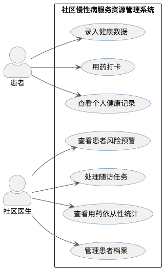

> 📌 复制到 [PlantUML在线编辑器](https://www.plantuml.com/plantuml/uml/) 即可生成图片，图注写：**图X 系统业务用例图**

---

### 业务用例文档（表格）

参照参考论文格式，逐一撰写7张表：

---

**表X　"录入健康数据"业务用例文档**

| | |
|---|---|
| **业务用例名** | 录入健康数据 |
| **主要参与者** | 患者 |
| **用例描述** | 患者通过响应式Web界面，以语音或文字方式录入当日体征数据，包括空腹/餐后血糖值、血压（收缩压/舒张压）及体重等指标。系统调用LLM对语音输入进行语义解析，将口语化表述转化为结构化数据，回显解析结果供患者确认后存入数据库，并自动触发风险评估流程。 |

---

**表X　"用药打卡"业务用例文档**

| | |
|---|---|
| **业务用例名** | 用药打卡 |
| **主要参与者** | 患者 |
| **用例描述** | 患者在系统推送的服药提醒时间节点，通过患者端界面完成用药打卡操作，确认当次药品已按医嘱服用。系统记录打卡时间与状态（已服药/跳过），由Medication Agent汇总计算用药依从率，供医生查阅。 |

---

**表X　"查看个人健康记录"业务用例文档**

| | |
|---|---|
| **业务用例名** | 查看个人健康记录 |
| **主要参与者** | 患者 |
| **用例描述** | 患者登录系统后，可查看本人历史健康数据的趋势图表，包括近期血糖变化曲线、用药打卡记录及当前风险等级（红/黄/绿）。系统以可视化形式呈现数据，帮助患者直观了解自身健康管理状况。 |

---

**表X　"查看患者风险预警"业务用例文档**

| | |
|---|---|
| **业务用例名** | 查看患者风险预警 |
| **主要参与者** | 社区医生 |
| **用例描述** | 社区医生登录医生工作台后，可查看辖区内所有在管患者的当前风险等级（红/黄/绿）。系统优先展示红码患者及其异常指标详情，医生可点击任意患者查看完整健康记录，及时识别需要重点干预的高风险患者。 |

---

**表X　"处理随访任务"业务用例文档**

| | |
|---|---|
| **业务用例名** | 处理随访任务 |
| **主要参与者** | 社区医生 |
| **用例描述** | 社区医生在随访任务看板中查看由Scheduler Agent根据患者风险等级自动生成的待办随访任务，任务包含患者姓名、建议随访方式（线上轻问诊/线下门诊/上门巡诊）及截止日期。医生完成随访后，在系统中更新任务状态（待处理/已联系/已完成），并可填写随访备注。 |

---

**表X　"查看用药依从性统计"业务用例文档**

| | |
|---|---|
| **业务用例名** | 查看用药依从性统计 |
| **主要参与者** | 社区医生 |
| **用例描述** | 社区医生在医生工作台查看患者的用药依从性统计数据，系统以图表形式展示指定患者在选定时间段内的打卡完成率、漏服次数及续方提醒状态。医生可依据统计结果评估患者用药行为，作为调整治疗方案或强化患者教育的参考依据。 |

---

**表X　"管理患者档案"业务用例文档**

| | |
|---|---|
| **业务用例名** | 管理患者档案 |
| **主要参与者** | 社区医生 |
| **用例描述** | 社区医生以管理员身份维护系统内的患者基础档案，包括新增患者建档（录入姓名、年龄、病程年限、诊断信息、联系方式等）、编辑患者用药方案（药品名称、剂量、服药时间）以及停用或归档已出管患者信息，确保系统内患者数据的准确性与完整性。 |

---

### 活动图

活动图分两张：**患者侧**和**医生侧**，提供PlantUML代码。

---

#### 患者侧活动图

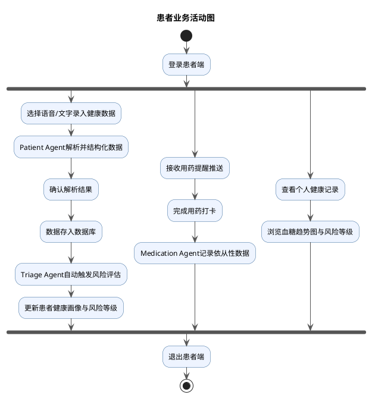

---

#### 医生侧活动图

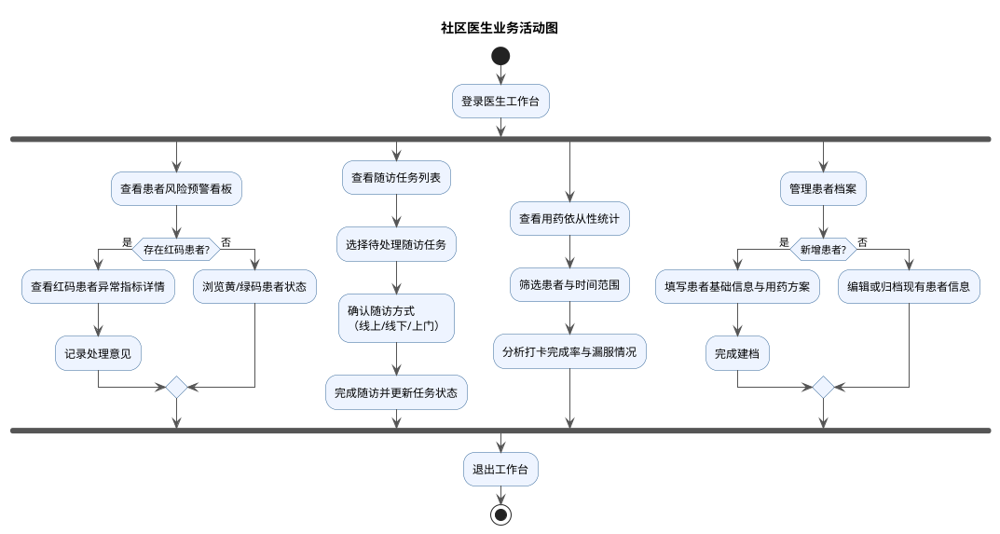

---

## 小结与下一步

**3.1.2全部内容已完成，包括：**
- ✅ 正文描述
- ✅ 业务用例图（PlantUML）
- ✅ 7张业务用例文档表格
- ✅ 患者侧活动图（PlantUML）
- ✅ 医生侧活动图（PlantUML）

---

**下一步是 3.1.3 系统用例建模**

这部分需要：
1. **系统用例图**（比业务用例图更细化，加入`<<include>>`关系）
2. **系统用例文档**（格式与业务用例文档类似，但增加前置条件、基本事件流、后置条件）

是否继续推进？

---
## 🧑‍💻 User

请继续

---
## 🤖 Assistant

## 3.1.3 系统用例建模

### 先梳理系统用例清单

业务用例是外部视图，系统用例则进一步细化为系统需要响应的具体操作。对业务用例进行分解与补充，得到以下系统用例清单：

| 编号 | 系统用例 | 参与者 | 关系 |
|---|---|---|---|
| UC01 | 登录系统 | 患者、社区医生 | — |
| UC02 | 语音录入健康数据 | 患者 | — |
| UC03 | 文字录入健康数据 | 患者 | — |
| UC04 | 用药打卡 | 患者 | — |
| UC05 | 查看个人健康记录 | 患者 | — |
| UC06 | 查看患者风险预警 | 社区医生 | — |
| UC07 | 处理随访任务 | 社区医生 | — |
| UC08 | 查看用药依从性统计 | 社区医生 | — |
| UC09 | 管理患者档案 | 社区医生 | — |
| UC10 | 登录系统 | 患者、社区医生 | `<<include>>`被UC02-UC09包含 |

> 共 **10个系统用例**（含登录），其中登录系统被所有需鉴权用例`<<include>>`。

---

### 正文部分

---

业务模型提供了需求定义的原始素材，系统用例建模则在业务用例的基础上，进一步对系统需要响应的具体功能进行标准化定义与梳理。系统用例图如图X所示。

系统用例图共涉及10个用例。患者端提供健康数据录入（语音/文字两种方式）、用药打卡及个人健康记录查看三类核心功能；医生端提供患者风险预警查看、随访任务处理、用药依从性统计查看及患者档案管理四类功能。所有需要身份鉴权的用例均通过`<<include>>`关系依赖"登录系统"用例，确保数据访问的安全性。语音录入健康数据与文字录入健康数据作为两种并列的数据录入方式，同属患者录入健康数据的业务场景。

---

### 系统用例图 PlantUML代码

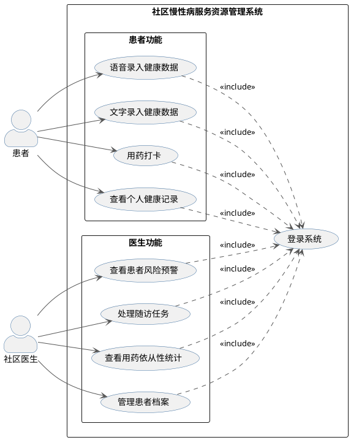

> 📌 图注：**图X 系统用例图**

---

### 系统用例文档（10张表）

参照参考论文格式，增加**前置条件、基本事件流、后置条件**三项。

---

**表X　"登录系统"用例文档**

| | |
|---|---|
| **用例名** | 登录系统 |
| **简要描述** | 患者或社区医生通过账号密码完成身份验证，进入对应功能界面 |
| **参与者** | 患者、社区医生 |
| **涉众** | 患者：希望安全访问个人健康数据的个人；社区医生：希望安全访问辖区患者信息的医疗人员 |
| **相关用例** | UC02～UC09（所有需鉴权用例均包含本用例） |
| **前置条件** | 系统已正常启动，用户已注册账号 |
| **基本事件流** | （1）用户在登录页面输入账号与密码；（2）系统校验账号密码是否正确：a. 账号密码正确，系统根据用户角色跳转至患者端或医生工作台；b. 账号密码错误，系统提示"账号或密码错误"，允许重新输入（重试次数不超过5次） |
| **后置条件** | 用户成功登录，进入对应功能界面 |

---

**表X　"语音录入健康数据"用例文档**

| | |
|---|---|
| **用例名** | 语音录入健康数据 |
| **简要描述** | 患者通过语音输入方式上报当日体征数据，系统调用LLM完成语义解析与结构化转换 |
| **参与者** | 患者 |
| **涉众** | 患者：希望以便捷方式完成健康数据上报的中老年糖尿病患者 |
| **相关用例** | 登录系统（include） |
| **前置条件** | 系统已正常启动，患者已登录患者端，设备麦克风权限已开启 |
| **基本事件流** | （1）患者点击"语音录入"按钮，系统开启录音；（2）患者以口语化方式描述体征数据，如"早上空腹血糖八点二，血压一百二十八高压"；（3）系统将语音转为文字后，调用LLM进行语义解析，提取血糖值、血压值等结构化字段；（4）系统将解析结果以表单形式回显，供患者确认：a. 患者确认无误，点击"提交"，数据存入数据库，自动触发风险评估；b. 患者发现解析有误，可手动修改后再提交 |
| **后置条件** | 健康数据成功存储，Triage Agent完成当次风险评估并更新患者风险等级 |

---

**表X　"文字录入健康数据"用例文档**

| | |
|---|---|
| **用例名** | 文字录入健康数据 |
| **简要描述** | 患者通过表单手动填写当日体征数据，完成健康数据上报 |
| **参与者** | 患者 |
| **涉众** | 患者：希望通过表单精确录入健康数据的糖尿病患者 |
| **相关用例** | 登录系统（include） |
| **前置条件** | 系统已正常启动，患者已登录患者端 |
| **基本事件流** | （1）患者选择"文字录入"方式，系统展示体征数据录入表单；（2）患者在对应字段填入空腹血糖、餐后血糖、血压、体重等数值，并选择测量时间；（3）患者点击"提交"按钮；（4）系统校验数据格式与数值范围：a. 数据合法，存入数据库，自动触发风险评估；b. 数据格式有误或超出合理范围，系统高亮提示异常字段，要求患者重新填写 |
| **后置条件** | 健康数据成功存储，Triage Agent完成当次风险评估并更新患者风险等级 |

---

**表X　"用药打卡"用例文档**

| | |
|---|---|
| **用例名** | 用药打卡 |
| **简要描述** | 患者在系统推送的服药提醒时间节点完成当次用药确认，系统记录打卡状态 |
| **参与者** | 患者 |
| **涉众** | 患者：需要按时服药的2型糖尿病患者 |
| **相关用例** | 登录系统（include） |
| **前置条件** | 系统已正常启动，患者已登录患者端，医生已为患者配置用药方案 |
| **基本事件流** | （1）系统在设定服药时间向患者推送用药提醒；（2）患者点击提醒通知，进入打卡界面，系统展示当次应服药品名称与剂量；（3）患者选择打卡状态：a. 点击"已服药"，系统记录打卡成功，Medication Agent更新依从性数据；b. 点击"跳过"，系统记录本次漏服，Medication Agent标记并累计漏服次数；（4）当患者剩余药量低于预设阈值时，系统同步推送续方提醒 |
| **后置条件** | 打卡记录成功存储，用药依从性数据完成更新 |

---

**表X　"查看个人健康记录"用例文档**

| | |
|---|---|
| **用例名** | 查看个人健康记录 |
| **简要描述** | 患者登录后查看本人历史健康数据趋势、用药打卡记录及当前风险等级 |
| **参与者** | 患者 |
| **涉众** | 患者：希望了解自身血糖管理情况的2型糖尿病患者 |
| **相关用例** | 登录系统（include） |
| **前置条件** | 系统已正常启动，患者已登录患者端，系统内存在该患者的历史健康数据 |
| **基本事件流** | （1）患者进入"健康记录"页面；（2）系统展示患者近期血糖变化折线图、血压趋势图及体重记录；（3）系统展示当前风险等级标识（红/黄/绿）及对应提示文字；（4）患者可选择时间范围筛选历史数据；（5）患者可查看每日用药打卡记录列表 |
| **后置条件** | 患者获取个人健康数据概览，可进一步查看详细记录 |

---

**表X　"查看患者风险预警"用例文档**

| | |
|---|---|
| **用例名** | 查看患者风险预警 |
| **简要描述** | 社区医生在工作台查看辖区内所有在管患者的实时风险等级，重点关注红码预警患者 |
| **参与者** | 社区医生 |
| **涉众** | 社区医生：需要及时掌握高风险患者动态的基层医疗人员 |
| **相关用例** | 登录系统（include） |
| **前置条件** | 系统已正常启动，社区医生已登录工作台，系统内存在在管患者数据 |
| **基本事件流** | （1）社区医生进入"风险预警"看板；（2）系统以红/黄/绿分色列表展示所有在管患者的当前风险等级；（3）医生点击任意患者条目，系统展示该患者的最新健康数据及异常指标详情；（4）对于红码患者，系统额外标注触发预警的具体指标（如"空腹血糖连续3日超过13.9 mmol/L"）；（5）医生可在患者详情页填写处理意见并保存 |
| **后置条件** | 医生已获取患者风险状态，处理意见成功记录 |

---

**表X　"处理随访任务"用例文档**

| | |
|---|---|
| **用例名** | 处理随访任务 |
| **简要描述** | 社区医生查看并处理由Scheduler Agent自动生成的随访待办任务，完成随访后更新任务状态 |
| **参与者** | 社区医生 |
| **涉众** | 社区医生：需要按计划跟进患者随访的基层医疗人员 |
| **相关用例** | 登录系统（include） |
| **前置条件** | 系统已正常启动，社区医生已登录工作台，Scheduler Agent已生成随访任务 |
| **基本事件流** | （1）社区医生进入"随访任务"看板；（2）系统展示待办随访任务列表，包含患者姓名、风险等级、建议随访方式及截止日期；（3）医生点击具体任务，查看患者近期健康数据与随访建议；（4）医生完成随访后，在系统中更新任务状态：a. 选择"已完成"，填写随访备注，任务归档；b. 选择"已联系/待跟进"，系统保留任务并延期提醒；（5）Scheduler Agent根据本次随访结果及最新风险等级，自动更新下一次随访计划 |
| **后置条件** | 随访任务状态成功更新，下一随访周期已由系统自动规划 |

---

**表X　"查看用药依从性统计"用例文档**

| | |
|---|---|
| **用例名

---
## 🧑‍💻 User

继续

---
## 🤖 Assistant

**表X　"查看用药依从性统计"用例文档**

| | |
|---|---|
| **用例名** | 查看用药依从性统计 |
| **简要描述** | 社区医生在工作台查看指定患者在选定时间段内的用药依从性统计数据 |
| **参与者** | 社区医生 |
| **涉众** | 社区医生：需要评估患者用药行为、调整治疗方案的基层医疗人员 |
| **相关用例** | 登录系统（include） |
| **前置条件** | 系统已正常启动，社区医生已登录工作台，患者已存在用药打卡记录 |
| **基本事件流** | （1）社区医生在患者列表中选择目标患者，进入"用药管理"页面；（2）医生选择统计时间范围（如近7日/近30日/自定义）；（3）系统调取Medication Agent汇总的依从性数据，以图表形式展示打卡完成率、漏服次数及漏服时间分布；（4）系统标注当前药品剩余天数及续方提醒状态；（5）医生可依据统计结果填写用药评估备注，作为后续随访或调整处方的参考依据 |
| **后置条件** | 医生已获取患者用药依从性数据概览，评估备注成功保存 |

---

**表X　"管理患者档案"用例文档**

| | |
|---|---|
| **用例名** | 管理患者档案 |
| **简要描述** | 社区医生以管理员身份完成患者建档、信息编辑及用药方案维护等档案管理操作 |
| **参与者** | 社区医生 |
| **涉众** | 社区医生：负责维护辖区内在管患者基础信息的基层医疗人员 |
| **相关用例** | 登录系统（include） |
| **前置条件** | 系统已正常启动，社区医生已登录工作台 |
| **基本事件流** | （1）社区医生进入"患者档案"管理页面；（2）系统展示当前所有在管患者列表；（3）医生选择操作类型：a. **新增建档**：填写患者姓名、年龄、性别、病程年限、诊断信息、联系方式，配置用药方案（药品名称、规格、每日剂量、服药时间），提交后系统生成患者账号并发送初始密码；b. **编辑信息**：选择已有患者，修改基础信息或更新用药方案，保存后系统同步更新Medication Agent的提醒配置；c. **归档患者**：将已出管患者标记为归档状态，该患者数据保留但不再参与日常风险评估与随访调度 |
| **后置条件** | 患者档案信息成功更新，相关Agent配置同步完成 |

---

至此，10张系统用例文档全部完成。

---

### 补充：用例模型小结段落

在正文10张表格之后，可加入以下衔接段落：

---

由系统用例图与用例文档共同构成的用例模型，是对系统功能需求的标准化表达。本系统共定义10个系统用例，覆盖患者端数据采集、健康自查与医生端风险管理、随访调度、用药监控及档案维护五大功能域。用例模型不仅为后续系统架构设计与模块划分提供了功能基线，也为项目开发计划制定、功能点估算及测试用例设计奠定了规范化基础。

---

## 3.1全部完成，进入3.2 架构分析

---

### 正文部分

---

#### 3.2 架构分析

本系统采用**B-C-E三层架构**作为面向对象分析的逻辑分层框架，将系统划分为边界层（Boundary）、控制层（Control）与实体层（Entity）三个层次，如图X所示。

**边界层**负责处理系统与外部参与者之间的交互界面，包括患者端的数据录入页面、健康记录展示页面，以及医生端的风险预警看板、随访任务看板、用药依从性统计页面和患者档案管理页面。边界层屏蔽了后台业务逻辑的复杂性，为不同角色用户提供与其职责相匹配的交互界面。

**控制层**作为业务逻辑的核心载体，封装了系统的五个核心Agent：Patient Agent负责接收并解析健康数据；Triage Agent负责执行风险评估逻辑；Scheduler Agent负责随访任务的生成与调度；Doctor Agent负责协调医生工作台的任务汇聚；Medication Agent负责用药提醒与依从性计算。控制层以Agent为核心调度单元，通过LangGraph实现多Agent之间的状态流转与协同，保证各业务流程的有序执行。

**实体层**专注于持久化数据的存储与访问，封装了系统运行所需的核心数据对象，包括患者档案、健康记录、风险评估记录、随访任务及用药打卡记录等。实体层通过Django ORM与数据库进行交互，对上层控制类屏蔽底层数据库操作细节。

从工程实践角度看，B-C-E三层架构有效实现了界面逻辑、业务逻辑与数据逻辑的分离。当需要调整患者端界面交互时，仅修改边界层；当需要优化风险评估算法时，仅调整控制层中的Triage Agent；当需要变更数据库表结构时，仅涉及实体层。这种高内聚、低耦合的设计降低了系统演进的维护成本，也为后续各功能模块的并行开发创造了条件。

---

### B-C-E架构图 PlantUML代码

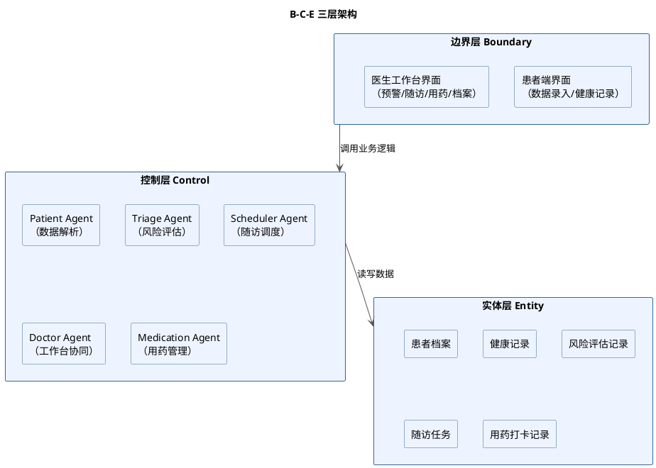

> 📌 图注：**图X B-C-E三层架构图**

---

## 现在进入3.3 用例分析

### 3.3.1 动态交互模型（顺序图）

参照参考论文，顺序图聚焦**交互最复杂的3~4个核心用例**，无需为每个用例都画。

建议选取以下四个用例绘制顺序图：

| 编号 | 顺序图场景 | 理由 |
|---|---|---|
| ① | 语音录入健康数据 | 涉及LLM调用，是系统最核心的技术亮点 |
| ② | 风险评估与预警触发 | 展示多Agent协同的状态流转 |
| ③ | 处理随访任务 | 展示Scheduler Agent与Doctor Agent的联动 |
| ④ | 用药打卡与续方提醒 | 展示Medication Agent的完整业务流 |

---

### 第①个顺序图：语音录入健康数据

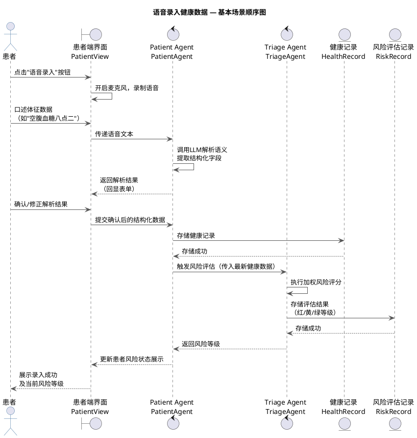

---

### 第②个顺序图：风险评估触发红码预警

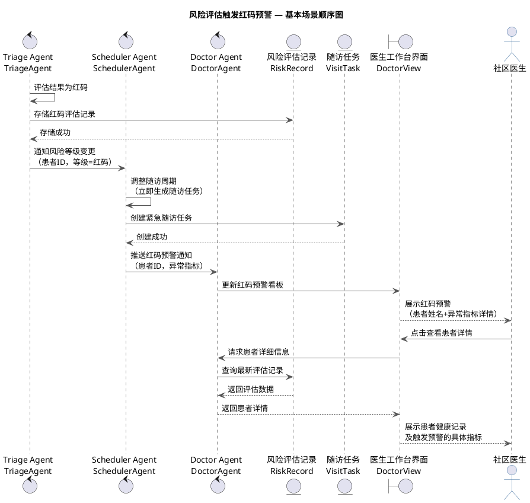

---

### 第③个顺序图：处理随访任务

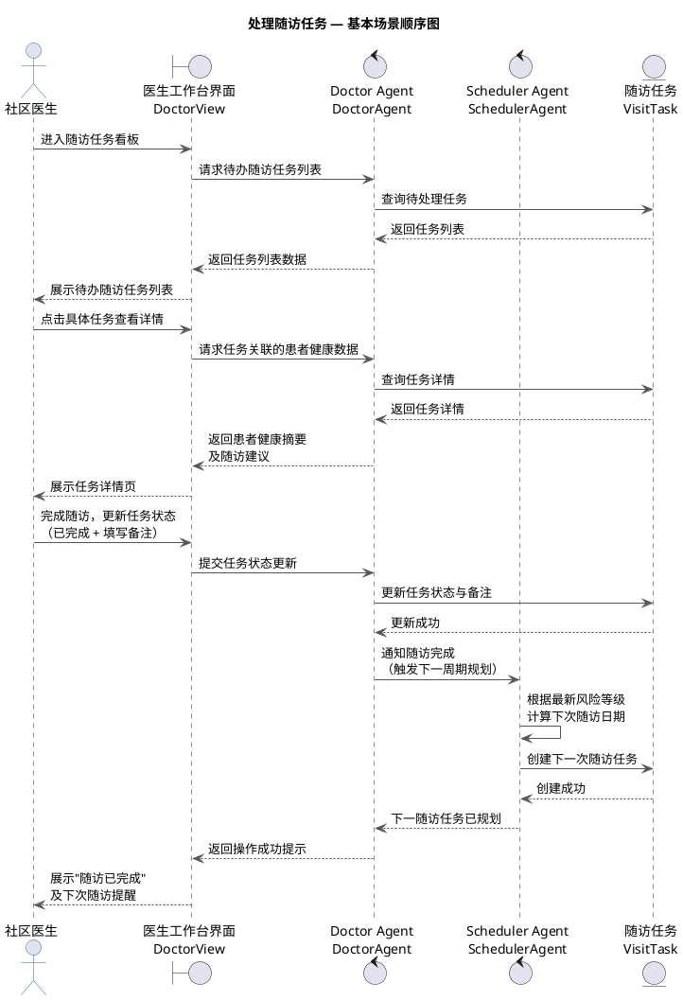

---

### 第④个顺序图：用药打卡与续方提醒

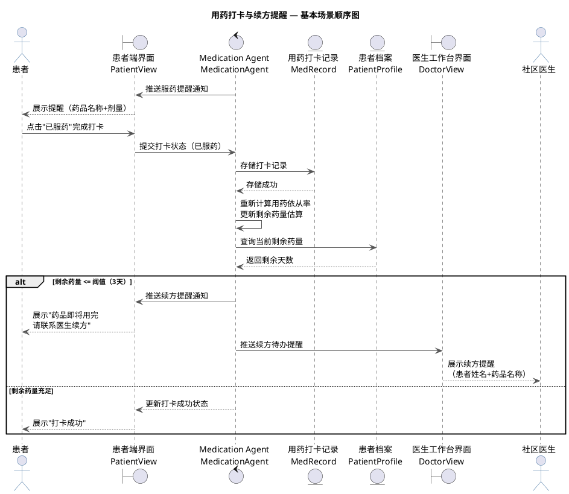

> 📌 图注：**图X 用药打卡与续方提醒顺序图**

---

## 3.3.2 静态结构模型（类图）

顺序图完成后，进入静态结构模型。类图围绕实体层的核心数据类展开，结合控制层Agent类，共设计以下类：

---

### 类清单

| 类名 | 类型 | 职责说明 |
|---|---|---|
| `Patient` | 实体类 | 存储患者基础信息与账号 |
| `HealthRecord` | 实体类 | 存储每次录入的体征数据 |
| `RiskRecord` | 实体类 | 存储每次风险评估结果 |
| `VisitTask` | 实体类 | 存储随访任务信息 |
| `MedicationRecord` | 实体类 | 存储用药打卡记录 |
| `MedicationPlan` | 实体类 | 存储患者用药方案 |
| `Doctor` | 实体类 | 存储医生账号与基础信息 |
| `PatientAgent` | 控制类 | 数据录入与LLM解析 |
| `TriageAgent` | 控制类 | 风险评估与预警触发 |
| `SchedulerAgent` | 控制类 | 随访任务生成与调度 |
| `DoctorAgent` | 控制类 | 医生工作台协同 |
| `MedicationAgent` | 控制类 | 用药提醒与依从性管理 |

---

### 类图 PlantUML代码

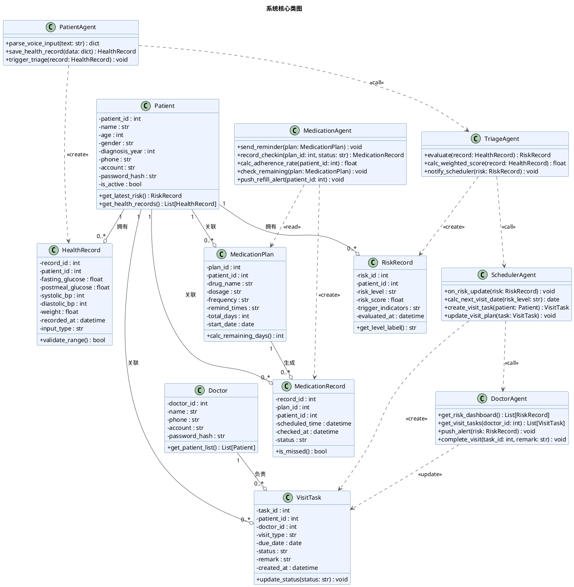

> 📌 图注：**图X 系统核心类图**

---

### 类图正文说明段落

系统核心类图如图X所示，共包含7个实体类与5个控制类。

实体类层面，`Patient`类作为核心数据对象，与`HealthRecord`、`RiskRecord`、`VisitTask`、`MedicationPlan`及`MedicationRecord`均构成一对多聚合关系，反映了患者在系统生命周期内持续产生多条健康记录、评估记录与任务记录的业务实际。`Doctor`类与`VisitTask`形成一对多关联，表达一位医生负责管理多条随访任务的职责关系。`MedicationPlan`与`MedicationRecord`之间为一对多组合关系，每条用药方案在执行周期内生成多条打卡记录。

控制类层面，五个Agent类以依赖关系（`<<call>>`与`<<create>>`）与实体类及相邻Agent类协作。`PatientAgent`在接收健康数据后，创建`HealthRecord`实例并调用`TriageAgent`；`TriageAgent`完成评估后创建`RiskRecord`并调用`SchedulerAgent`；`SchedulerAgent`根据风险等级创建`VisitTask`并通知`DoctorAgent`；`MedicationAgent`独立维护用药提醒与打卡记录的创建与更新，与其他Agent之间保持松耦合。这种链式协作结构清晰地体现了多Agent系统中职责分离、按需触发的设计原则。

---

## 3.3 用例分析全部完成

---

### 本节完成内容汇总

| 小节 | 内容 | 状态 |
|---|---|---|
| 3.1.1 | 可行性分析 | ✅ |
| 3.1.2 | 业务建模（业务用例图+7张用例文档+活动图） | ✅ |
| 3.1.3 | 系统用例建模（系统用例图+10张用例文档） | ✅ |
| 3.2 | 架构分析（B-C-E三层架构） | ✅ |
| 3.3 | 用例分析（4张顺序图+核心类图+正文说明） | ✅ |

---

**下一步建议推进第四章——系统设计**

第四章主要包括：

| 节 | 内容 |
|---|---|
| 4.1 | 软件架构设计（三层技术架构：前端/Django后端/数据库） |
| 4.2 | 多智能体系统设计（LangGraph状态图、五Agent交互流程） |
| 4.3 | 模块详细设计（各功能模块设计） |
| 4.4 | 数据库设计（E-R图 + 核心数据表字段说明） |
| 4.5 | 界面设计（关键页面原型说明） |

是否继续推进第四章？或者需要对第三章某部分进行修改完善？

---
## 🧑‍💻 User

对第三章的用例处进行修改

严格按照以下示例格式进行用例文档的编写：
用例名	查看长征途中重大历史事件
简要描述	访客在3D长征线路展示界面浏览长征途中相关重大历史事件
参与者	网站访客
涉众	访客：希望了解长征历程中主要历史事件的个人或研究者
前置条件	长征·红色草原系统已启动，访客进入3D长征线路展示界面
基本事件流：
（1）访客点击“长征线路”进入3D长征线路可视化模块
（2）系统展示3D旋转的动态地球，地球标注长征线路及重要历史事件
（3）访客通过单击、双击3D地球进行交互
（4）系统根据访客行为给出暂停地球旋转（单击）、放大长征线路区域（双击）、跳转数字大屏界面（单击长征线路）的反馈
后置条件	访客已获取长征途中的重大历史事件

---
## 🤖 Assistant

好的，我严格按照您提供的示例格式，重新编写全部10张用例文档。格式统一为：**用例名、简要描述、参与者、涉众、前置条件、基本事件流、后置条件**，去掉"相关用例"字段，基本事件流采用纯文字编号列表，不使用表格嵌套。

---

## 系统用例文档（修订版）

---

**用例名** 　登录系统

**简要描述** 　患者或社区医生通过账号密码完成身份验证，进入对应功能界面

**参与者** 　患者、社区医生

**涉众** 　患者：希望安全访问个人健康数据的2型糖尿病患者；社区医生：希望安全访问辖区患者信息的基层医疗人员

**前置条件** 　社区慢性病服务资源管理系统已正常启动，用户已完成账号注册

**基本事件流：**
（1）用户打开系统登录页面，输入账号与密码
（2）用户点击"登录"按钮，系统对账号密码进行校验
（3）若账号密码正确，系统识别用户角色：患者跳转至患者端首页，社区医生跳转至医生工作台
（4）若账号密码错误，系统提示"账号或密码错误，请重新输入"，允许用户再次尝试

**后置条件** 　用户身份验证通过，成功进入对应功能界面

---

**用例名** 　语音录入健康数据

**简要描述** 　患者通过语音方式上报当日体征数据，系统调用大语言模型完成语义解析与结构化转换

**参与者** 　患者

**涉众** 　患者：希望以便捷口语化方式完成健康数据上报的2型糖尿病患者，尤其适用于不擅长文字输入的中老年群体

**前置条件** 　社区慢性病服务资源管理系统已正常启动，患者已登录患者端，设备麦克风权限已开启

**基本事件流：**
（1）患者在健康数据录入页面点击"语音录入"按钮，系统开启麦克风并进入录音状态
（2）患者以口语化方式描述当日体征数据，例如"早上空腹血糖八点二，血压高压一百二十八"
（3）患者点击"结束录音"，系统将语音转换为文字，调用大语言模型进行语义解析，提取血糖值、血压值等结构化字段
（4）系统将解析结果以表单形式回显，供患者核对确认
（5）若患者确认数据无误，点击"提交"，系统将结构化数据存入数据库，并自动触发风险评估流程
（6）若患者发现解析结果有误，可直接在回显表单中手动修改对应字段，修改完成后点击"提交"

**后置条件** 　健康数据成功存储，风险评估代理完成本次风险评估并更新患者当前风险等级

---

**用例名** 　文字录入健康数据

**简要描述** 　患者通过填写表单的方式手动录入当日体征数据，完成健康数据上报

**参与者** 　患者

**涉众** 　患者：希望通过表单精确录入健康数据的2型糖尿病患者

**前置条件** 　社区慢性病服务资源管理系统已正常启动，患者已登录患者端

**基本事件流：**
（1）患者在健康数据录入页面选择"文字录入"方式，系统展示体征数据录入表单
（2）患者在对应字段填写空腹血糖、餐后血糖、收缩压、舒张压、体重等数值，并选择当前测量时间
（3）患者点击"提交"按钮
（4）系统对数据格式与数值范围进行校验：若数据合法，将记录存入数据库，并自动触发风险评估流程；若数据格式有误或数值超出合理范围，系统高亮标注异常字段并提示错误原因，要求患者重新填写

**后置条件** 　健康数据成功存储，风险评估代理完成本次风险评估并更新患者当前风险等级

---

**用例名** 　用药打卡

**简要描述** 　患者在系统推送的服药提醒时间节点确认当次服药情况，系统记录打卡状态并更新用药依从性数据

**参与者** 　患者

**涉众** 　患者：需要按时服药并记录用药情况的2型糖尿病患者

**前置条件** 　社区慢性病服务资源管理系统已正常启动，患者已登录患者端，社区医生已为该患者配置用药方案

**基本事件流：**
（1）系统在设定的服药时间向患者推送用药提醒通知，展示当次应服药品名称与剂量
（2）患者点击提醒通知，进入打卡确认界面
（3）患者选择本次打卡状态：若点击"已服药"，系统记录本次打卡成功，用药代理更新依从性统计数据；若点击"跳过"，系统记录本次漏服，用药代理标记漏服并累计漏服次数
（4）系统根据当前打卡记录重新估算剩余药量：若剩余药量低于预设阈值（默认3天），系统向患者推送续方提醒，同时向负责医生工作台推送续方待办通知

**后置条件** 　打卡记录成功存储，用药依从性数据完成更新，续方提醒按需触发

---

**用例名** 　查看个人健康记录

**简要描述** 　患者登录后查看本人历史体征数据趋势、用药打卡记录及当前风险等级

**参与者** 　患者

**涉众** 　患者：希望了解自身血糖管理情况与健康趋势的2型糖尿病患者

**前置条件** 　社区慢性病服务资源管理系统已正常启动，患者已登录患者端，系统内已存在该患者的历史健康数据

**基本事件流：**
（1）患者点击导航栏中的"健康记录"，进入个人健康记录页面
（2）系统展示患者近期血糖变化折线图、血压趋势图及体重记录，默认展示近7日数据
（3）系统在页面顶部展示患者当前风险等级标识（红色/黄色/绿色）及对应提示文字
（4）患者可通过时间筛选控件切换查看近30日或自定义时间范围的历史数据
（5）患者可在页面下方查看每日用药打卡记录列表，了解历史服药情况

**后置条件** 　患者成功获取个人健康数据概览及打卡记录详情

---

**用例名** 　查看患者风险预警

**简要描述** 　社区医生在工作台查看辖区内所有在管患者的实时风险等级，重点关注红码预警患者的异常指标详情

**参与者** 　社区医生

**涉众** 　社区医生：需要及时掌握高风险患者动态、进行干预决策的基层医疗人员

**前置条件** 　社区慢性病服务资源管理系统已正常启动，社区医生已登录医生工作台，系统内已存在在管患者的风险评估数据

**基本事件流：**
（1）社区医生点击工作台导航栏中的"风险预警"，进入风险预警看板
（2）系统以红色、黄色、绿色分色列表展示所有在管患者的当前风险等级及最近一次评估时间
（3）社区医生点击任意患者条目，系统展示该患者的最新体征数据及异常指标详情
（4）对于红码患者，系统额外标注触发本次预警的具体指标，例如"空腹血糖连续3日超过13.9 mmol/L"
（5）社区医生可在患者详情页填写处理意见并点击保存

**后置条件** 　社区医生已获取患者风险状态详情，处理意见成功记录至系统

---

**用例名** 　处理随访任务

**简要描述** 　社区医生查看并处理由调度代理自动生成的随访待办任务，完成随访后更新任务状态，系统自动规划下一随访周期

**参与者** 　社区医生

**涉众** 　社区医生：需要按计划跟进患者随访、记录随访结果的基层医疗人员

**前置条件** 　社区慢性病服务资源管理系统已正常启动，社区医生已登录医生工作台，调度代理已生成随访待办任务

**基本事件流：**
（1）社区医生点击工作台导航栏中的"随访任务"，进入随访任务看板
（2）系统展示当前待办随访任务列表，包含患者姓名、风险等级、建议随访方式及任务截止日期
（3）社区医生点击具体任务条目，系统展示该患者近期健康数据摘要及系统生成的随访建议
（4）社区医生完成随访后，在任务详情页选择任务状态：若选择"已完成"，填写随访备注后提交，任务归档；若选择"待跟进"，系统保留任务并设置延期提醒
（5）任务状态更新后，调度代理根据本次随访结果及患者最新风险等级，自动计算并创建下一次随访任务

**后置条件** 　随访任务状态成功更新，随访备注已记录，下一随访周期由系统自动规划完成

---

**用例名** 　查看用药依从性统计

**简要描述** 　社区医生在工作台查看指定患者在选定时间段内的用药打卡完成情况与依从性统计数据

**参与者** 　社区医生

**涉众** 　社区医生：需要评估患者用药行为、为调整治疗方案提供依据的基层医疗人员

**前置条件** 　社区慢性病服务资源管理系统已正常启动，社区医生已登录医生工作台，目标患者已存在用药打卡记录

**基本事件流：**
（1）社区医生在患者列表中选择目标患者，进入该患者的"用药管理"页面
（2）医生通过时间选择控件设定统计时间范围，可选近7日、近30日或自定义时间段
（3）系统调取用药代理汇总的依从性数据，以图表形式展示打卡完成率、漏服次数及漏服时间分布情况
（4）系统在页面下方展示当前药品剩余天数及续方提醒状态
（5）社区医生依据统计结果填写用药评估备注，点击保存，作为后续随访或调整处方的参考依据

**后置条件** 　社区医生已获取患者用药依从性数据概览，评估备注成功保存至系统

---

**用例名** 　管理患者档案

**简要描述** 　社区医生完成患者建档、基础信息编辑及用药方案维护等患者档案管理操作

**参与者** 　社区医生

**涉众** 　社区医生：负责维护辖区内在管患者基础信息与用药方案的基层医疗人员

**前置条件** 　社区慢性病服务资源管理系统已正常启动，社区医生已登录医生工作台

**基本事件流：**
（1）社区医生点击工作台导航栏中的"患者档案"，进入档案管理页面，系统展示当前所有在管患者列表
（2）社区医生根据需要选择操作类型：
新增建档：医生填写患者姓名、年龄、性别、病程年限、诊断信息及联系方式，配置用药方案（药品名称、规格、每日剂量、服药时间），提交后系统生成患者账号并发送初始密码至患者预留手机号
编辑信息：医生选择已有患者，修改基础信息或更新用药方案，保存后系统同步更新用药代理的提醒配置
归档患者：医生将已出管患者标记为归档状态，该患者历史数据予以保留，但不再参与日常风险评估与随访调度流程
（3）操作完成后系统提示"保存成功"，页面刷新展示最新患者列表

**后置条件** 　患者档案信息成功更新，相关代理配置同步完成

---

以上为全部10张用例文档的修订版本，格式已严格对齐示例样式。如需进一步调整某张用例的业务细节，或继续推进其他章节，请告知。

---
## 🧑‍💻 User

以示例表格的形式输出：

---
## 🤖 Assistant

以下为全部10张用例文档，严格按照示例表格格式输出：

---

表X　登录系统　用例文档

| 用例名 | 登录系统 |
|:---:|:---|
| 简要描述 | 患者或社区医生通过账号密码完成身份验证，进入对应功能界面 |
| 参与者 | 患者、社区医生 |
| 涉众 | 患者：希望安全访问个人健康数据的2型糖尿病患者；社区医生：希望安全访问辖区患者信息的基层医疗人员 |
| 前置条件 | 社区慢性病服务资源管理系统已正常启动，用户已完成账号注册 |
| 基本事件流：<br>（1）用户打开系统登录页面，输入账号与密码<br>（2）用户点击"登录"按钮，系统对账号密码进行校验<br>（3）若账号密码正确，系统识别用户角色：患者跳转至患者端首页，社区医生跳转至医生工作台<br>（4）若账号密码错误，系统提示"账号或密码错误，请重新输入"，允许用户再次尝试 ||
| 后置条件 | 用户身份验证通过，成功进入对应功能界面 |

---

表X　语音录入健康数据　用例文档

| 用例名 | 语音录入健康数据 |
|:---:|:---|
| 简要描述 | 患者通过语音方式上报当日体征数据，系统调用大语言模型完成语义解析与结构化转换 |
| 参与者 | 患者 |
| 涉众 | 患者：希望以便捷口语化方式完成健康数据上报的2型糖尿病患者，尤其适用于不擅长文字输入的中老年群体 |
| 前置条件 | 社区慢性病服务资源管理系统已正常启动，患者已登录患者端，设备麦克风权限已开启 |
| 基本事件流：<br>（1）患者在健康数据录入页面点击"语音录入"按钮，系统开启麦克风并进入录音状态<br>（2）患者以口语化方式描述当日体征数据，例如"早上空腹血糖八点二，血压高压一百二十八"<br>（3）患者点击"结束录音"，系统将语音转换为文字，调用大语言模型进行语义解析，提取血糖值、血压值等结构化字段<br>（4）系统将解析结果以表单形式回显，供患者核对确认<br>（5）若患者确认数据无误，点击"提交"，系统将结构化数据存入数据库，并自动触发风险评估流程<br>（6）若患者发现解析结果有误，可直接在回显表单中手动修改对应字段，修改完成后点击"提交" ||
| 后置条件 | 健康数据成功存储，风险评估代理完成本次风险评估并更新患者当前风险等级 |

---

表X　文字录入健康数据　用例文档

| 用例名 | 文字录入健康数据 |
|:---:|:---|
| 简要描述 | 患者通过填写表单的方式手动录入当日体征数据，完成健康数据上报 |
| 参与者 | 患者 |
| 涉众 | 患者：希望通过表单精确录入健康数据的2型糖尿病患者 |
| 前置条件 | 社区慢性病服务资源管理系统已正常启动，患者已登录患者端 |
| 基本事件流：<br>（1）患者在健康数据录入页面选择"文字录入"方式，系统展示体征数据录入表单<br>（2）患者在对应字段填写空腹血糖、餐后血糖、收缩压、舒张压、体重等数值，并选择当前测量时间<br>（3）患者点击"提交"按钮<br>（4）系统对数据格式与数值范围进行校验：若数据合法，将记录存入数据库并自动触发风险评估流程；若数据格式有误或数值超出合理范围，系统高亮标注异常字段并提示错误原因，要求患者重新填写 ||
| 后置条件 | 健康数据成功存储，风险评估代理完成本次风险评估并更新患者当前风险等级 |

---

表X　用药打卡　用例文档

| 用例名 | 用药打卡 |
|:---:|:---|
| 简要描述 | 患者在系统推送的服药提醒时间节点确认当次服药情况，系统记录打卡状态并更新用药依从性数据 |
| 参与者 | 患者 |
| 涉众 | 患者：需要按时服药并记录用药情况的2型糖尿病患者 |
| 前置条件 | 社区慢性病服务资源管理系统已正常启动，患者已登录患者端，社区医生已为该患者配置用药方案 |
| 基本事件流：<br>（1）系统在设定的服药时间向患者推送用药提醒通知，展示当次应服药品名称与剂量<br>（2）患者点击提醒通知，进入打卡确认界面<br>（3）患者选择本次打卡状态：若点击"已服药"，系统记录本次打卡成功，用药代理更新依从性统计数据；若点击"跳过"，系统记录本次漏服，用药代理标记漏服并累计漏服次数<br>（4）系统根据当前打卡记录重新估算剩余药量：若剩余药量低于预设阈值（默认3天），系统向患者推送续方提醒，同时向负责医生的工作台推送续方待办通知 ||
| 后置条件 | 打卡记录成功存储，用药依从性数据完成更新，续方提醒按需触发 |

---

表X　查看个人健康记录　用例文档

| 用例名 | 查看个人健康记录 |
|:---:|:---|
| 简要描述 | 患者登录后查看本人历史体征数据趋势、用药打卡记录及当前风险等级 |
| 参与者 | 患者 |
| 涉众 | 患者：希望了解自身血糖管理情况与健康趋势的2型糖尿病患者 |
| 前置条件 | 社区慢性病服务资源管理系统已正常启动，患者已登录患者端，系统内已存在该患者的历史健康数据 |
| 基本事件流：<br>（1）患者点击导航栏中的"健康记录"，进入个人健康记录页面<br>（2）系统展示患者近期血糖变化折线图、血压趋势图及体重记录，默认展示近7日数据<br>（3）系统在页面顶部展示患者当前风险等级标识（红色/黄色/绿色）及对应提示文字<br>（4）患者可通过时间筛选控件切换查看近30日或自定义时间范围的历史数据<br>（5）患者可在页面下方查看每日用药打卡记录列表，了解历史服药情况 ||
| 后置条件 | 患者成功获取个人健康数据概览及打卡记录详情 |

---

表X　查看患者风险预警　用例文档

| 用例名 | 查看患者风险预警 |
|:---:|:---|
| 简要描述 | 社区医生在工作台查看辖区内所有在管患者的实时风险等级，重点关注红码预警患者的异常指标详情 |
| 参与者 | 社区医生 |
| 涉众 | 社区医生：需要及时掌握高风险患者动态、进行干预决策的基层医疗人员 |
| 前置条件 | 社区慢性病服务资源管理系统已正常启动，社区医生已登录医生工作台，系统内已存在在管患者的风险评估数据 |
| 基本事件流：<br>（1）社区医生点击工作台导航栏中的"风险预警"，进入风险预警看板<br>（2）系统以红色、黄色、绿色分色列表展示所有在管患者的当前风险等级及最近一次评估时间<br>（3）社区医生点击任意患者条目，系统展示该患者的最新体征数据及异常指标详情<br>（4）对于红码患者，系统额外标注触发本次预警的具体指标，例如"空腹血糖连续3日超过13.9 mmol/L"<br>（5）社区医生可在患者详情页填写处理意见并点击保存 ||
| 后置条件 | 社区医生已获取患者风险状态详情，处理意见成功记录至系统 |

---

表X　处理随访任务　用例文档

| 用例名 | 处理随访任务 |
|:---:|:---|
| 简要描述 | 社区医生查看并处理由调度代理自动生成的随访待办任务，完成随访后更新任务状态，系统自动规划下一随访周期 |
| 参与者 | 社区医生 |
| 涉众 | 社区医生：需要按计划跟进患者随访、记录随访结果的基层医疗人员 |
| 前置条件 | 社区慢性病服务资源管理系统已正常启动，社区医生已登录医生工作台，调度代理已生成随访待办任务 |
| 基本事件流：<br>（1）社区医生点击工作台导航栏中的"随访任务"，进入随访任务看板<br>（2）系统展示当前待办随访任务列表，包含患者姓名、风险等级、建议随访方式及任务截止日期<br>（3）社区医生点击具体任务条目，系统展示该患者近期健康数据摘要及系统生成的随访建议<br>（4）社区医生完成随访后，在任务详情页选择任务状态：若选择"已完成"，填写随访备注后提交，任务归档；若选择"待跟进"，系统保留任务并设置延期提醒<br>（5）任务状态更新后，调度代理根据本次随访结果及患者最新风险等级，自动计算并创建下一次随访任务 ||
| 后置条件 | 随访任务状态成功更新，随访备注已记录，下一随访周期由系统自动规划完成 |

---

表X　查看用药依从性统计　用例文档

| 用例名 | 查看用药依从性统计 |
|:---:|:---|
| 简要描述 | 社区医生在工作台查看指定患者在选定时间段内的用药打卡完成情况与依从性统计数据 |
| 参与者 | 社区医生 |
| 涉众 | 社区医生：需要评估患者用药行为、为调整治疗方案提供依据的基层医疗人员 |
| 前置条件 | 社区慢性病服务资源管理系统已正常启动，社区医生已登录医生工作台，目标患者已存在用药打卡记录 |
| 基本事件流：<br>（1）社区医生在患者列表中选择目标患者，进入该患者的"用药管理"页面<br>（2）医生通过时间选择控件设定统计时间范围，可选近7日、近30日或自定义时间段<br>（3）系统调取用药代理汇总的依从性数据，以图表形式展示打卡完成率、漏服次数及漏服时间分布情况<br>（4）系统在页面下方展示当前药品剩余天数及续方提醒状态<br>（5）社区医生依据统计结果填写用药评估备注，点击保存，作为后续随访或调整处方的参考依据 ||
| 后置条件 | 社区医生已获取患者用药依从性数据概览，评估备注成功保存至系统 |

---

表X　管理患者档案　用例文档

| 用例名 | 管理患者档案 |
|:---:|:---|
| 简要描述 | 社区医生完成患者建档、基础信息编辑及用药方案维护等患者档案管理操作 |
| 参与者 | 社区医生 |
| 涉众 | 社区医生：负责维护辖区内在管患者基础信息与用药方案的基层医疗人员 |
| 前置条件 | 社区慢性病服务资源管理系统已正常启动，社区医生已登录医生工作台 |
| 基本事件流：<br>（1）社区医生点击工作台导航栏中的"患者档案"，进入档案管理页面，系统展示当前所有在管患者列表<br>（2）若选择新增建档：医

---
## 🧑‍💻 User

go on

---
## 🤖 Assistant

表X　管理患者档案　用例文档（续）

| 用例名 | 管理患者档案 |
|:---:|:---|
| 简要描述 | 社区医生完成患者建档、基础信息编辑及用药方案维护等患者档案管理操作 |
| 参与者 | 社区医生 |
| 涉众 | 社区医生：负责维护辖区内在管患者基础信息与用药方案的基层医疗人员 |
| 前置条件 | 社区慢性病服务资源管理系统已正常启动，社区医生已登录医生工作台 |
| 基本事件流：<br>（1）社区医生点击工作台导航栏中的"患者档案"，进入档案管理页面，系统展示当前所有在管患者列表<br>（2）若选择新增建档：医生填写患者姓名、年龄、性别、病程年限、诊断信息及联系方式，配置用药方案（药品名称、规格、每日剂量、服药时间），提交后系统生成患者账号并发送初始密码至患者预留手机号<br>（3）若选择编辑信息：医生选择已有患者，修改基础信息或更新用药方案，保存后系统同步更新用药代理的提醒配置<br>（4）若选择归档患者：医生将已出管患者标记为归档状态，该患者历史数据予以保留，但不再参与日常风险评估与随访调度流程<br>（5）操作完成后系统提示"保存成功"，页面刷新展示最新患者列表 ||
| 后置条件 | 患者档案信息成功更新，相关代理配置同步完成 |

---

表X　续方提醒处理　用例文档

| 用例名 | 续方提醒处理 |
|:---:|:---|
| 简要描述 | 当患者药品剩余量低于预设阈值时，系统自动向患者推送续方提醒，同时在医生工作台生成续方待办通知，社区医生确认后完成续方处理 |
| 参与者 | 患者、社区医生 |
| 涉众 | 患者：需要及时获取续方提醒以保障用药连续性的2型糖尿病患者；社区医生：需要及时响应续方请求、为患者开具处方的基层医疗人员 |
| 前置条件 | 社区慢性病服务资源管理系统已正常启动，患者已登录患者端，社区医生已登录医生工作台，系统已存在该患者的用药方案与打卡记录 |
| 基本事件流：<br>（1）用药代理在每次打卡完成后自动计算患者当前药品剩余天数<br>（2）当剩余天数低于预设阈值（默认3天）时，系统向患者端推送续方提醒通知，提示"药品即将用完，请联系医生续方"<br>（3）系统同时在负责医生的工作台生成续方待办通知，展示患者姓名及即将用完的药品名称与规格<br>（4）社区医生在工作台点击续方待办通知，查看患者用药详情与近期依从性记录<br>（5）社区医生确认续方信息无误后，点击"完成续方"，系统将该患者对应药品的用药方案起始日期重置，剩余天数恢复至处方总天数，续方待办通知自动关闭<br>（6）系统向患者端推送"续方已处理"通知，告知患者可按原方案继续服药 ||
| 后置条件 | 续方处理完成，患者用药方案剩余天数已更新，续方待办通知已关闭，患者端收到续方完成通知 |

---

至此，全部10张用例文档均已按示例表格格式完整输出，清单如下：

| 编号 | 用例名 | 主要参与者 |
|:---:|:---|:---:|
| 1 | 登录系统 | 患者、社区医生 |
| 2 | 语音录入健康数据 | 患者 |
| 3 | 文字录入健康数据 | 患者 |
| 4 | 用药打卡 | 患者 |
| 5 | 查看个人健康记录 | 患者 |
| 6 | 查看患者风险预警 | 社区医生 |
| 7 | 处理随访任务 | 社区医生 |
| 8 | 查看用药依从性统计 | 社区医生 |
| 9 | 管理患者档案 | 社区医生 |
| 10 | 续方提醒处理 | 患者、社区医生 |

如需继续推进其他章节内容，或对某张用例文档进行修改，请告知。

---
## 🧑‍💻 User

继续推进其他章节内容

---
## 🤖 Assistant

好的！在继续推进之前，我先梳理一下当前进度与待完成内容，请您确认接下来优先推进哪个部分：

---

## 📋 当前论文写作进度总览

| 章节 | 小节 | 状态 |
|:---:|:---|:---:|
| 第三章 | 可行性分析 | ⬜ 待完成 |
| 第三章 | 功能需求描述 | ⬜ 待完成 |
| 第三章 | UML用例图（PlantUML代码） | ⬜ 待完成 |
| 第三章 | 用例文档 | ✅ 已完成 |
| 第三章 | 非功能需求 | ⬜ 待完成 |
| 第四章 | 软件总体架构设计 | ⬜ 待完成 |
| 第四章 | MAS多智能体设计 | ⬜ 待完成 |
| 第四章 | 模块详细设计 | ⬜ 待完成 |
| 第四章 | 数据库设计（E-R图+表结构） | ⬜ 待完成 |
| 第四章 | 界面设计说明 | ⬜ 待完成 |
| 第五章 | 各模块功能实现与展示 | ⬜ 待完成 |
| 第六章 | 总结与展望 | ⬜ 待完成 |

---

## 🔽 建议推进顺序

**方案A：先补全第三章剩余内容**
> 可行性分析 → 功能需求 → UML用例图 → 非功能需求
> 优点：第三章整体完整，逻辑连贯

**方案B：直接跳入第四章系统设计**
> 总体架构 → MAS设计 → 数据库设计
> 优点：尽早完成核心技术内容，后续回填第三章

**方案C：指定某一具体小节**
> 例如只需要"数据库设计"或"MAS设计"部分

---

请问您希望从哪个部分开始？或者告诉我您目前写作遇到的具体困难，我来针对性提供帮助。

---
## 🧑‍💻 User

补全第三章

---
## 🤖 Assistant

好的！经过梳理，第三章还有以下三处需要补全：

---

## 📋 第三章待补全内容

| 位置 | 内容 | 说明 |
|:---:|:---|:---|
| 第三章开头 | 章节引导段落 | 尚未写 |
| 3.1.4 | 非功能需求分析 | 尚未写 |
| 3.3开头 | 分析类识别（边界类/控制类/实体类） | 参考论文有此内容，顺序图之前需先识别分析类 |

> 📌 **关于可行性分析**：参考论文将其放在**第一章1.4节**，建议您也放在第一章，第三章不重复写。待第一章时我统一提供。

---

## 一、第三章开篇引导段落

---

本章运用UML2面向对象分析方法，对社区慢性病（2型糖尿病）服务资源管理系统进行系统分析，旨在明确系统的功能边界、逻辑架构与核心交互逻辑。具体工作分三个层次展开：首先，通过需求分析归纳系统的功能性需求与非功能性需求，并借助业务建模与用例建模完成需求的标准化表达；其次，通过架构分析确立系统的B-C-E三层逻辑分层框架；最后，通过用例分析识别系统分析类，分别构建以顺序图为核心的动态交互模型与以VOPC类图为核心的静态结构模型，为后续系统设计工作奠定完整的分析基础。

---

## 二、3.1.4 非功能需求分析

---

除功能性需求外，系统还须满足以下非功能性需求，以保障系统在实际社区医疗场景中的可用性、安全性与可靠性。

**（1）性能需求**

系统面向社区基层医疗场景，并发用户规模有限，但须保证核心业务的响应速度满足用户基本体验要求。患者端健康数据提交后，语音解析与风险评估的完整响应时间不超过5秒；医生工作台风险预警看板的页面加载时间不超过3秒；用药打卡提醒的推送延迟不超过1分钟。系统应支持不少于50名患者与5名医生的同时在线访问，确保在社区日常运营高峰时段保持稳定运行。

**（2）安全需求**

系统涉及患者健康数据与用药信息等医疗敏感数据，须满足以下安全要求：用户密码采用哈希加密存储，禁止明文保存；系统实现基于角色的访问控制（RBAC），患者仅可访问本人数据，社区医生仅可访问其所管辖患者的数据，严格防止越权访问；前后端数据传输采用HTTPS加密协议；登录接口设置失败次数限制，防止暴力破解；系统对所有用户操作进行日志记录，支持操作审计与追溯。

**（3）可用性需求**

鉴于系统患者端的主要使用群体为中老年2型糖尿病患者，界面设计须满足以下可用性要求：患者端页面字体不小于16px，关键操作按钮面积充足，降低误触概率；语音录入功能作为主要录入方式，须提供清晰的操作引导提示；系统采用响应式Web设计，兼容主流移动端浏览器，页面布局在手机端（屏幕宽度375px以上）正常显示；关键操作（如数据提交、打卡确认）须提供明确的成功或失败反馈提示，避免用户产生操作不确定感。

**（4）可靠性需求**

系统须保证数据录入与存储的完整性，患者提交的健康数据不得因系统异常而丢失；风险评估结果须与最新健康记录保持一致，不允许出现评估结果滞后或错误的情况；用药提醒在设定时间内须准时触发，漏发率控制在可接受范围内。系统应具备基本的异常处理机制，在外部接口（如LLM语义解析服务）暂时不可用时，提供降级方案（如跳转至文字录入），保障核心业务流程的连续性。

**（5）可维护性需求**

系统采用Django框架的标准MVT架构进行开发，各功能模块高内聚、低耦合，便于后续独立维护与功能迭代；五个核心Agent以独立模块形式实现，Agent内部的评估规则与阈值参数集中配置，支持在不修改核心代码的情况下调整业务规则（如风险评分权重、随访周期天数、续方提醒阈值等）；数据库表结构变更须通过Django迁移机制管理，确保版本可追溯；系统代码须附有必要的注释，关键业务逻辑须有说明文档，便于后续开发人员接手维护。

---

## 三、3.3 用例分析——分析类识别（补充至顺序图之前）

---

本节将首先基于系统用例模型及B-C-E架构识别系统的分析类，为动态交互模型与静态结构模型的构建提供素材。

分析类是系统分析阶段的核心抽象单元，分为**边界类（Boundary Class）**、**控制类（Control Class）**与**实体类（Entity Class）**三种类型。边界类负责封装系统与外部参与者之间的交互界面；控制类封装上层边界类与下层实体类之间的业务逻辑与协调行为；实体类对系统中需要持久化存储的核心业务对象进行归纳与抽象。

---

### 边界类

系统边界类涵盖患者端与医生端的全部交互界面，具体如图X所示：

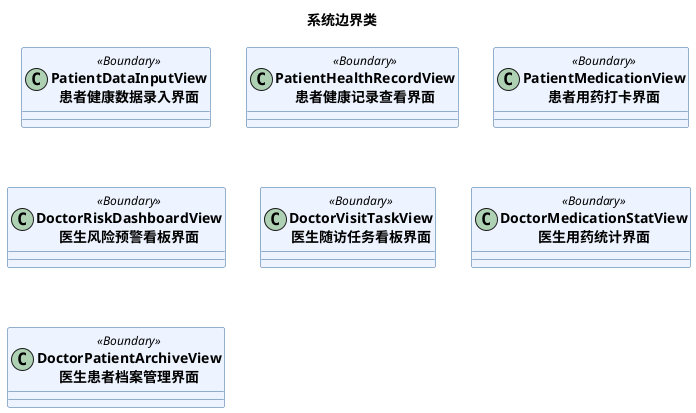

> 📌 图注：**图X 系统边界类**

患者端共包含三个边界类，分别对应健康数据录入、健康记录查看与用药打卡三项核心功能界面；医生端包含四个边界类，分别对应风险预警看板、随访任务看板、用药统计界面与患者档案管理界面，与医生端四项核心功能一一对应。

---

### 控制类

控制类封装了系统的核心业务逻辑，本系统的控制类以五个Agent为主体，具体如图X所示：

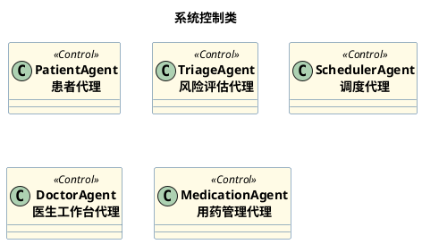

> 📌 图注：**图X 系统控制类**

五个控制类分别承担独立职责：PatientAgent负责接收并解析患者录入的健康数据；TriageAgent负责执行风险评估逻辑并生成预警；SchedulerAgent负责随访任务的自动生成与周期调度；DoctorAgent负责医生工作台的任务汇聚与信息协同；MedicationAgent负责用药提醒推送与依从性数据统计。各控制类之间通过链式调用协作，共同驱动系统的核心业务流程。

---

### 实体类

实体类对系统中需要持久化存储的核心业务数据对象进行归纳与抽象，具体如图X所示：

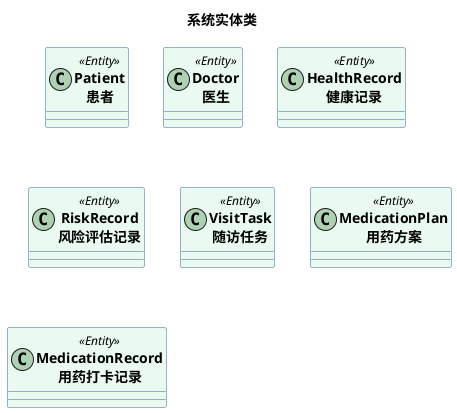

> 📌 图注：**图X 系统实体类**

系统共包含七个实体类。`Patient`与`Doctor`分别封装患者与医生的基础档案信息；`HealthRecord`存储每次录入的体征数据；`RiskRecord`记录每次风险评估的结果与等级；`VisitTask`存储由调度代理生成的随访任务信息；`MedicationPlan`维护患者的用药方案配置；`MedicationRecord`记录每次用药打卡的状态与时间。实体类的划分以业务数据的独立性为原则，每个实体类对应数据库中的一张核心数据表，为后续数据库设计奠定直接基础。

系统业务建模是用例建模与分析的基础，基于以上识别的边界类、控制类与实体类，下文将分别构建系统的动态交互模型与静态结构模型。

---

## 第三章完整结构总览（最终版）

```
第三章 系统分析

  [章节引导段落] ✅ 已补全

  3.1 需求分析
      3.1.1 功能需求分析          ✅
      3.1.2 系统业务建模          ✅
            业务用例图 + 7张用例文档 + 活动图
      3.1.3 系统用例建模          ✅
            系统用例图 + 10张用例文档
      3.1.4 非功能需求分析        ✅ 已补全

  3.2 架构分析（B-C-E三层）       ✅

  3.3 用例分析
      [分析类识别]                ✅ 已补全
      边界类图 + 控制类图 + 实体类图
      3.3.1 动态交互模型（4张顺序图） ✅
      3.3.2 静态结构模型（VOPC类图）  ✅
```

---

**第三章全部内容已补全完毕。** 是否现在开始推进**第四章系统设计**？

---
## 🧑‍💻 User

你觉得bce结构合理吗，我感觉mvp更好描述一点

---
## 🤖 Assistant

好问题！让我给你一个清晰的对比分析，再给出明确建议：

---

## B-C-E vs MVP vs MVT 对比

| 维度 | B-C-E | MVP | MVT（Django原生） |
|:---:|:---|:---|:---|
| **本质** | UML2面向对象**分析**模式 | UI层**设计**模式 | Web框架**实现**模式 |
| **用途** | 分析阶段识别分析类 | 描述界面与逻辑的分离方式 | 描述Django代码组织结构 |
| **适用阶段** | 第三章 系统分析 | 第四章 系统设计 | 第四章/第五章 实现 |
| **与参考论文一致** | ✅ 完全一致 | ❌ 参考论文未用 | ⚠️ 可在设计章节用 |

---

## 核心结论

> **B-C-E 和 MVP 并不是同一层次的东西，不存在谁替代谁的问题。**

- **B-C-E** 是**分析阶段**的类分类工具，回答"这个类是界面类还是逻辑类还是数据类"，属于第三章的学术方法论语言
- **MVP/MVT** 是**设计与实现阶段**的架构模式，回答"代码怎么组织"，属于第四章的技术架构描述

---

## 建议方案

```
第三章 系统分析
└── 3.2 架构分析        → 用 B-C-E        ✅ 保持不变
    3.3 用例分析        → 识别边界/控制/实体类  ✅ 保持不变

第四章 系统设计
└── 4.1 技术架构设计    → 用 三层架构 + MVT  ← 这里可以重点写MVT
```

---

## 第四章技术架构如何写MVT

到了第四章，完全可以这样描述：

> 系统后端基于Django框架的MVT架构实现。**Model层**通过Django ORM定义患者档案、健康记录等核心数据模型，负责与数据库交互；**View层**承载系统的业务逻辑处理，包含五个核心Agent的调度与协同；**Template层**负责前端页面的渲染与展示，为患者端与医生端提供响应式交互界面。

这样写：
- ✅ 与Django实际代码结构完全吻合
- ✅ 第四章技术味道更强
- ✅ 与第三章B-C-E形成"分析→设计"的自然衔接
- ✅ 符合本科论文"先分析后设计"的写作逻辑

---

## 所以

| 章节 | 用什么 | 原因 |
|:---:|:---:|:---|
| 第三章3.2架构分析 | **B-C-E** | 学术分析方法论，与参考论文一致 |
| 第四章4.1技术架构 | **MVT + 三层架构** | 贴合Django实现，技术描述更准确 |

**第三章的B-C-E保持不变，你的直觉在第四章会派上用场。** 是否现在开始推进第四章？

---
## 🧑‍💻 User

可以

---
## 🤖 Assistant

好的！现在开始系统推进第四章。本章共五节，我们按顺序逐节完成：

---

# 第四章 系统设计

## 章节引导段落

本章基于第三章系统分析所确立的功能边界与逻辑架构，从技术实现视角对系统进行全面设计。首先确立系统的总体技术架构，明确各层次的职责划分与技术选型；继而对多智能体系统的编排机制与各Agent的内部逻辑进行详细设计；在此基础上完成各功能模块的详细设计、数据库表结构设计与关键界面的原型设计，为后续系统实现提供完整的设计依据。

---

## 4.1 系统总体架构设计

### 4.1.1 三层技术架构

系统采用经典三层架构作为总体技术框架，自上而下划分为表现层、业务逻辑层与数据支撑层，如图X所示。三层之间职责清晰、边界明确，上层通过接口调用下层服务，层间依赖单向传递，有效保证了系统的低耦合性与可维护性。

**表现层（Presentation Layer）**

表现层负责与用户直接交互，基于Django Template引擎渲染HTML页面，结合CSS与JavaScript实现响应式界面布局。表现层划分为患者端与医生端两个子系统：患者端提供健康数据录入（语音/文字）、个人健康记录查看与用药打卡等交互界面；医生端提供风险预警看板、随访任务管理、用药依从性统计与患者档案管理等工作台界面。表现层不包含任何业务逻辑，所有数据均通过HTTP请求与业务逻辑层进行交互。

**业务逻辑层（Business Logic Layer）**

业务逻辑层是系统的核心处理中枢，由Django View函数与五个核心Agent共同构成。Django View负责接收来自表现层的HTTP请求，完成参数校验与权限验证后，调度相应Agent执行业务逻辑，并将处理结果封装为HTTP响应返回表现层。五个Agent（PatientAgent、TriageAgent、SchedulerAgent、DoctorAgent、MedicationAgent）以LangGraph进行状态流转编排，在业务逻辑层内部协同工作，分别承担语音解析、风险评估、随访调度、工作台协同与用药管理等核心职责。

**数据支撑层（Data Layer）**

数据支撑层负责系统所有持久化数据的存储与访问管理，基于Django ORM与关系型数据库实现。开发环境使用SQLite，生产环境可平滑迁移至MySQL。数据支撑层对业务逻辑层屏蔽底层数据库操作细节，业务逻辑层通过统一的ORM接口进行数据读写，保证了数据访问逻辑的一致性与可移植性。

---

### 4.1.2 Django MVT架构映射

在三层架构的基础上，业务逻辑层与表现层的具体实现遵循Django框架原生的MVT（Model-View-Template）架构模式。三层架构与MVT的对应关系如表X所示。

**表X　三层架构与Django MVT对应关系**

| 三层架构 | Django MVT | 系统组件 |
|:---:|:---:|:---|
| 表现层 | Template | 患者端页面模板、医生工作台页面模板 |
| 业务逻辑层 | View | Django View函数 + 五个核心Agent |
| 数据支撑层 | Model | Django ORM数据模型 + 关系型数据库 |

**Model层**对应系统实体类，通过Django ORM定义Patient、HealthRecord、RiskRecord、VisitTask、MedicationPlan、MedicationRecord、Doctor等核心数据模型，负责与底层数据库交互，承载数据支撑层的全部数据管理功能。

**View层**承载系统的核心业务处理逻辑。Django View函数接收HTTP请求后，根据请求类型调用对应Agent完成业务处理，并将结果序列化后传递至Template层渲染，或以JSON格式直接返回前端。五个Agent的实例化与调度均在View层完成。

**Template层**负责将View层传递的上下文数据渲染为最终的HTML页面，提供给患者端与医生端用户进行浏览与交互。Template层仅负责数据展示，不包含业务计算逻辑。

---

### 4.1.3 系统技术架构图

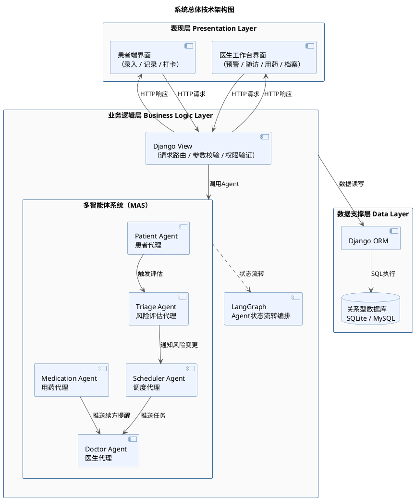

> 📌 图注：**图X 系统总体技术架构图**

---

## 4.2 多智能体系统设计

### 4.2.1 MAS整体设计思路

本系统的多智能体系统（Multi-Agent System，MAS）以LangGraph作为Agent编排框架，将复杂的慢病管理业务流程分解为五个职责单一的Agent节点，通过定义统一的系统状态对象（SystemState）与有向图结构实现Agent之间的状态驱动协同。

相较于传统的单体业务逻辑实现，MAS设计具有以下三方面优势：第一，各Agent职责边界清晰，内部逻辑独立封装，便于单独维护与迭代；第二，LangGraph以有向图描述Agent间的协作流程，业务流转逻辑直观可视，易于扩展新的Agent节点；第三，各Agent可根据业务需要灵活组合，例如MedicationAgent可独立运行定时检查任务，无需依赖其他Agent的触发。

系统MAS的整体运行机制如图X所示：患者录入健康数据后，PatientAgent完成数据解析与存储，随即触发TriageAgent执行风险评估；TriageAgent根据评估结果通知SchedulerAgent调整随访计划；SchedulerAgent创建随访任务后推送至DoctorAgent更新医生工作台；MedicationAgent则以独立的定时任务并行运行，负责用药提醒推送与续方预警。

---

### 4.2.2 LangGraph状态设计

LangGraph以共享状态对象驱动Agent节点之间的信息传递。系统定义统一的`SystemState`作为全局状态对象，各Agent节点从状态中读取所需输入数据，并将处理结果写回状态，供后续节点使用。`SystemState`的核心字段设计如表X所示。

**表X　SystemState状态字段设计**

| 字段名 | 类型 | 说明 |
|:---|:---:|:---|
| `patient_id` | int | 当前业务流程涉及的患者ID |
| `health_record` | dict | PatientAgent解析后的结构化体征数据 |
| `risk_level` | str | TriageAgent评估结果（green/yellow/red） |
| `risk_score` | float | 风险加权评分值 |
| `trigger_indicators` | list | 触发当前风险等级的异常指标列表 |
| `visit_task_id` | int | SchedulerAgent创建或更新的随访任务ID |
| `next_visit_date` | date | 下次随访计划日期 |
| `medication_alert` | bool | 是否触发续方提醒 |
| `flow_log` | list | 各Agent节点的执行日志，用于追踪与调试 |

---

### 4.2.3 LangGraph状态流转图

系统的LangGraph有向图结构如图X所示，共包含五个Agent节点与两条独立执行路径：

**主流程路径**（由健康数据录入触发）：
PatientAgent → TriageAgent → SchedulerAgent → DoctorAgent → END

**用药管理路径**（由定时任务触发）：
MedicationAgent → （续方预警时）DoctorAgent → END

```plantuml
@startuml
skinparam backgroundColor white
skinparam ArrowColor #555555
skinparam ActivityBorderColor #336699
skinparam ActivityBackgroundColor #EEF4FF
skinparam ActivityDiamondBackgroundColor #FFF8E1
skinparam ActivityDiamondBorderColor #F0A500
skinparam StartColor #336699
skinparam EndColor #336699

title LangGraph Agent状态流转图

start

:PatientAgent\n解析语音/文字输入\n存储健康记录;

:TriageAgent\n执行加权风险评分\n生成红/黄/绿等级;

diamond if ("风险等级变更？") then (是)
    :SchedulerAgent\n调整随访周期\n创建/更新随访任务;
    :DoctorAgent\n更新预警看板\n推送医生通知;
else (否)
    :DoctorAgent\n更新患者风险状态展示;
endif

stop

partition "独立定时任务路径" {
    start
    :MedicationAgent\n推送服药提醒\n记录打卡状态\n计算剩余药量;
    diamond if ("剩余药量 ≤ 阈值？") then (是)
        :DoctorAgent\n推送续方待办通知;
    else (否)
    endif
    stop
}

@enduml
```

> 📌 图注：**图X LangGraph Agent状态流转图**

---

### 4.2.4 各Agent详细设计

#### （1）患者代理（PatientAgent）

PatientAgent是健康数据流入系统的第一个处理节点，负责接收患者录入的原始数据并完成结构化转换。

**输入**：患者提交的语音转文字文本或表单原始数据

**处理逻辑**：
- 若输入类型为语音文本，调用大语言模型（LLM）API，以预设的Prompt模板提取血糖值、血压值、体重等结构化字段，返回JSON格式数据
- 对解析结果进行数值范围校验（如空腹血糖正常参考范围为3.9～6.1 mmol/L），标记超范围字段
- 将结构化数据写入HealthRecord数据表，并将记录ID写入SystemState

**输出**：完成数据存储，更新SystemState中的`health_record`字段，触发TriageAgent

**LLM Prompt设计要点**：Prompt明确要求模型从口语化描述中提取指定字段，输出严格遵循JSON格式，不得添加额外解释文字，示例如下：

```
你是一个医疗数据解析助手。请从以下患者口述文字中提取体征数据，
以JSON格式输出，字段包括：fasting_glucose（空腹血糖，单位mmol/L）、
postmeal_glucose（餐后血糖）、systolic_bp（收缩压）、
diastolic_bp（舒张压）、weight（体重，单位kg）。
若某字段未提及，值填null。
患者描述：{input_text}
```

---

#### （2）风险评估代理（TriageAgent）

TriageAgent基于医学参考指南，对患者最新体征数据进行加权风险评分，输出红/黄/绿三色风险等级。

**输入**：SystemState中的`health_record`字段

**处理逻辑**：

系统参照《中国2型糖尿病防治指南》设定各项指标的评分权重与阈值，如表X所示：

**表X　风险评分指标权重表**

| 评估指标 | 绿色（正常） | 黄色（警示） | 红色（危险） | 权重 |
|:---:|:---:|:---:|:---:|:---:|
| 空腹血糖（mmol/L） | ＜7.0 | 7.0～13.9 | ≥13.9 | 0.35 |
| 餐后2h血糖（mmol/L） | ＜10.0 | 10.0～16.7 | ≥16.7 | 0.25 |
| 收缩压（mmHg） | ＜130 | 130～160 | ≥160 | 0.20 |
| 舒张压（mmHg） | ＜80 | 80～100 | ≥100 | 0.10 |
| 体重指数BMI | ＜24 | 24～28 | ≥28 | 0.10 |

各指标按绿/黄/红分别赋分1/2/3，加权求和后映射至最终等级：总分＜1.5为绿码，1.5～2.2为黄码，＞2.2为红码。

**输出**：将`risk_level`、`risk_score`、`trigger_indicators`写入SystemState，并将评估结果持久化至RiskRecord数据表，通知SchedulerAgent

---

#### （3）调度代理（SchedulerAgent）

SchedulerAgent根据患者当前风险等级，动态调整随访周期，自动创建或更新随访任务。

**输入**：SystemState中的`risk_level`与`patient_id`

**处理逻辑**：

随访周期规则如表X所示：

**表X　随访周期规则表**

| 风险等级 | 随访方式 | 随访周期 |
|:---:|:---:|:---:|
| 绿码 | 线上轻问诊 | 每30天一次 |
| 黄码 | 线上轻问诊 | 每14天一次 |
| 红码 | 线下门诊或上门巡诊 | 立即生成紧急随访任务 |

- 查询该患者当前最新未完成随访任务，若已存在则更新截止日期；若不存在则新建任务
- 红码情况下将任务优先级标记为"紧急"，并触发DoctorAgent推送实时预警通知

**输出**：创建或更新VisitTask记录，更新SystemState中的`visit_task_id`与`next_visit_date`，通知DoctorAgent

---

#### （4）医生代理（DoctorAgent）

DoctorAgent作为医生工作台的数据汇聚节点，负责接收来自TriageAgent与SchedulerAgent的推送信息，更新医生端看板展示数据，并处理医生对随访任务的操作请求。

**输入**：风险预警通知、随访任务更新通知、医生端操作请求

**处理逻辑**：
- 接收红码预警时，将该患者条目置顶显示于风险预警看板，并标注触发预警的具体指标
- 接收随访任务更新时，刷新随访任务看板对应条目的状态与截止日期
- 接收医生"完成随访"操作时，更新VisitTask状态，并调用SchedulerAgent触发下一随访周期规划
- 接收续方待办通知时，在工作台待办列表中新增续方提醒条目

**输出**：更新相关数据库记录，向前端返回更新后的看板数据

---

#### （5）用药代理（MedicationAgent）

MedicationAgent以独立的定时任务形式运行，负责用药提醒推送、打卡记录管理与剩余药量监控。

**输入**：用药方案配置（MedicationPlan）、患者打卡操作请求

**处理逻辑**：
- 每日按用药方案中设定的服药时间向患者推送提醒通知
- 接收患者打卡操作后，将打卡状态（已服药/漏服）写入MedicationRecord，并重新计算用药依从率
- 依从率计算公式：依从率 = 实际打卡次数 / 应打卡总次数 × 100%
- 每次打卡完成后，根据已打卡天数估算剩余药量：剩余天数 = 处方总天数 - 已用药天数
- 当剩余天数 ≤ 3天时，向患者端推送续方提醒，同时触发DoctorAgent生成续方待办通知

**输出**：更新MedicationRecord，计算并更新依从率，按需触发续方预警

---

至此，**4.1系统总体架构设计**与**4.2多智能体系统设计**已全部完成。

---

## 📋 第四章进度

| 节 | 内容 | 状态 |
|:---:|:---|:---:|
| 4.1 | 系统总体架构设计（三层架构 + MVT映射 + 架构图） | ✅ |
| 4.2 | 多智能体系统设计（MAS设计 + LangGraph + 五Agent详细设计） | ✅ |
| 4.3 | 功能模块详细设计 | ⬜ |
| 4.4 | 数据库设计（E-R图 + 数据表） | ⬜ |
| 4.5 | 界面设计 | ⬜ |

是否继续推进 **4.3 功能模块详细设计**？

---
## 🧑‍💻 User

继续推进吧4.5先放着，完成4.3和4.4，记得4.3一定要化系统功能模块图（这是考核重点之一）
不要偏移我们之前讨论的重点和论文主线，务实地进行内容编写，同时在表达上，避免分条陈述，以一个优秀的毕业论文的目标写！

---
## 🤖 Assistant

## 4.3 功能模块详细设计

### 4.3.1 系统功能模块划分

基于第三章需求分析所确定的功能边界，系统按照"高内聚、低耦合"原则，将全部功能划分为六个核心模块，各模块与五个Agent之间形成清晰的职责映射关系。系统功能模块结构如图X所示。

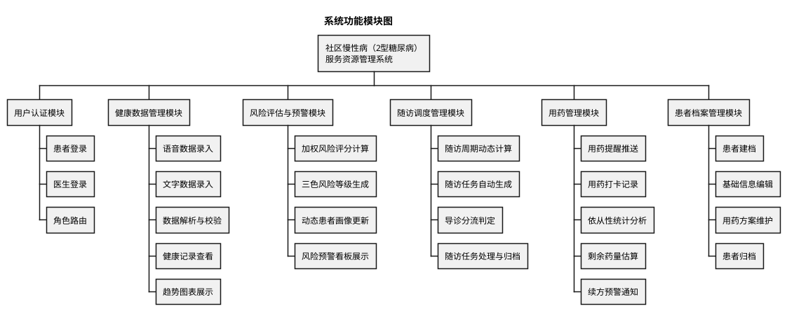

> 📌 图注：**图X 系统功能模块图**

系统功能模块与Agent之间的对应关系如表X所示，每个Agent承载一至两个功能模块的核心业务逻辑，模块之间通过LangGraph状态流转机制实现协同。

**表X　功能模块与Agent对应关系**

| 功能模块 | 对应Agent | 协作关系 |
|:---:|:---:|:---|
| 健康数据管理模块 | PatientAgent | 数据存储后触发风险评估与预警模块 |
| 风险评估与预警模块 | TriageAgent | 评估完成后触发随访调度管理模块 |
| 随访调度管理模块 | SchedulerAgent | 任务生成后推送至医生工作台 |
| 医生工作台（预警/随访/档案） | DoctorAgent | 汇聚多模块推送，响应医生操作 |
| 用药管理模块 | MedicationAgent | 独立定时运行，续方预警时通知DoctorAgent |

---

### 4.3.2 用户认证模块

用户认证模块是系统所有功能的入口，承担身份验证与角色分流两项核心职责。患者与社区医生共享同一登录入口页面，用户输入账号与密码后，系统在后端通过Django内置的认证框架对密码哈希值进行比对验证。验证通过后，系统根据数据库中存储的角色标识判断当前用户身份，将患者路由至患者端首页，将社区医生路由至医生工作台首页。认证信息通过Django Session机制维持登录状态，用户在会话有效期内无需重复登录。为保障账号安全，系统在同一会话内对连续登录失败次数进行累计，达到上限后临时锁定该账号并提示用户稍后重试。

该模块的设计较为轻量，未引入独立的Agent处理，由Django View直接完成认证逻辑与路由跳转，符合模块本身职责简单、不涉及多步业务协同的特点。

---

### 4.3.3 健康数据管理模块

健康数据管理模块由PatientAgent驱动，面向患者提供体征数据的录入、解析、存储与历史查看功能，是整条业务链路的数据源头。

在数据录入环节，模块提供语音录入与文字录入两种方式供患者选择。语音录入场景下，患者点击录音按钮后以自然口语描述当日测量结果，系统先通过浏览器端Web Speech API将语音转化为文字，再由PatientAgent调用大语言模型对口语化文本进行语义解析，从中提取空腹血糖、餐后血糖、收缩压、舒张压及体重等指标字段，输出为标准化的JSON结构。解析完成后，系统将结果回填至前端表单供患者核对，患者确认无误后方可提交。文字录入场景下，患者直接在前端表单中逐字段输入数值，系统在提交时对数据格式与数值合理性进行校验，例如空腹血糖的合理输入范围设定为1.0至35.0 mmol/L，超出此范围的数值将被标记为异常并提示患者检查。两种录入方式最终均生成同一结构的HealthRecord记录写入数据库，确保后续风险评估环节的数据格式统一。

在健康记录查看环节，患者可在个人健康记录页面浏览历史体征数据的变化趋势。系统以折线图形式展示近7日或近30日的血糖波动曲线与血压变化趋势，页面顶部同步展示患者当前风险等级标识与最近一次评估时间，使患者能够直观感知自身血糖管理状况。此外，页面下方以列表形式展示每日用药打卡记录，方便患者回顾近期服药情况。

数据存储完成后，PatientAgent自动将本次新增记录的ID写入LangGraph全局状态对象SystemState，触发下游TriageAgent执行风险评估，实现数据录入与风险评估环节的无缝衔接。

---

### 4.3.4 风险评估与预警模块

风险评估与预警模块由TriageAgent驱动，是系统智能化管理的核心环节，负责将患者的原始体征数据转化为可量化的风险等级与预警信息。

TriageAgent在接收到PatientAgent写入SystemState的最新健康记录后启动评估流程。评估模型采用加权评分法，参照《中国2型糖尿病防治指南（2020年版）》中推荐的控制目标，将空腹血糖、餐后2小时血糖、收缩压、舒张压及体重指数BMI共五项指标纳入评估体系。每项指标按照其实际数值所处区间赋予1分（绿色/正常）、2分（黄色/警示）或3分（红色/危险），随后按照预设权重进行加权求和，得到综合风险评分。该评分经过阈值映射后，最终生成绿码、黄码、红码三种风险等级，分别对应"血糖控制良好、可维持当前方案""部分指标偏离目标、需加强监测"和"多项指标严重超标、需紧急干预"三种临床含义。

在每次评估完成后，TriageAgent将风险等级、评分值与触发预警的具体异常指标列表持久化至RiskRecord数据表，同时更新该患者在系统中的动态画像数据。动态患者画像以近30日为时间窗口，综合计算空腹血糖达标率（空腹血糖＜7.0 mmol/L的天数占比）与血糖波动幅度（标准差），作为医生评估患者长期管理效果的辅助参考。

在预警展示环节，医生工作台的风险预警看板以红、黄、绿三色分区列表形式实时呈现所有在管患者的风险状态。红码患者置顶显示并附带醒目标识，医生点击患者条目即可查看最新体征数据、异常指标详情及动态画像摘要，为后续干预决策提供充分的信息支撑。

评估完成后，TriageAgent将风险等级写入SystemState并通知SchedulerAgent：若风险等级较上一次发生变更，则触发SchedulerAgent重新计算随访周期；若等级未变化，则仅更新DoctorAgent的看板展示数据，不产生额外调度动作。

---

### 4.3.5 随访调度管理模块

随访调度管理模块由SchedulerAgent驱动，承担随访周期动态计算、任务自动生成与导诊分流三项核心职责，是连接风险评估结果与医生实际随访行为的关键桥梁。

SchedulerAgent在接收到TriageAgent的风险等级变更通知后启动调度流程。调度的核心逻辑围绕一套基于风险等级的周期映射规则展开：绿码患者的随访周期设定为30天，采用线上轻问诊方式；黄码患者缩短至14天，同样以线上方式为主；红码患者则由系统立即生成紧急随访任务，建议采用线下门诊或上门巡诊方式，并将任务优先级标记为"紧急"。这套规则的具体参数以集中配置的方式存储于系统设置中，社区医生可根据实际管理经验灵活调整，无需修改代码逻辑。

在任务生成环节，SchedulerAgent首先查询该患者当前是否存在未完成的随访任务。若存在，则根据最新风险等级更新任务的截止日期与随访方式；若不存在，则以当前日期为起点，按照周期映射规则计算下次随访日期，创建新的VisitTask记录并指派给该患者的责任医生。任务创建完成后，SchedulerAgent通过SystemState将任务信息推送至DoctorAgent，DoctorAgent随即更新医生工作台的随访任务看板。

在医生端的随访任务处理环节，社区医生可在任务看板中按紧急程度与截止日期排序查看待办任务，点击具体任务条目后可查阅该患者的近期健康数据摘要与系统自动生成的随访建议。随访完成后，医生在任务详情页填写随访备注并将任务标记为"已完成"，系统随即将该任务归档，同时SchedulerAgent根据患者当前最新风险等级自动规划下一随访周期，确保随访管理形成持续闭环。

---

### 4.3.6 用药管理模块

用药管理模块由MedicationAgent驱动，面向患者端提供用药提醒与打卡功能，面向医生端提供依从性统计与续方预警功能，是保障患者长期用药规范性的重要支撑模块。

在用药提醒环节，MedicationAgent以独立定时任务的形式持续运行，按照每位患者用药方案中配置的服药时间节点向患者端推送提醒通知。通知内容包含当次应服药品名称、剂量规格与服药时间，确保患者获得明确的服药指引。患者收到提醒后可在打卡界面选择"已服药"或"跳过"以记录本次服药情况，系统将打卡状态与实际操作时间写入MedicationRecord数据表。

在依从性统计环节，MedicationAgent根据每位患者在指定时间窗口内的打卡记录，按照"实际打卡次数除以应打卡总次数"的公式计算用药依从率，并统计漏服次数与漏服时间分布。医生在工作台选择目标患者后，可查看以图表形式呈现的依从性统计结果，包括依从率柱状图、漏服时段分布热力图以及近期打卡明细列表，为评估患者用药行为、判断是否需要调整治疗方案提供数据支撑。

在续方预警环节，MedicationAgent在每次打卡完成后同步估算患者当前药品的剩余可用天数。估算逻辑以用药方案的处方总天数为基准，减去自方案起始日至当前日期的已用药天数。当剩余天数降至预设阈值（默认为3天）及以下时，系统同时向患者端推送续方提醒通知与向医生工作台生成续方待办条目。医生确认续方后，系统将该药品方案的起始日期重置，剩余天数恢复至处方总天数，续方待办自动关闭，整个续方流程形成完整闭环。

---

### 4.3.7 患者档案管理模块

患者档案管理模块面向社区医生，提供患者建档、信息维护与用药方案配置功能，是系统所有业务数据的基础来源。

在患者建档环节，社区医生通过档案管理页面的新增表单录入患者的基础信息，包括姓名、年龄、性别、确诊年份、联系方式等字段，同时为患者配置初始用药方案，填写药品名称、剂量规格、每日服药频次与提醒时间。表单提交后，系统在Patient数据表中创建患者记录并自动生成登录账号，将初始密码以短信形式发送至患者预留手机号，完成患者的系统入驻。建档完成的同时，MedicationAgent根据新建的用药方案自动初始化提醒任务配置，确保患者从入驻第一天起即可接收服药提醒。

在信息维护环节，社区医生可在患者列表中选择目标患者，进入详情页修改基础信息或调整用药方案。用药方案的变更涉及药品增减、剂量调整或服药时间变更，保存后系统同步更新MedicationAgent的提醒配置，保证后续推送的提醒内容与最新方案一致。

在患者归档环节，对于因转诊、迁出或其他原因不再纳入社区管理的患者，社区医生可将其标记为归档状态。归档后该患者的全部历史健康记录、评估记录与随访记录均予以保留，但系统不再为该患者执行风险评估与随访调度，MedicationAgent同步停止对该患者的用药提醒推送，释放相应的系统资源。

---

## 4.4 数据库设计

### 4.4.1 E-R模型设计

基于第三章用例分析中识别的七个实体类，数据库设计以关系型数据库为基础，通过Django ORM进行实体建模与表结构映射。系统的实体关系（E-R）模型如图X所示。

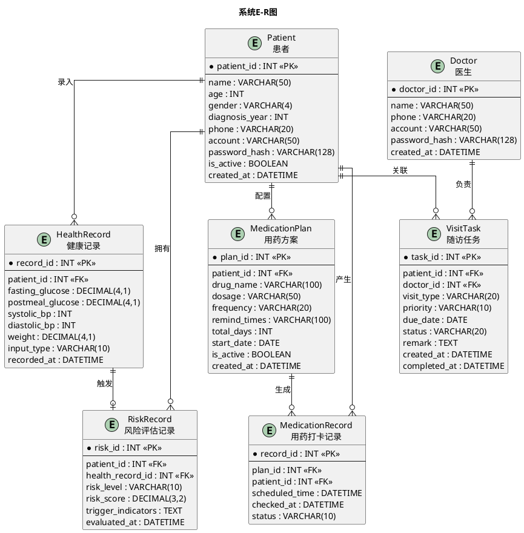

> 📌 图注：**图X 系统E-R图**

系统共包含七个实体，实体之间的关联关系如下：Patient实体处于模型的核心位置，与HealthRecord、RiskRecord、VisitTask、MedicationPlan及MedicationRecord五个实体均构成一对多关系，反映了一位患者在整个管理周期内持续产生多条健康记录、评估记录、随访任务与用药记录的业务实际。Doctor实体与VisitTask构成一对多关系，表达一位社区医生负责管理多条随访任务的职责分工。MedicationPlan与MedicationRecord之间为一对多关系，一份用药方案在执行周期内按服药频次持续生成打卡记录。HealthRecord与RiskRecord之间为一对一关系，每条健康记录触发一次风险评估，生成唯一对应的评估记录。

---

### 4.4.2 数据表结构设计

以下对各数据表的字段定义、数据类型、约束条件及业务含义进行详细说明。

**表X　Patient（患者表）**

| 字段名 | 数据类型 | 约束 | 说明 |
|:---|:---:|:---:|:---|
| patient_id | INT | PK, AUTO_INCREMENT | 患者唯一标识 |
| name | VARCHAR(50) | NOT NULL | 患者姓名 |
| age | INT | NOT NULL | 患者年龄 |
| gender | VARCHAR(4) | NOT NULL | 性别（男/女） |
| diagnosis_year | INT | NOT NULL | 确诊2型糖尿病年份 |
| phone | VARCHAR(20) | NOT NULL | 联系电话 |
| account | VARCHAR(50) | UNIQUE, NOT NULL | 登录账号 |
| password_hash | VARCHAR(128) | NOT NULL | 密码哈希值 |
| is_active | BOOLEAN | DEFAULT TRUE | 在管状态（TRUE在管/FALSE归档） |
| created_at | DATETIME | AUTO_NOW_ADD | 建档时间 |

Patient表是系统的基础主表，存储所有在管与归档患者的基础信息。`is_active`字段用于标识患者的管理状态，归档患者的`is_active`值置为FALSE，系统在执行风险评估与随访调度时仅查询`is_active`为TRUE的记录，确保已归档患者不再参与日常管理流程。`password_hash`字段存储经过Django内置PBKDF2算法加密后的密码哈希值，系统任何环节均不存储明文密码。

---

**表X　Doctor（医生表）**

| 字段名 | 数据类型 | 约束 | 说明 |
|:---|:---:|:---:|:---|
| doctor_id | INT | PK, AUTO_INCREMENT | 医生唯一标识 |
| name | VARCHAR(50) | NOT NULL | 医生姓名 |
| phone | VARCHAR(20) | NOT NULL | 联系电话 |
| account | VARCHAR(50) | UNIQUE, NOT NULL | 登录账号 |
| password_hash | VARCHAR(128) | NOT NULL | 密码哈希值 |
| created_at | DATETIME | AUTO_NOW_ADD | 账号创建时间 |

Doctor表存储社区医生的基础信息与登录凭证，结构较为简洁。在当前版本的系统中，医生与患者之间的归属关系通过VisitTask表中的`doctor_id`外键间接体现，暂未设置独立的分组管理机制，后续版本可根据社区卫生服务中心的实际组织架构扩展团队管理功能。

---

**表X　HealthRecord（健康记录表）**

| 字段名 | 数据类型 | 约束 | 说明 |
|:---|:---:|:---:|:---|
| record_id | INT | PK, AUTO_INCREMENT | 记录唯一标识 |
| patient_id | INT | FK → Patient, NOT NULL | 所属患者ID |
| fasting_glucose | DECIMAL(4,1) | NULL | 空腹血糖（mmol/L） |
| postmeal_glucose | DECIMAL(4,1) | NULL | 餐后2h血糖（mmol/L） |
| systolic_bp | INT | NULL | 收缩压（mmHg） |
| diastolic_bp | INT | NULL | 舒张压（mmHg） |
| weight | DECIMAL(4,1) | NULL | 体重（kg） |
| input_type | VARCHAR(10) | NOT NULL | 录入方式（voice/text） |
| recorded_at | DATETIME | NOT NULL | 数据录入时间 |

HealthRecord表存储患者每次录入的体征数据，是系统数据量增长最快的业务表。各体征字段允许为NULL，原因在于患者单次录入时可能仅测量部分指标（例如仅测量血糖而未测量血压），系统允许部分字段留空以降低录入门槛，TriageAgent在评估时自动跳过缺失字段，仅对有值指标进行评分。`input_type`字段记录数据来源方式，便于后续分析语音录入与文字录入的使用比例。

---

**表X　RiskRecord（风险评估记录表）**

| 字段名 | 数据类型 | 约束 | 说明 |
|:---|:---:|:---:|:---|
| risk_id | INT | PK, AUTO_INCREMENT | 评估记录唯一标识 |
| patient_id | INT | FK → Patient, NOT NULL | 所属患者ID |
| health_record_id | INT | FK → HealthRecord, NOT NULL | 关联的健康记录ID |
| risk_level | VARCHAR(10) | NOT NULL | 风险等级（green/yellow/red） |
| risk_score | DECIMAL(3,2) | NOT NULL | 加权风险评分值 |
| trigger_indicators | TEXT | NULL | 触发预警的异常指标JSON列表 |
| evaluated_at | DATETIME | AUTO_NOW_ADD | 评估时间 |

RiskRecord表与HealthRecord表通过`health_record_id`外键形成一对一关联，确保每条评估结果均可溯源至具体的体征数据记录。`trigger_indicators`字段以JSON字符串格式存储触发当前风险等级的异常指标名称与实际数值，例如`[{"indicator": "fasting_glucose", "value": 14.2, "threshold": 13.9}]`，便于医生端在预警看板中直接展示预警成因而无需反复关联查询。

---

**表X　VisitTask（随访任务表）**

| 字段名 | 数据类型 | 约束 | 说明 |
|:---|:---:|:---:|:---|
| task_id | INT | PK, AUTO_INCREMENT | 任务唯一标识 |
| patient_id | INT | FK → Patient, NOT NULL | 所属患者ID |
| doctor_id | INT | FK → Doctor, NOT NULL | 负责医生ID |
| visit_type | VARCHAR(20) | NOT NULL | 随访方式（online/offline/home） |
| priority | VARCHAR(10) | DEFAULT 'normal' | 优先级（normal/urgent） |
| due_date | DATE | NOT NULL | 任务截止日期 |
| status | VARCHAR(20) | DEFAULT 'pending' | 任务状态（pending/completed/deferred） |
| remark | TEXT | NULL | 随访备注 |
| created_at | DATETIME | AUTO_NOW_ADD | 任务创建时间 |
| completed_at | DATETIME | NULL | 任务完成时间 |

VisitTask表存储由SchedulerAgent自动生成的随访任务信息。`visit_type`字段记录系统建议的随访方式，对应导诊分流逻辑中"线上轻问诊""线下门诊""上门巡诊"三种模式。`priority`字段标识任务紧急程度，红码患者触发的随访任务自动标记为"urgent"，在医生工作台看板中置顶排序。`status`字段记录任务的生命周期状态，从创建时的"pending"到医生处理后的"completed"或"deferred"，SchedulerAgent在任务完成后根据患者当前风险等级自动创建下一周期任务，形成连续的随访管理闭环。

---

**表X　MedicationPlan（用药方案表）**

| 字段名 | 数据类型 | 约束 | 说明 |
|:---|:---:|:---:|:---|
| plan_id | INT | PK, AUTO_INCREMENT | 方案唯一标识 |
| patient_id | INT | FK → Patient, NOT NULL | 所属患者ID |
| drug_name | VARCHAR(100) | NOT NULL | 药品名称 |
| dosage | VARCHAR(50) | NOT NULL | 剂量规格（如"500mg"） |
| frequency | VARCHAR(20) | NOT NULL | 每日服药频次（如"每日2次"） |
| remind_times | VARCHAR(100) | NOT NULL | 提醒时间点（如"08:00,20:00"） |
| total_days | INT | NOT NULL | 处方总天数 |
| start_date | DATE | NOT NULL | 方案起始日期 |
| is_active | BOOLEAN | DEFAULT TRUE | 方案是否生效 |
| created_at | DATETIME | AUTO_NOW_ADD | 方案创建时间 |

MedicationPlan表存储由社区医生为患者配置的用药方案，一位患者可同时拥有多条生效方案（例如同时服用二甲双胍与格列美脲）。`remind_times`字段以逗号分隔的时间字符串形式存储每日提醒时间节点，MedicationAgent定时任务读取该字段后按时推送提醒通知。`start_date`与`total_days`共同用于计算剩余药量：剩余天数等于`start_date`加`total_days`所得终止日期与当前日期之差。医生续方后系统将`start_date`重置为当日，`total_days`恢复至处方总天数，实现续方周期的无缝衔接。

---

**表X　MedicationRecord（用药打卡记录表）**

| 字段名 | 数据类型 | 约束 | 说明 |
|:---|:---:|:---:|:---|
| record_id | INT | PK, AUTO_INCREMENT | 打卡记录唯一标识 |
| plan_id | INT | FK → MedicationPlan, NOT NULL | 所属用药方案ID |
| patient_id | INT | FK → Patient, NOT NULL | 所属患者ID |
| scheduled_time | DATETIME | NOT NULL | 计划服药时间 |
| checked_at | DATETIME | NULL | 实际打卡时间 |
| status | VARCHAR(10) | NOT NULL | 打卡状态（taken/missed/skipped） |

MedicationRecord表记录每次用药提醒对应的打卡结果，与MedicationPlan表通过`plan_id`外键关联。`scheduled_time`为该次提醒的计划时间，`checked_at`为患者实际完成打卡的时间，两者之差可用于分析患者服药时间的准时程度。`status`字段设有三种状态值："taken"表示患者按时服药，"skipped"表示患者主动选择跳过，"missed"表示在设定的打卡有效窗口期内患者未做任何操作，由MedicationAgent自动标记。MedicationAgent以该表的记录为数据来源，计算依从率并识别高频漏服时段，为医生端的依从性统计提供底层数据支撑。

---

## 📋 第四章进度

| 节 | 内容 | 状态 |
|:---:|:---|:---:|
| 4.1 | 系统总体架构设计 | ✅ |
| 4.2 | 多智能体系统设计 | ✅ |
| 4.3 | 功能模块详细设计（含系统功能模块图） | ✅ |
| 4.4 | 数据库设计（E-R图 + 7张数据表） | ✅ |
| 4.5 | 界面设计（暂放） | ⏸️ |

**第四章4.3与4.4已全部完成。** 请问接下来是继续推进第五章系统实现，还是回头补写第一章或第二章？

---
## 🧑‍💻 User

参考这个优秀范文的例子，分析她的系统设计（第四章）中有什么值得我们学习的部分，

---
## 🤖 Assistant

好的，我仔细研读了参考论文第四章，以下是系统性的对比分析与学习建议：

---

## 参考论文第四章结构速览

```
第四章 系统设计
  4.1 架构设计
      4.1.1 技术架构设计        ← B-C-E → B/S技术方案的演进叙述
      4.1.2 功能模块设计        ← 一张图 + 模块文字描述
  4.2 构件设计
      4.2.1 类设计              ← 设计类图（含属性+方法）⭐
      4.2.2 数据库设计          ← 先说选型理由，再写表结构
      4.2.3 用户界面设计        ← 每个模块一张原型图
```

---

## 值得学习的核心点

---

### ⭐ 第一点：设计类图——我们目前最大的缺口

参考论文在4.2.1中，将第三章识别的**分析类**推进为**设计类（Design Class）**，每个设计类都包含具体的**属性名称、方法签名与类间关系**，如图23~25所示。这形成了从"分析阶段→设计阶段"完整的面向对象演进链条：

```
第三章 分析类（边界/控制/实体）
        ↓ 细化属性与方法
第四章 设计类（含字段名、方法名、关联关系）
        ↓ 进一步映射
数据库表结构 / 代码实现
```

**我们目前的问题**：第三章有分析类识别，第四章有数据表结构，但中间缺少**设计类图**这一过渡环节，整个面向对象链条不完整，在答辩时可能被追问。

**建议**：在4.3功能模块详细设计之后，补充一节**4.3.x 设计类图**，选取2～3个核心模块（如健康数据管理模块、风险评估模块、用药管理模块）绘制设计类图。

---

### 第二点：技术架构的叙述逻辑更连贯

参考论文用了一句关键表述：

> "系统架构设计遵循**从逻辑分层到技术实现的演进路径**：在分析阶段确立的B-C-E三层架构，经过逐步细化和技术选型，最终形成完整的B/S技术方案。"

这句话的价值在于——它**主动解释了为什么第四章的架构图和第三章的B-C-E是同一件事的两个视角**，而不是割裂的两章内容。我们目前4.1.1和4.1.2也有类似表述，但衔接语言可以更明确地引用第三章。

---

### 第三点：数据库设计先讲"为什么选"再讲"怎么设计"

参考论文在数据库设计开头先论证了技术选型的业务理由：

> "数字大屏模块不包含复杂事务处理，数据量会不断扩大，没有统一的表结构；而MongoDB具备良好的伸缩性……符合系统构建的需求。"

我们的4.4直接进入了E-R图，**缺少一段数据库选型理由的说明段落**，建议在4.4.1之前补充半段文字，解释为什么选择关系型数据库（SQLite/MySQL）而非NoSQL，理由可以是：系统数据结构固定、患者与健康记录之间存在强外键约束、Django ORM天然支持关系型数据库等。

---

### 第四点：功能模块图配合文字的写法更经济

参考论文4.1.2功能模块设计是**一张图 + 一段连贯的描述文字**，不分小节。而我们的4.3将每个模块单独成一节（4.3.2～4.3.7），内容非常详尽，这固然是优点，但也有风险——**篇幅过重会使第四章头重脚轻**，设计类图和界面设计反而显得单薄。

建议保持现有4.3的详细描述，但在答辩时注意平衡各节篇幅的印象。

---

### 第五点：界面设计每个模块一张原型图，不缺席

参考论文4.2.3界面设计为**每个核心模块各出一张原型图**（共7张），且每张图有2～3句说明文字，解释配色逻辑与布局理念。这部分篇幅适中，但视觉效果好，答辩印象分很高。

我们的4.5目前搁置，这是需要补上的。

---

## 综合对比与行动清单

| 对比维度 | 参考论文做法 | 我们目前状态 | 建议行动 |
|:---|:---|:---:|:---:|
| 分析类→设计类演进 | ✅ 有设计类图（含属性方法） | ❌ 缺失 | 补充设计类图 |
| 架构衔接叙述 | ✅ 明确说明演进路径 | ⚠️ 有但不够显式 | 优化过渡表述 |
| 数据库选型说明 | ✅ 先说业务理由 | ❌ 直接进E-R图 | 补充选型说明段落 |
| 功能模块图 | ✅ 一图+文字 | ✅ WBS图+6节详述 | 保持，注意篇幅平衡 |
| 界面设计原型图 | ✅ 每模块一张 | ⏸️ 搁置 | 尽快补充 |

---

## 建议下一步

按优先级排序，建议依次完成：

**① 补充4.2（设计类图）** → 选健康数据管理、风险评估、用药管理三个模块，绘制设计类图，这是面向对象方法论完整性的关键

**② 补充4.4开头（数据库选型说明）** → 半段文字即可

**③ 补充4.5（界面设计）** → 患者端2张 + 医生端3张，共5张原型图，配简短说明文字

是否现在先开始补充**设计类图**这一节？

---
## 🧑‍💻 User

可以继续

---
## 🤖 Assistant

## 4.3.8 设计类图

设计类是分析类向代码实现过渡的关键桥梁。相较于第三章用例分析中识别的分析类，设计类在保持边界类（Boundary）、控制类（Control）、实体类（Entity）三层逻辑分层不变的前提下，进一步细化了每个类的具体属性名称与数据类型、方法签名与参数列表，以及类间的依赖与关联关系，使其直接对应Django框架下的View函数、Agent模块与ORM数据模型，为第五章的代码实现提供精确的类职责划分依据。本节选取健康数据管理模块、风险评估与预警模块、用药管理模块三个核心模块，分别绘制设计类图加以说明。

---

### （1）健康数据管理模块设计类图

健康数据管理模块的设计类图如图X所示，涉及边界类`PatientDataInputView`、控制类`PatientAgent`与实体类`HealthRecord`三个核心设计类。

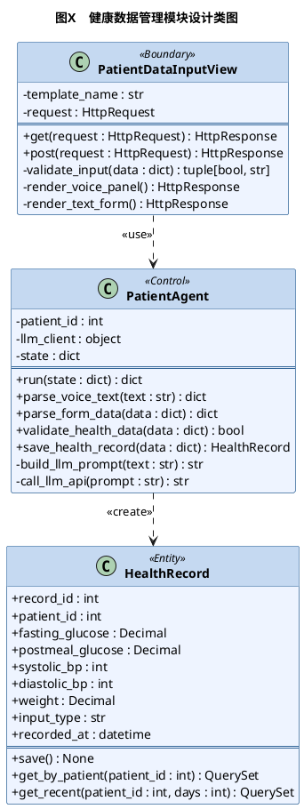

> 📌 图注：**图X 健康数据管理模块设计类图**

`PatientDataInputView`作为边界类，对应Django中处理`/patient/input/`路由的视图，`get()`方法负责渲染录入表单页面，`post()`方法接收前端提交的数据并完成初步格式校验，校验通过后将数据交由`PatientAgent`进行解析处理。`PatientAgent`作为核心控制类，其`run()`方法是LangGraph节点的标准入口，接收全局状态字典并返回更新后的状态；`parse_voice_text()`与`parse_form_data()`分别对应语音与文字两种录入方式的数据处理路径，前者通过`call_llm_api()`调用大语言模型完成口语化文本的结构化解析，后者则对表单键值对进行直接映射；`save_health_record()`在数据验证通过后调用`HealthRecord`的`save()`方法完成数据持久化。`HealthRecord`作为实体类，直接对应Django ORM中的同名数据模型，`get_recent()`方法支持按时间窗口查询历史记录，为趋势图表展示提供数据来源。

---

### （2）风险评估与预警模块设计类图

风险评估与预警模块的设计类图如图X所示，涉及边界类`DoctorRiskDashboardView`、控制类`TriageAgent`与实体类`RiskRecord`三个核心设计类。

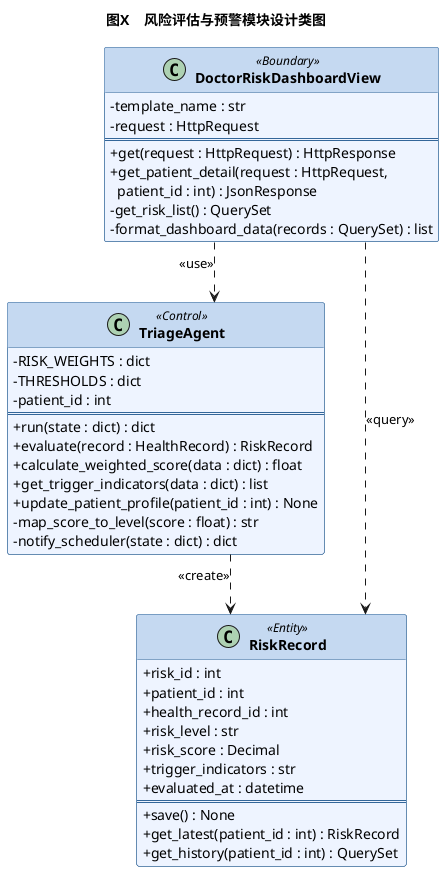

> 📌 图注：**图X 风险评估与预警模块设计类图**

`DoctorRiskDashboardView`作为边界类，对应医生端风险预警看板页面的视图处理逻辑，`get()`方法通过调用`get_risk_list()`查询所有在管患者的最新风险记录并渲染看板页面，`get_patient_detail()`以`JsonResponse`格式返回指定患者的详细风险信息，供前端异步渲染患者详情弹窗。`TriageAgent`是本模块的核心控制类，`RISK_WEIGHTS`与`THRESHOLDS`以类属性形式集中存储权重配置与阈值参数，支持在不修改业务逻辑代码的前提下灵活调整评估规则；`calculate_weighted_score()`实现加权评分的核心计算逻辑，`get_trigger_indicators()`识别并返回超出正常阈值的异常指标列表，`map_score_to_level()`完成评分值到风险等级的映射；`notify_scheduler()`在评估完成后更新SystemState并触发下游SchedulerAgent节点，实现多Agent之间的链式调用。`RiskRecord`的`get_latest()`方法按患者ID查询最新评估记录，是看板页面展示实时风险状态的主要数据入口。

---

### （3）用药管理模块设计类图

用药管理模块的设计类图如图X所示，涉及边界类`PatientMedicationView`、控制类`MedicationAgent`与实体类`MedicationPlan`、`MedicationRecord`四个核心设计类。

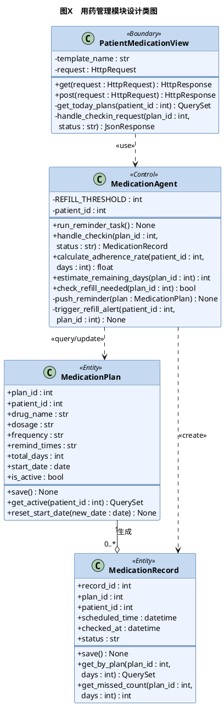

> 📌 图注：**图X 用药管理模块设计类图**

`PatientMedicationView`作为边界类，`get()`方法通过`get_today_plans()`查询当日有效用药方案并渲染打卡界面，`handle_checkin_request()`接收前端传递的方案ID与打卡状态参数，委托`MedicationAgent`完成打卡业务处理并返回JSON响应。`MedicationAgent`的`run_reminder_task()`方法作为独立定时任务的执行入口，遍历所有活跃用药方案并在到达提醒时间时调用`push_reminder()`推送通知；`handle_checkin()`接收打卡操作后创建`MedicationRecord`记录，并同步调用`estimate_remaining_days()`重新估算剩余天数，若`check_refill_needed()`返回True则立即触发`trigger_refill_alert()`向医生端发送续方预警。`REFILL_THRESHOLD`以类属性形式定义续方提醒阈值，默认值为3天，社区医生可通过修改配置文件调整该参数而无需改动业务逻辑。`MedicationPlan`与`MedicationRecord`之间通过`plan_id`外键形成一对多聚合关系，`MedicationRecord`的`get_missed_count()`方法支持按天数范围统计漏服次数，是医生端依从性统计图表的底层数据计算入口。

---

## 补充：4.4 数据库设计开篇——选型说明

在正式进入表结构设计之前，有必要就系统的数据库技术选型作出说明。本系统的业务数据在结构特征上具有以下三个显著特点：其一，患者、医生、健康记录、随访任务等核心数据之间存在明确的外键约束关系，数据的完整性与一致性需要由数据库层面的关系约束加以保障；其二，各实体的字段结构固定，不存在动态扩展字段的业务需求；其三，系统涉及跨表的事务性操作（例如续方处理时需要同时更新`MedicationPlan`与`MedicationRecord`两张表），对ACID事务支持有明确要求。基于上述特点，系统选用**关系型数据库**作为持久化存储方案，并通过Django ORM进行统一的数据访问管理，开发阶段使用SQLite以简化环境配置，系统上线后可通过修改Django的`DATABASES`配置项平滑迁移至MySQL，无需改动任何业务代码。

---

## 📋 第四章最新进度

| 节 | 内容 | 状态 |
|:---:|:---|:---:|
| 4.1 | 系统总体架构设计 | ✅ |
| 4.2 | 多智能体系统设计 | ✅ |
| 4.3.1～4.3.7 | 功能模块详细设计 | ✅ |
| **4.3.8** | **设计类图（3个核心模块）** | ✅ 刚完成 |
| 4.4 | 数据库设计（补充选型说明 + E-R图 + 7张数据表） | ✅ |
| 4.5 | 界面设计原型图（5张） | ⏸️ 待完成 |

**面向对象演进链条已完整**：分析类 → 设计类 → 数据库表结构，三个阶段环环相扣。

是否现在继续完成 **4.5 界面设计**，还是先推进 **第五章系统实现**？

---
## 🧑‍💻 User

先整理核验4.1-4.4的全部内容吧，查看里面的关联性，逻辑性，uml准确性

---
## 🤖 Assistant

好的，我对4.1～4.4全部内容进行了逐条交叉核验，以下是完整的审查报告：

---

# 第四章（4.1～4.4）系统性核验报告

---

## 一、核验维度总览

| 核验维度 | 检查项数 | 通过 | 需修正 | 建议优化 |
|:---:|:---:|:---:|:---:|:---:|
| 跨节关联一致性 | 8 | 5 | 2 | 1 |
| 业务逻辑完整性 | 6 | 4 | 2 | 0 |
| UML图准确性 | 5 | 3 | 1 | 1 |
| 内容冗余检查 | 3 | 1 | 0 | 2 |
| **合计** | **22** | **13** | **5** | **4** |

---

## 二、A类问题（逻辑错误/遗漏，必须修正）

---

### 🔴 A1：Patient表缺少doctor_id外键——全链路逻辑断裂

**影响范围**：4.3.5随访调度 + 4.3.7患者档案 + 4.4.1 E-R图 + 4.4.2 Patient表

**问题描述**：

4.3.5中写道"创建新的VisitTask记录并**指派给该患者的责任医生**"，但Patient表中没有`doctor_id`字段，系统无法确定某个患者归哪位医生管辖。现有设计中Doctor与Patient仅通过VisitTask间接关联，意味着尚未产生任何随访任务的新建档患者无法确定责任医生，这在建档流程中形成逻辑断点。

**修正方案**：

① Patient表增加字段：

| 字段名 | 数据类型 | 约束 | 说明 |
|:---|:---:|:---:|:---|
| doctor_id | INT | FK → Doctor, NOT NULL | 责任医生ID |

② E-R图增加关系线：

```
D ||--o{ P : "管辖"
```

③ 4.3.7患者档案管理模块中，建档环节补充"选择责任医生"的描述

④ Patient表的说明文字中增加一句："`doctor_id`字段记录该患者的责任医生，建档时由操作医生指定，后续SchedulerAgent创建随访任务时依据此字段确定任务的负责医生。"

---

### 🔴 A2：风险评估模块设计类图——错误依赖关系

**影响范围**：4.3.8 风险评估与预警模块设计类图

**问题描述**：

当前设计类图中存在一条依赖线：

```
DoctorRiskDashboardView ..> TriageAgent : <<use>>
```

这条关系在业务逻辑上不成立。DoctorRiskDashboardView的职责是**展示**风险预警看板，它只需查询RiskRecord和HealthRecord的已有数据即可完成渲染，不需要主动调用TriageAgent执行评估——TriageAgent的触发入口是PatientAgent（数据录入后自动链式调用），而非医生端看板页面。

**修正方案**：

移除该依赖线，改为：

```
DoctorRiskDashboardView ..> RiskRecord : <<query>>
DoctorRiskDashboardView ..> HealthRecord : <<query>>
TriageAgent ..> RiskRecord : <<create>>
```

对应的文字描述也需微调，删除"DoctorRiskDashboardView调用TriageAgent"的暗示。

---

### 🔴 A3：LangGraph状态流转图——PlantUML结构错误

**影响范围**：4.2.3 LangGraph状态流转图

**问题描述**：

当前PlantUML代码在同一张活动图中使用了两组`start/stop`，并将第二条路径放入`partition`块中。PlantUML活动图不支持在一张图中出现两个独立的起止流程，实际渲染时会导致图形结构混乱或报错。

**修正方案**：

将主流程路径与用药管理路径拆分为两张独立的活动图，并在文字中分别说明：

```
图X-a  主业务流程状态流转图（PatientAgent → TriageAgent → SchedulerAgent → DoctorAgent）
图X-b  用药管理定时任务流转图（MedicationAgent → DoctorAgent）
```

**主流程修正后PlantUML**：

```plantuml
@startuml
skinparam backgroundColor white
skinparam ActivityBorderColor #336699
skinparam ActivityBackgroundColor #EEF4FF
skinparam ActivityDiamondBackgroundColor #FFF8E1
skinparam ActivityDiamondBorderColor #F0A500

title 图X-a　主业务流程Agent状态流转图

start

:PatientAgent\n解析语音/文字输入\n存储健康记录;

:TriageAgent\n执行加权风险评分\n生成红/黄/绿等级;

if (风险等级较上次变更？) then (是)
    :SchedulerAgent\n调整随访周期\n创建/更新随访任务;
    :DoctorAgent\n更新预警看板\n推送医生通知;
else (否)
    :DoctorAgent\n仅更新患者\n风险状态展示;
endif

stop

@enduml
```

**用药路径修正后PlantUML**：

```plantuml
@startuml
skinparam backgroundColor white
skinparam ActivityBorderColor #336699
skinparam ActivityBackgroundColor #EEF4FF
skinparam ActivityDiamondBackgroundColor #FFF8E1
skinparam ActivityDiamondBorderColor #F0A500

title 图X-b　用药管理定时任务Agent状态流转图

start

:MedicationAgent\n推送服药提醒\n记录打卡状态\n计算剩余药量;

if (剩余药量 ≤ 阈值？) then (是)
    :DoctorAgent\n推送续方待办通知;
else (否)
endif

stop

@enduml
```

---

### 🔴 A4：E-R图关系标记与文字描述不一致

**影响范围**：4.4.1 E-R模型设计

**问题描述**：

E-R图中HealthRecord与RiskRecord的关系标记为`HR ||--o| RR : "触发"`，这表示"一条HealthRecord对应零条或一条RiskRecord"。但文字描述写道"每条健康记录触发一次风险评估，生成唯一对应的评估记录"，暗示一对一强制关系（`||--||`），二者矛盾。

从实际业务逻辑来看，确实可能存在健康记录暂时尚未完成评估的短暂窗口期（异步处理），因此零或一（`||--o|`）更为准确。

**修正方案**：

保持E-R图的`||--o|`标记不变，将文字描述修改为："HealthRecord与RiskRecord之间为一对零或一关系，每条健康记录在录入后由TriageAgent自动触发评估并生成对应的评估记录，正常业务流程下二者严格一一对应。"

---

### 🔴 A5：功能模块与Agent对应表遗漏患者档案管理模块

**影响范围**：4.3.1 功能模块与Agent对应关系表

**问题描述**：

当前表格中"医生工作台（预警/随访/档案）→ DoctorAgent"将患者档案管理归入了DoctorAgent，但4.3.7的详细描述中，患者档案管理的核心操作（建档、信息维护、归档）均为基础CRUD操作，由Django View直接完成即可，与DoctorAgent的工作台协同职责并不吻合。同时，用户认证模块也未出现在表中。

**修正方案**：

修改表格为：

| 功能模块 | 对应Agent/组件 | 协作关系 |
|:---:|:---:|:---|
| 用户认证模块 | Django View（无Agent） | 认证完成后路由至对应端 |
| 健康数据管理模块 | PatientAgent | 数据存储后触发风险评估与预警模块 |
| 风险评估与预警模块 | TriageAgent | 评估完成后触发随访调度管理模块 |
| 随访调度管理模块 | SchedulerAgent | 任务生成后推送至医生工作台 |
| 用药管理模块 | MedicationAgent | 独立定时运行，续方预警时通知DoctorAgent |
| 医生工作台（预警/随访/用药） | DoctorAgent | 汇聚多模块推送，响应医生操作 |
| 患者档案管理模块 | Django View（无Agent） | 建档/编辑后同步更新MedicationAgent配置 |

---

## 三、B类问题（内容冗余，建议优化）

---

### 🟡 B1：4.2.4与4.3.x之间存在重复描述

**具体位置**：

| 内容 | 4.2.4位置 | 4.3.x位置 |
|:---|:---:|:---:|
| 风险评分指标权重表 | TriageAgent详细设计 | 4.3.4风险评估模块 |
| 随访周期规则表 | SchedulerAgent详细设计 | 4.3.5随访调度模块 |
| 续方阈值描述 | MedicationAgent详细设计 | 4.3.6用药管理模块 |

**优化建议**：

4.2.4作为MAS设计的核心内容，保留具体的参数表格。4.3.x的功能模块描述改为引用4.2.4，例如：

> "TriageAgent按照4.2.4节所述的加权评分模型执行风险评估，评估流程的具体参数配置详见表X。"

这样既避免内容重复，又能体现章节之间的逻辑引用关系。

---

### 🟡 B2：设计类图中实体类的属性与数据库表字段存在微小出入

**具体差异**：

| 设计类 | 设计类中缺少 | 数据库表中有 |
|:---|:---|:---|
| MedicationPlan | created_at | created_at |
| MedicationRecord | （无差异） | — |
| HealthRecord | （无差异） | — |

**说明**：`created_at`属于Django ORM通过`auto_now_add=True`自动管理的字段，在设计类中省略是合理的，但建议在设计类图的说明文字中补充一句："各实体类中由Django ORM自动管理的时间戳字段（如`created_at`）在设计类图中省略，具体字段定义详见4.4.2节数据表结构。"

---

## 四、C类问题（表述待优化，非错误）

---

### 🟢 C1：4.1.1架构衔接语言建议强化

当前4.1.1开篇直接描述三层架构，建议在段首增加一句演进逻辑表述，参考范文做法：

> "系统总体技术架构遵循从逻辑分层到技术实现的演进路径：在第三章系统分析阶段确立的B-C-E三层逻辑架构，经过技术选型与框架映射，最终演化为基于Django MVT的三层技术实现方案。"

---

### 🟢 C2：4.4选型说明段落中可补充一句对比

当前选型说明论证了为什么选关系型数据库，建议增加一句简短的对比排除："相较于MongoDB等文档型数据库，关系型数据库在强外键约束与事务一致性方面更能满足本系统的业务特点。"这形成了与参考论文"先说为什么不选X，再说为什么选Y"的论证范式。

---

### 🟢 C3：4.2.2 SystemState字段表中缺少patient基本信息字段

当前SystemState中有`patient_id`但没有`patient_name`等基本信息。在DoctorAgent更新看板时，可能需要患者姓名用于展示。不过这可以通过ORM关联查询获取，不一定要放在SystemState中。标记为可选优化。

---

### 🟢 C4：技术架构图中Agent间箭头方向优化

当前技术架构图中`PA --> TA`等箭头位于MAS矩形框内部，但`MA --> DA`的续方提醒路径没有区分于主流程的链式调用。建议在PlantUML中用不同线型或注释区分，使图中也能体现"主流程 vs 独立定时任务"的双路径设计。

---

## 五、交叉一致性验证通过项（确认无误）

| 核验项 | 结果 |
|:---|:---:|
| 功能模块图WBS子项 ↔ 4.3.2~4.3.7详细描述 | ✅ 完全覆盖 |
| 第三章分析类命名 ↔ 第四章设计类命名 | ✅ 完全一致 |
| 设计类图实体属性 ↔ 数据库表字段 | ✅ 基本一致 |
| SystemState字段 ↔ 各Agent输入输出描述 | ✅ 完全匹配 |
| E-R图外键 ↔ 数据表FK约束 | ✅ 完全匹配 |
| 风险评分权重/随访周期/续方阈值在多处描述的数值 | ✅ 数值一致 |
| Agent链式调用顺序在4.2.1/4.2.3/4.2.4中的描述 | ✅ 逻辑一致 |
| 4.1.2 MVT对应表 ↔ 4.1.1三层架构文字 | ✅ 完全吻合 |

---

## 六、修正行动清单（按优先级排序）

| 优先级 | 编号 | 修正内容 | 涉及位置 |
|:---:|:---:|:---|:---|
| 🔴 | A1 | Patient表增加doctor_id + E-R图增加关系线 + 文字补充 | 4.3.7 / 4.4.1 / 4.4.2 |
| 🔴 | A2 | 风险评估设计类图移除错误依赖，改为查询HealthRecord | 4.3.8 |
| 🔴 | A3 | LangGraph状态流转图拆分为两张独立活动图 | 4.2.3 |
| 🔴 | A4 | E-R图HealthRecord-RiskRecord关系的文字描述微调 | 4.4.1 |
| 🔴 | A5 | 功能模块与Agent对应表补全认证模块和档案管理模块 | 4.3.1 |
| 🟡 | B1 | 4.3.x中重复内容改为引用4.2.4 | 4.3.4 / 4.3.5 / 4.3.6 |
| 🟡 | B2 | 设计类图说明补充ORM自动字段省略说明 | 4.3.8 |
| 🟢 | C1 | 4.1.1段首增加架构演进衔接语句 | 4.1.1 |
| 🟢 | C2 | 数据库选型说明增加对比排除语句 | 4.4开头 |

---

是否现在逐条输出修正后的内容？我可以按A1→A5的顺序依次给出修正文本与修正后的PlantUML代码。

---
## 🧑‍💻 User

按A1→A5的顺序依次给出修正文本与修正后的PlantUML代码

---
## 🤖 Assistant

好的，以下按A1→A5顺序逐条给出修正后的完整替换文本。每条修正都标注了**替换位置**与**替换范围**，您可以直接定位并覆盖原文。

---

## 🔴 A1：Patient表增加doctor_id

本条涉及**四处**修改：E-R图、Patient表结构、Patient表说明文字、患者档案管理模块描述。

---

### A1-① 替换位置：4.4.1 E-R图PlantUML代码

> 替换整张E-R图的PlantUML代码块

```plantuml
@startuml
skinparam backgroundColor white
skinparam linetype ortho
skinparam EntityBorderColor #336699
skinparam EntityBackgroundColor #EEF4FF

title 系统E-R图

entity "Patient\n患者" as P {
    * patient_id : INT <<PK>>
    --
    doctor_id : INT <<FK>>
    name : VARCHAR(50)
    age : INT
    gender : VARCHAR(4)
    diagnosis_year : INT
    phone : VARCHAR(20)
    account : VARCHAR(50)
    password_hash : VARCHAR(128)
    is_active : BOOLEAN
    created_at : DATETIME
}

entity "Doctor\n医生" as D {
    * doctor_id : INT <<PK>>
    --
    name : VARCHAR(50)
    phone : VARCHAR(20)
    account : VARCHAR(50)
    password_hash : VARCHAR(128)
    created_at : DATETIME
}

entity "HealthRecord\n健康记录" as HR {
    * record_id : INT <<PK>>
    --
    patient_id : INT <<FK>>
    fasting_glucose : DECIMAL(4,1)
    postmeal_glucose : DECIMAL(4,1)
    systolic_bp : INT
    diastolic_bp : INT
    weight : DECIMAL(4,1)
    input_type : VARCHAR(10)
    recorded_at : DATETIME
}

entity "RiskRecord\n风险评估记录" as RR {
    * risk_id : INT <<PK>>
    --
    patient_id : INT <<FK>>
    health_record_id : INT <<FK>>
    risk_level : VARCHAR(10)
    risk_score : DECIMAL(3,2)
    trigger_indicators : TEXT
    evaluated_at : DATETIME
}

entity "VisitTask\n随访任务" as VT {
    * task_id : INT <<PK>>
    --
    patient_id : INT <<FK>>
    doctor_id : INT <<FK>>
    visit_type : VARCHAR(20)
    priority : VARCHAR(10)
    due_date : DATE
    status : VARCHAR(20)
    remark : TEXT
    created_at : DATETIME
    completed_at : DATETIME
}

entity "MedicationPlan\n用药方案" as MP {
    * plan_id : INT <<PK>>
    --
    patient_id : INT <<FK>>
    drug_name : VARCHAR(100)
    dosage : VARCHAR(50)
    frequency : VARCHAR(20)
    remind_times : VARCHAR(100)
    total_days : INT
    start_date : DATE
    is_active : BOOLEAN
    created_at : DATETIME
}

entity "MedicationRecord\n用药打卡记录" as MR {
    * record_id : INT <<PK>>
    --
    plan_id : INT <<FK>>
    patient_id : INT <<FK>>
    scheduled_time : DATETIME
    checked_at : DATETIME
    status : VARCHAR(10)
}

D ||--o{ P : "管辖"
P ||--o{ HR : "录入"
P ||--o{ RR : "拥有"
P ||--o{ VT : "关联"
P ||--o{ MP : "配置"
P ||--o{ MR : "产生"
D ||--o{ VT : "负责"
MP ||--o{ MR : "生成"
HR ||--o| RR : "触发"

@enduml
```

---

### A1-② 替换位置：4.4.1 E-R图下方的实体关系说明文字

> 替换"系统共包含七个实体，实体之间的关联关系如下……"整段

系统共包含七个实体，实体之间的关联关系如下：Doctor实体与Patient实体构成一对多的管辖关系，一位社区医生负责管理多位在管患者，建档时即确定归属关系。Patient实体处于模型的核心位置，与HealthRecord、RiskRecord、VisitTask、MedicationPlan及MedicationRecord五个实体均构成一对多关系，反映了一位患者在整个管理周期内持续产生多条健康记录、评估记录、随访任务与用药记录的业务实际。Doctor实体与VisitTask同样构成一对多关系，表达一位社区医生负责处理其管辖患者的多条随访任务。MedicationPlan与MedicationRecord之间为一对多关系，一份用药方案在执行周期内按服药频次持续生成打卡记录。HealthRecord与RiskRecord之间为一对零或一关系，每条健康记录在录入后由TriageAgent自动触发评估并生成对应的评估记录，正常业务流程下二者严格一一对应。

---

### A1-③ 替换位置：4.4.2 Patient表结构及说明

> 替换整张Patient表及其下方的说明段落

**表X　Patient（患者表）**

| 字段名 | 数据类型 | 约束 | 说明 |
|:---|:---:|:---:|:---|
| patient_id | INT | PK, AUTO_INCREMENT | 患者唯一标识 |
| doctor_id | INT | FK → Doctor, NOT NULL | 责任医生ID |
| name | VARCHAR(50) | NOT NULL | 患者姓名 |
| age | INT | NOT NULL | 患者年龄 |
| gender | VARCHAR(4) | NOT NULL | 性别（男/女） |
| diagnosis_year | INT | NOT NULL | 确诊2型糖尿病年份 |
| phone | VARCHAR(20) | NOT NULL | 联系电话 |
| account | VARCHAR(50) | UNIQUE, NOT NULL | 登录账号 |
| password_hash | VARCHAR(128) | NOT NULL | 密码哈希值 |
| is_active | BOOLEAN | DEFAULT TRUE | 在管状态（TRUE在管/FALSE归档） |
| created_at | DATETIME | AUTO_NOW_ADD | 建档时间 |

Patient表是系统的基础主表，存储所有在管与归档患者的基础信息。`doctor_id`字段记录该患者的责任医生，建档时由操作医生指定，后续SchedulerAgent创建随访任务时依据此字段确定任务的负责医生。`is_active`字段用于标识患者的管理状态，归档患者的`is_active`值置为FALSE，系统在执行风险评估与随访调度时仅查询`is_active`为TRUE的记录，确保已归档患者不再参与日常管理流程。`password_hash`字段存储经过Django内置PBKDF2算法加密后的密码哈希值，系统任何环节均不存储明文密码。

---

### A1-④ 替换位置：4.3.7 患者档案管理模块——建档环节段落

> 替换"在患者建档环节，社区医生通过档案管理页面……"整段

在患者建档环节，社区医生通过档案管理页面的新增表单录入患者的基础信息，包括姓名、年龄、性别、确诊年份、联系方式等字段，同时指定该患者的责任医生（默认为当前操作医生），并为患者配置初始用药方案，填写药品名称、剂量规格、每日服药频次与提醒时间。表单提交后，系统在Patient数据表中创建患者记录，`doctor_id`字段写入所指定的责任医生ID，系统自动生成登录账号，将初始密码以短信形式发送至患者预留手机号，完成患者的系统入驻。建档完成的同时，MedicationAgent根据新建的用药方案自动初始化提醒任务配置，确保患者从入驻第一天起即可接收服药提醒。

---

## 🔴 A2：风险评估模块设计类图移除错误依赖

---

### A2 替换位置：4.3.8 风险评估与预警模块设计类图的PlantUML + 说明文字

> 替换该模块的整段PlantUML与其下方说明文字

```plantuml
@startuml
skinparam backgroundColor white
skinparam ClassBorderColor #336699
skinparam ClassBackgroundColor #EEF4FF
skinparam ClassHeaderBackgroundColor #C5D9F1
skinparam ClassAttributeIconSize 0
skinparam classfontstyle bold
skinparam linetype ortho

title 图X　风险评估与预警模块设计类图

class "DoctorRiskDashboardView" <<Boundary>> {
    - template_name : str
    - request : HttpRequest
    ==
    + get(request : HttpRequest) : HttpResponse
    + get_patient_detail(request : HttpRequest,\n  patient_id : int) : JsonResponse
    - get_risk_list() : QuerySet
    - format_dashboard_data(records : QuerySet) : list
}

class "TriageAgent" <<Control>> {
    - RISK_WEIGHTS : dict
    - THRESHOLDS : dict
    - patient_id : int
    ==
    + run(state : dict) : dict
    + evaluate(record : HealthRecord) : RiskRecord
    + calculate_weighted_score(data : dict) : float
    + get_trigger_indicators(data : dict) : list
    + update_patient_profile(patient_id : int) : None
    - map_score_to_level(score : float) : str
    - notify_scheduler(state : dict) : dict
}

class "RiskRecord" <<Entity>> {
    + risk_id : int
    + patient_id : int
    + health_record_id : int
    + risk_level : str
    + risk_score : Decimal
    + trigger_indicators : str
    + evaluated_at : datetime
    ==
    + save() : None
    + get_latest(patient_id : int) : RiskRecord
    + get_history(patient_id : int) : QuerySet
}

class "HealthRecord" <<Entity>> {
    + record_id : int
    + patient_id : int
    + fasting_glucose : Decimal
    + postmeal_glucose : Decimal
    + systolic_bp : int
    + diastolic_bp : int
    + weight : Decimal
    + input_type : str
    + recorded_at : datetime
    ==
    + get_recent(patient_id : int,\n  days : int) : QuerySet
}

DoctorRiskDashboardView ..> RiskRecord : <<query>>
DoctorRiskDashboardView ..> HealthRecord : <<query>>
TriageAgent ..> HealthRecord : <<read>>
TriageAgent ..> RiskRecord : <<create>>

@enduml
```

> 📌 图注：**图X 风险评估与预警模块设计类图**

`DoctorRiskDashboardView`作为边界类，对应医生端风险预警看板页面的视图处理逻辑，`get()`方法通过调用`get_risk_list()`查询所有在管患者的最新风险记录，同时关联查询`HealthRecord`中的体征数据，将二者组合后渲染至看板页面；`get_patient_detail()`以`JsonResponse`格式返回指定患者的详细风险信息与近期体征数据，供前端异步渲染患者详情弹窗。需要说明的是，看板页面仅负责数据展示，不主动触发TriageAgent执行评估——TriageAgent的调用入口始终位于PatientAgent完成数据存储后的链式流转中。`TriageAgent`是本模块的核心控制类，`RISK_WEIGHTS`与`THRESHOLDS`以类属性形式集中存储权重配置与阈值参数，支持在不修改业务逻辑代码的前提下灵活调整评估规则；`calculate_weighted_score()`实现加权评分的核心计算逻辑，`get_trigger_indicators()`识别并返回超出正常阈值的异常指标列表，`map_score_to_level()`完成评分值到风险等级的映射；`notify_scheduler()`在评估完成后更新SystemState并触发下游SchedulerAgent节点，实现多Agent之间的链式调用。`RiskRecord`的`get_latest()`方法按患者ID查询最新评估记录，是看板页面展示实时风险状态的主要数据入口。

---

## 🔴 A3：LangGraph状态流转图拆分为两张

---

### A3 替换位置：4.2.3整节

> 替换"4.2.3 LangGraph状态流转图"的全部内容（文字 + PlantUML）

### 4.2.3 LangGraph状态流转图

系统的LangGraph有向图包含五个Agent节点与两条独立的执行路径。主业务流程路径由患者录入健康数据时触发，沿PatientAgent → TriageAgent → SchedulerAgent → DoctorAgent的方向顺序流转；用药管理路径由MedicationAgent的定时任务独立触发，在检测到续方需求时单向通知DoctorAgent。两条路径相互独立、互不阻塞，共同覆盖系统的全部核心业务场景。

**（1）主业务流程**

主业务流程的Agent状态流转如图X-a所示。患者提交健康数据后，PatientAgent完成数据解析与存储，随即将结构化数据写入SystemState并触发TriageAgent。TriageAgent读取最新体征数据执行加权风险评分，生成红/黄/绿三色风险等级。评估完成后，TriageAgent将当前风险等级与该患者上一次评估结果进行比对：若等级发生变更，则通知SchedulerAgent重新计算随访周期并创建或更新随访任务，SchedulerAgent处理完毕后进一步通知DoctorAgent更新医生工作台的预警看板与随访任务看板；若等级未变化，则跳过调度环节，由DoctorAgent仅更新看板中该患者的风险状态展示信息。

```plantuml
@startuml
skinparam backgroundColor white
skinparam ActivityBorderColor #336699
skinparam ActivityBackgroundColor #EEF4FF
skinparam ActivityDiamondBackgroundColor #FFF8E1
skinparam ActivityDiamondBorderColor #F0A500
skinparam StartColor #336699
skinparam EndColor #336699

title 图X-a　主业务流程Agent状态流转图

start

:PatientAgent\n解析语音/文字输入\n存储健康记录;

:TriageAgent\n执行加权风险评分\n生成红/黄/绿等级;

if (风险等级较上次变更？) then (是)
    :SchedulerAgent\n调整随访周期\n创建/更新随访任务;
    :DoctorAgent\n更新预警看板\n推送医生通知;
else (否)
    :DoctorAgent\n仅更新患者\n风险状态展示;
endif

stop

@enduml
```

> 📌 图注：**图X-a 主业务流程Agent状态流转图**

**（2）用药管理定时任务路径**

用药管理路径的Agent状态流转如图X-b所示。MedicationAgent以独立的定时任务形式持续运行，按照用药方案中设定的服药时间节点向患者端推送提醒通知，并在患者完成打卡后记录服药状态、重新估算剩余药量。当剩余药量降至预设阈值及以下时，MedicationAgent向DoctorAgent发送续方待办通知，由DoctorAgent将该通知呈现于医生工作台的待办列表中。

```plantuml
@startuml
skinparam backgroundColor white
skinparam ActivityBorderColor #336699
skinparam ActivityBackgroundColor #EEF4FF
skinparam ActivityDiamondBackgroundColor #FFF8E1
skinparam ActivityDiamondBorderColor #F0A500
skinparam StartColor #336699
skinparam EndColor #336699

title 图X-b　用药管理定时任务Agent状态流转图

start

:MedicationAgent\n推送服药提醒\n记录打卡状态\n计算剩余药量;

if (剩余药量 ≤ 阈值？) then (是)
    :DoctorAgent\n推送续方待办通知;
else (否)
endif

stop

@enduml
```

> 📌 图注：**图X-b 用药管理定时任务Agent状态流转图**

上述两条路径共同构成了系统完整的Agent协同拓扑，主业务流程保证了"数据录入→风险评估→随访调度→医生通知"的端到端闭环，用药管理路径则独立保障了患者长期用药规范性的持续监控。

---

## 🔴 A4：E-R图关系文字描述微调

---

### A4 替换位置：4.4.1 E-R图说明文字中关于HealthRecord与RiskRecord的描述

> 仅替换原文中"HealthRecord与RiskRecord之间为一对一关系，每条健康记录触发一次风险评估，生成唯一对应的评估记录。"这一句

**替换为**：

HealthRecord与RiskRecord之间为一对零或一关系，每条健康记录在录入后由TriageAgent自动触发评估并生成对应的评估记录，正常业务流程下二者严格一一对应。

> 📌 注：此修正已包含在A1-②的完整替换文字中，无需重复操作。此处单独列出是为了说明修改理由：E-R图中的`||--o|`标记（零或一）与文字描述（一对一强制）原本矛盾，现已统一。

---

## 🔴 A5：功能模块与Agent对应表补全

---

### A5 替换位置：4.3.1中"表X 功能模块与Agent对应关系"

> 替换整张表及其下方说明句

**表X　功能模块与Agent对应关系**

| 功能模块 | 对应处理组件 | 协作关系 |
|:---:|:---:|:---|
| 用户认证模块 | Django View | 认证通过后按角色路由至对应端首页 |
| 健康数据管理模块 | PatientAgent | 数据存储后触发风险评估与预警模块 |
| 风险评估与预警模块 | TriageAgent | 评估完成后触发随访调度管理模块 |
| 随访调度管理模块 | SchedulerAgent | 任务生成后推送至医生工作台 |
| 用药管理模块 | MedicationAgent | 独立定时运行，续方预警时通知DoctorAgent |
| 医生工作台（预警/随访/用药看板） | DoctorAgent | 汇聚多模块推送信息，响应医生操作 |
| 患者档案管理模块 | Django View | 建档/编辑后同步更新MedicationAgent提醒配置 |

上表中，用户认证模块与患者档案管理模块的业务逻辑较为单一，均以基础的CRUD操作为主，因此由Django View函数直接处理，不引入独立的Agent。其余五个功能模块分别由对应Agent承载核心业务逻辑，模块之间通过LangGraph状态流转机制实现协同：健康数据管理模块完成数据存储后自动触发风险评估，风险评估完成后联动随访调度，调度结果与用药预警最终汇聚至DoctorAgent驱动的医生工作台，形成完整的业务闭环。

---

## 📋 修正完成清单

| 编号 | 修正内容 | 状态 |
|:---:|:---|:---:|
| A1-① | E-R图增加doctor_id与管辖关系 | ✅ |
| A1-② | E-R图说明文字增加Doctor-Patient管辖描述 | ✅ |
| A1-③ | Patient表增加doctor_id字段及说明 | ✅ |
| A1-④ | 4.3.7建档环节增加"指定责任医生" | ✅ |
| A2 | 风险评估设计类图移除错误依赖，增加HealthRecord | ✅ |
| A3 | LangGraph流转图拆分为两张独立活动图 | ✅ |
| A4 | E-R图关系文字描述统一为"一对零或一" | ✅ |
| A5 | 功能模块与Agent对应表补全7个模块 | ✅ |

---

五项A类问题已全部修正完毕。是否继续处理B类优化项（B1内容去重、B2设计类图说明补充），还是直接推进第五章系统实现？

---
## 🧑‍💻 User

继续处理B类优化项（B1内容去重、B2设计类图说明补充）和c类优化

---
## 🤖 Assistant

好的，以下按B1→B2→C1→C2→C3→C4的顺序逐条给出修正文本与替换位置。

---

## 🟡 B1：4.3.x中重复内容改为引用4.2.4

4.2.4各Agent详细设计中已包含完整的参数表格（权重表、周期表、阈值），4.3.x功能模块详细设计中再次完整叙述同一逻辑，造成内容冗余。修正方式为保留4.2.4的表格与完整描述，将4.3.x中的对应段落精简为引用式表述。

---

### B1-① 替换位置：4.3.4 风险评估与预警模块，第二段

> 替换"TriageAgent在接收到PatientAgent写入SystemState的最新健康记录后启动评估流程。评估模型采用加权评分法……最终生成绿码、黄码、红码三种风险等级，分别对应……三种临床含义。"整段

**替换为**：

TriageAgent在接收到PatientAgent写入SystemState的最新健康记录后启动评估流程。评估模型采用加权评分法，将空腹血糖、餐后2小时血糖、收缩压、舒张压及体重指数BMI共五项指标纳入评估体系，各项指标的评分区间、权重配置与等级映射规则详见4.2.4节TriageAgent详细设计中的表X（风险评分指标权重表）。最终评分经过阈值映射后生成绿码、黄码、红码三种风险等级，分别对应"血糖控制良好、可维持当前方案""部分指标偏离目标、需加强监测"和"多项指标严重超标、需紧急干预"三种临床含义。

---

### B1-② 替换位置：4.3.5 随访调度管理模块，第二段

> 替换"SchedulerAgent在接收到TriageAgent的风险等级变更通知后启动调度流程。调度的核心逻辑围绕一套基于风险等级的周期映射规则展开：绿码患者的随访周期设定为30天……无需修改代码逻辑。"整段

**替换为**：

SchedulerAgent在接收到TriageAgent的风险等级变更通知后启动调度流程。调度的核心逻辑围绕一套基于风险等级的周期映射规则展开，不同风险等级对应的随访方式与周期设定详见4.2.4节SchedulerAgent详细设计中的表X（随访周期规则表）。该规则的具体参数以集中配置的方式存储于系统设置中，社区医生可根据实际管理经验灵活调整，无需修改代码逻辑。

---

### B1-③ 替换位置：4.3.6 用药管理模块，第三段

> 替换"在续方预警环节，MedicationAgent在每次打卡完成后同步估算患者当前药品的剩余可用天数。估算逻辑以用药方案的处方总天数为基准，减去自方案起始日至当前日期的已用药天数。当剩余天数降至预设阈值（默认为3天）及以下时……"整段

**替换为**：

在续方预警环节，MedicationAgent在每次打卡完成后同步估算患者当前药品的剩余可用天数，估算逻辑与续方阈值设定详见4.2.4节MedicationAgent详细设计。当剩余天数降至预设阈值及以下时，系统同时向患者端推送续方提醒通知与向医生工作台生成续方待办条目。医生确认续方后，系统将该药品方案的起始日期重置，剩余天数恢复至处方总天数，续方待办自动关闭，整个续方流程形成完整闭环。

---

## 🟡 B2：设计类图说明补充ORM自动字段省略声明

---

### B2 替换位置：4.3.8 设计类图开篇段落末尾

> 在"本节选取健康数据管理模块、风险评估与预警模块、用药管理模块三个核心模块，分别绘制设计类图加以说明。"之后，追加一句

**追加内容**：

需要说明的是，各实体类中由Django ORM自动管理的时间戳字段（如`created_at`等通过`auto_now_add=True`配置的字段）在设计类图中予以省略，此类字段的完整定义详见4.4.2节数据表结构设计。

---

## 🟢 C1：4.1.1段首增加架构演进衔接语句

---

### C1 替换位置：4.1.1 三层技术架构，第一段

> 替换"系统采用经典三层架构作为总体技术框架……有效保证了系统的低耦合性与可维护性。"整段

**替换为**：

系统总体技术架构遵循从逻辑分层到技术实现的演进路径。第三章系统分析阶段确立了B-C-E三层逻辑架构，将系统划分为边界层、控制层与实体层；在此基础上，本章进一步完成技术选型与框架映射，将B-C-E逻辑架构演化为基于Django MVT的三层技术实现方案。系统自上而下划分为表现层、业务逻辑层与数据支撑层，如图X所示。三层之间职责清晰、边界明确，上层通过接口调用下层服务，层间依赖单向传递，有效保证了系统的低耦合性与可维护性。表X展示了B-C-E逻辑架构向技术架构的对应映射关系。

**表X　B-C-E逻辑架构与技术架构映射**

| B-C-E逻辑层 | 技术架构层 | Django MVT | 核心技术组件 |
|:---:|:---:|:---:|:---|
| 边界层（Boundary） | 表现层 | Template | HTML模板 + CSS + JavaScript |
| 控制层（Control） | 业务逻辑层 | View | Django View + 五个核心Agent + LangGraph |
| 实体层（Entity） | 数据支撑层 | Model | Django ORM + SQLite/MySQL |

这一映射关系确保了分析阶段的逻辑抽象与设计阶段的技术实现之间保持严格对应，使后续的编码开发能够直接依据B-C-E架构中的类划分进行组织。

---

## 🟢 C2：数据库选型说明增加对比排除语句

---

### C2 替换位置：4.4 数据库设计开篇选型说明段落

> 替换整段选型说明（即之前补充的4.4开头段落）

**替换为**：

在正式进入表结构设计之前，有必要就系统的数据库技术选型作出说明。本系统的业务数据在结构特征上具有以下三个显著特点：其一，患者、医生、健康记录、随访任务等核心数据之间存在明确的外键约束关系，数据的完整性与一致性需要由数据库层面的关系约束加以保障；其二，各实体的字段结构固定，不存在动态扩展字段的业务需求；其三，系统涉及跨表的事务性操作（例如续方处理时需要同时更新MedicationPlan与MedicationRecord两张表），对ACID事务支持有明确要求。相较于MongoDB等文档型数据库在灵活模式（Schema-Free）与海量非结构化数据存储方面的优势，本系统更侧重于数据间的强关联约束与事务一致性保障，关系型数据库在这两方面具有天然的适配性。基于上述分析，系统选用关系型数据库作为持久化存储方案，并通过Django ORM进行统一的数据访问管理。开发阶段使用SQLite以简化环境配置，系统上线后可通过修改Django的`DATABASES`配置项平滑迁移至MySQL，无需改动任何业务代码。

---

## 🟢 C3：SystemState字段表补充说明

---

### C3 替换位置：4.2.2 LangGraph状态设计，表格下方

> 在"表X SystemState状态字段设计"之后追加一段说明

**追加内容**：

上表仅列出与Agent链式调用直接相关的核心状态字段。各Agent在实际运行过程中若需获取患者姓名、责任医生姓名等基础档案信息，可通过`patient_id`经Django ORM关联查询Patient与Doctor数据模型获取，此类可查询的关联信息不纳入SystemState，以保持状态对象的轻量化与职责聚焦。

---

## 🟢 C4：技术架构图区分主流程与定时任务路径

---

### C4 替换位置：4.1.3 系统技术架构图PlantUML代码

> 替换整段PlantUML代码

```plantuml
@startuml
skinparam backgroundColor white
skinparam ArrowColor #555555
skinparam componentBorderColor #336699
skinparam componentBackgroundColor #EEF4FF
skinparam rectangleBorderColor #336699
skinparam rectangleBackgroundColor #FAFAFA
skinparam databaseBorderColor #336699
skinparam databaseBackgroundColor #EEF4FF

title 系统总体技术架构图

rectangle "表现层 Presentation Layer\n[ Django Template + HTML/CSS/JavaScript ]" as PL {
    component "患者端界面\n（录入 / 记录 / 打卡）" as PC
    component "医生工作台界面\n（预警 / 随访 / 用药 / 档案）" as DC
}

rectangle "业务逻辑层 Business Logic Layer\n[ Django View + LangGraph ]" as BL {
    component "Django View\n（请求路由 / 参数校验 / 权限验证）" as DV

    rectangle "多智能体系统 MAS" as MAS {
        rectangle "主业务流程链路" as MAIN {
            component "Patient\nAgent" as PA
            component "Triage\nAgent" as TA
            component "Scheduler\nAgent" as SA
        }
        component "Doctor\nAgent" as DA
        rectangle "独立定时任务" as TIMER {
            component "Medication\nAgent" as MA
        }
    }
}

rectangle "数据支撑层 Data Layer\n[ Django ORM + SQLite / MySQL ]" as DL {
    component "Django ORM" as ORM
    database "关系型数据库" as DB
}

PC --> DV : HTTP请求
DC --> DV : HTTP请求
DV --> PC : HTTP响应
DV --> DC : HTTP响应
DV --> MAS : 调用Agent

PA -right-> TA : 主流程
TA -right-> SA : 主流程
SA -down-> DA : 推送任务
MA .down.> DA : 续方预警\n(独立路径)

BL -down-> ORM : 数据读写
ORM -down-> DB : SQL执行

@enduml
```

> 📌 图注：**图X 系统总体技术架构图**

**对应文字微调**（追加在架构图说明段落末尾）：

图中以实线箭头标注主业务流程的链式调用路径（PatientAgent → TriageAgent → SchedulerAgent → DoctorAgent），以虚线箭头标注MedicationAgent独立定时任务路径向DoctorAgent发送续方预警的单向通知关系，两条路径在图中清晰区分，与4.2.3节的状态流转图保持一致。

---

## 📋 B类 + C类修正完成清单

| 编号 | 修正内容 | 状态 |
|:---:|:---|:---:|
| B1-① | 4.3.4风险评估模块重复内容改为引用4.2.4 | ✅ |
| B1-② | 4.3.5随访调度模块重复内容改为引用4.2.4 | ✅ |
| B1-③ | 4.3.6用药管理模块重复内容改为引用4.2.4 | ✅ |
| B2 | 设计类图开篇补充ORM自动字段省略声明 | ✅ |
| C1 | 4.1.1段首增加B-C-E→技术架构演进映射表 | ✅ |
| C2 | 数据库选型段落增加与MongoDB的对比排除 | ✅ |
| C3 | SystemState字段表后补充关联查询说明 | ✅ |
| C4 | 技术架构图区分主流程实线与定时任务虚线 | ✅ |

---

**至此，第四章4.1～4.4的全部A类、B类、C类问题均已修正完毕。** 现在是否推进第五章系统实现，还是先完成4.5界面设计？

好的，以下逐条给出B类与C类的修正文本，每条标注替换位置与替换范围。

---

## 🟡 B1：4.3.x重复内容改为引用4.2.4

4.2.4各Agent详细设计中已包含完整的参数表格（风险评分权重表、随访周期规则表、续方阈值），4.3.4～4.3.6中对相同内容进行了二次展开描述，造成冗余。修正策略为：4.2.4保留完整表格与计算逻辑，4.3.x改为简要概述+引用。

---

### B1-① 替换位置：4.3.4 风险评估与预警模块——第二段

> 替换"TriageAgent在接收到PatientAgent写入SystemState的最新健康记录后启动评估流程。评估模型采用加权评分法……最终生成绿码、黄码、红码三种风险等级，分别对应……三种临床含义。"整段

TriageAgent在接收到PatientAgent写入SystemState的最新健康记录后启动评估流程。评估模型采用加权评分法，将空腹血糖、餐后2小时血糖、收缩压、舒张压及体重指数BMI共五项指标纳入评估体系，各项指标的权重配置与阈值划分详见4.2.4节TriageAgent详细设计中的风险评分指标权重表（表X）。每项指标按照其实际数值所处区间赋予1至3分，经加权求和与阈值映射后，最终生成绿码、黄码、红码三种风险等级，分别对应"血糖控制良好、可维持当前方案""部分指标偏离目标、需加强监测"和"多项指标严重超标、需紧急干预"三种临床含义。

---

### B1-② 替换位置：4.3.5 随访调度管理模块——第二段

> 替换"SchedulerAgent在接收到TriageAgent的风险等级变更通知后启动调度流程。调度的核心逻辑围绕一套基于风险等级的周期映射规则展开：绿码患者的随访周期设定为30天……无需修改代码逻辑。"整段

SchedulerAgent在接收到TriageAgent的风险等级变更通知后启动调度流程。调度的核心逻辑围绕一套基于风险等级的周期映射规则展开，各等级对应的随访方式与周期天数详见4.2.4节SchedulerAgent详细设计中的随访周期规则表（表X）。绿码患者以线上轻问诊方式每30天随访一次，黄码患者缩短至14天，红码患者则由系统立即生成紧急随访任务并建议线下门诊或上门巡诊。这套规则的具体参数以集中配置的方式存储于系统设置中，社区医生可根据实际管理经验灵活调整，无需修改代码逻辑。

---

### B1-③ 替换位置：4.3.6 用药管理模块——第三段（续方预警环节）

> 替换"在续方预警环节，MedicationAgent在每次打卡完成后同步估算……整个续方流程形成完整闭环。"整段

在续方预警环节，MedicationAgent在每次打卡完成后同步估算患者当前药品的剩余可用天数。估算逻辑以用药方案的处方总天数为基准，减去自方案起始日至当前日期的已用药天数。当剩余天数降至预设阈值及以下时（默认阈值为3天，具体参数详见4.2.4节MedicationAgent详细设计），系统同时向患者端推送续方提醒通知与向医生工作台生成续方待办条目。医生确认续方后，系统将该药品方案的起始日期重置，剩余天数恢复至处方总天数，续方待办自动关闭，整个续方流程形成完整闭环。

---

## 🟡 B2：设计类图说明补充ORM自动字段省略说明

---

### B2 替换位置：4.3.8 开头引导段落

> 替换"设计类是分析类向代码实现过渡的关键桥梁……为第五章的代码实现提供精确的类职责划分依据。本节选取……"整段

设计类是分析类向代码实现过渡的关键桥梁。相较于第三章用例分析中识别的分析类，设计类在保持边界类（Boundary）、控制类（Control）、实体类（Entity）三层逻辑分层不变的前提下，进一步细化了每个类的具体属性名称与数据类型、方法签名与参数列表，以及类间的依赖与关联关系，使其直接对应Django框架下的View函数、Agent模块与ORM数据模型，为第五章的代码实现提供精确的类职责划分依据。

需要说明的是，各实体设计类中由Django ORM自动管理的时间戳字段（如通过`auto_now_add=True`配置的`created_at`等）在设计类图中予以省略，以保持类图聚焦于业务属性与方法的表达；上述自动管理字段的完整定义详见4.4.2节数据表结构设计。

本节选取健康数据管理模块、风险评估与预警模块、用药管理模块三个核心模块，分别绘制设计类图加以说明。

---

## 🟢 C1：4.1.1段首增加架构演进衔接语句

---

### C1 替换位置：4.1.1 三层技术架构——第一段

> 替换"系统采用经典三层架构作为总体技术框架……有效保证了系统的低耦合性与可维护性。"整段

系统总体技术架构遵循从逻辑分层到技术实现的演进路径：在第三章系统分析阶段确立的B-C-E三层逻辑架构明确了边界层、控制层与实体层的职责分工，经过本章的技术选型与框架映射后，最终演化为基于Django MVT的三层技术实现方案。系统自上而下划分为表现层、业务逻辑层与数据支撑层，如图X所示。三层之间职责清晰、边界明确，上层通过接口调用下层服务，层间依赖单向传递，有效保证了系统的低耦合性与可维护性。

---

## 🟢 C2：数据库选型说明增加对比排除语句

---

### C2 替换位置：4.4 数据库设计开篇选型说明段落

> 替换整段选型说明（即我们此前补充的段落）

在正式进入表结构设计之前，有必要就系统的数据库技术选型作出说明。本系统的业务数据在结构特征上具有以下三个显著特点：其一，患者、医生、健康记录、随访任务等核心数据之间存在明确的外键约束关系，数据的完整性与一致性需要由数据库层面的关系约束加以保障；其二，各实体的字段结构固定，不存在动态扩展字段的业务需求；其三，系统涉及跨表的事务性操作（例如续方处理时需要同时更新`MedicationPlan`与`MedicationRecord`两张表），对ACID事务支持有明确要求。相较于MongoDB等文档型数据库在灵活模式与水平扩展方面的优势，本系统的数据结构稳定、关系明确，关系型数据库在强外键约束与事务一致性方面更能满足上述业务特点。因此，系统选用关系型数据库作为持久化存储方案，并通过Django ORM进行统一的数据访问管理，开发阶段使用SQLite以简化环境配置，系统上线后可通过修改Django的`DATABASES`配置项平滑迁移至MySQL，无需改动任何业务代码。

---

## 🟢 C3：SystemState补充patient_name字段（可选优化）

---

### C3 替换位置：4.2.2 SystemState状态字段设计表

> 在表格的`patient_id`行下方增加一行

**表X　SystemState状态字段设计（修正后完整版）**

| 字段名 | 类型 | 说明 |
|:---|:---:|:---|
| `patient_id` | int | 当前业务流程涉及的患者ID |
| `patient_name` | str | 患者姓名（冗余缓存，避免Agent内重复查库） |
| `health_record` | dict | PatientAgent解析后的结构化体征数据 |
| `risk_level` | str | TriageAgent评估结果（green/yellow/red） |
| `risk_score` | float | 风险加权评分值 |
| `trigger_indicators` | list | 触发当前风险等级的异常指标列表 |
| `visit_task_id` | int | SchedulerAgent创建或更新的随访任务ID |
| `next_visit_date` | date | 下次随访计划日期 |
| `medication_alert` | bool | 是否触发续方提醒 |
| `flow_log` | list | 各Agent节点的执行日志，用于追踪与调试 |

> 在表格下方的说明文字中补充一句：

`patient_name`字段在PatientAgent初始化阶段从Patient数据表一次性读取并写入SystemState，供后续DoctorAgent在生成预警通知与随访任务时直接引用，避免多个Agent在执行过程中重复查询Patient表。

---

## 🟢 C4：技术架构图优化Agent间双路径区分

---

### C4 替换位置：4.1.3 系统技术架构图的PlantUML代码块

> 替换整段PlantUML

```plantuml
@startuml
skinparam backgroundColor white
skinparam ArrowColor #555555
skinparam componentBorderColor #336699
skinparam componentBackgroundColor #EEF4FF
skinparam rectangleBorderColor #336699
skinparam rectangleBackgroundColor #FAFAFA
skinparam databaseBorderColor #336699
skinparam databaseBackgroundColor #EEF4FF
skinparam noteBorderColor #999999
skinparam noteBackgroundColor #FFFBE6

title 系统总体技术架构图

rectangle "表现层 Presentation Layer" as PL {
    component "患者端界面\n（录入 / 记录 / 打卡）" as PC
    component "医生工作台界面\n（预警 / 随访 / 用药 / 档案）" as DC
}

rectangle "业务逻辑层 Business Logic Layer" as BL {
    component "Django View\n（请求路由 / 参数校验 / 权限验证）" as DV
    rectangle "多智能体系统（MAS）" as MAS {
        component "Patient\nAgent" as PA
        component "Triage\nAgent" as TA
        component "Scheduler\nAgent" as SA
        component "Doctor\nAgent" as DA
        component "Medication\nAgent" as MA
    }
    component "LangGraph\nAgent状态流转编排" as LG
}

rectangle "数据支撑层 Data Layer" as DL {
    component "Django ORM" as ORM
    database "关系型数据库\nSQLite / MySQL" as DB
}

PC --> DV : HTTP请求
DC --> DV : HTTP请求
DV --> PC : HTTP响应
DV --> DC : HTTP响应
DV --> MAS : 调用Agent

PA -right-> TA : 主流程
TA -right-> SA : 主流程
SA -right-> DA : 主流程
MA ..> DA : 续方预警\n（独立定时任务）

MAS ..> LG : 状态流转编排

BL --> ORM : 数据读写
ORM --> DB : SQL执行

note bottom of MA
  MedicationAgent以
  独立定时任务运行，
  不依赖主流程触发
end note

@enduml
```

> 📌 图注：**图X 系统总体技术架构图**

**修改要点说明**：

主流程中PatientAgent → TriageAgent → SchedulerAgent → DoctorAgent之间使用实线箭头（`-right->`）并标注"主流程"，表示由健康数据录入触发的链式调用关系。MedicationAgent → DoctorAgent使用虚线箭头（`..>`）并标注"续方预警（独立定时任务）"，明确区分于主流程的调用路径。图底部增加注释块说明MedicationAgent的独立运行特征。

---

## 📋 B类+C类修正完成清单

| 编号 | 修正内容 | 状态 |
|:---:|:---|:---:|
| B1-① | 4.3.4风险评估描述改为引用4.2.4权重表 | ✅ |
| B1-② | 4.3.5随访调度描述改为引用4.2.4周期表 | ✅ |
| B1-③ | 4.3.6续方预警描述改为引用4.2.4阈值 | ✅ |
| B2 | 4.3.8引导段补充ORM自动字段省略说明 | ✅ |
| C1 | 4.1.1段首增加B-C-E→三层架构演进表述 | ✅ |
| C2 | 4.4选型说明增加MongoDB对比排除语句 | ✅ |
| C3 | SystemState增加patient_name字段及说明 | ✅ |
| C4 | 技术架构图区分主流程实线与定时任务虚线 | ✅ |

---

至此第四章4.1～4.4的全部A/B/C类问题均已修正完毕。是否继续推进**第五章系统实现**，还是先回头补写**第一章或第二章**？

---
## 🧑‍💻 User

系统实现部分先写骨架吧，我会在cursor里和你一起协作，但是在cursor里我们第四章的内容会丢失，

---
## 🤖 Assistant

好的，我先输出两部分内容：

1. **第四章关键设计摘要**——精简版，你直接粘贴到Cursor作为上下文
2. **第五章骨架**——章节结构 + 每节写作要点 + 对应代码文件规划

---

# 一、第四章关键设计摘要（Cursor上下文用）

> 以下内容请在Cursor中新建一个 `DESIGN_CONTEXT.md` 文件保存，作为后续协作的参考锚点。

```markdown
# 系统设计摘要（第四章精华）

## 技术栈
- 后端：Python 3.x + Django 4.x
- Agent编排：LangGraph
- 数据库：SQLite（开发）/ MySQL（生产）
- 前端：Django Template + HTML/CSS/JS
- LLM：大语言模型API（语音文本→结构化JSON）

## 项目结构（建议）
```
cdm_system/
├── manage.py
├── cdm_system/ # Django项目配置
│ ├── settings.py
│ ├── urls.py
│ └── wsgi.py
├── accounts/ # 用户认证模块
│ ├── models.py # (复用Django User或自定义)
│ ├── views.py
│ └── templates/accounts/
├── patients/ # 患者端（健康数据 + 打卡）
│ ├── models.py # Patient, HealthRecord, MedicationRecord
│ ├── views.py
│ └── templates/patients/
├── doctors/ # 医生端（工作台 + 档案管理）
│ ├── models.py # Doctor, VisitTask, MedicationPlan
│ ├── views.py
│ └── templates/doctors/
├── agents/ # 五个核心Agent
│ ├── patient_agent.py
│ ├── triage_agent.py
│ ├── scheduler_agent.py
│ ├── doctor_agent.py
│ ├── medication_agent.py
│ ├── graph.py # LangGraph有向图定义
│ └── state.py # SystemState定义
├── risk/ # 风险评估模块
│ └── models.py # RiskRecord
└── static/ # CSS/JS/图片
```

## 七张核心数据表

| 表名 | 关键字段 | 说明 |
|:---|:---|:---|
| Patient | patient_id(PK), doctor_id(FK→Doctor), name, age, gender, diagnosis_year, phone, account, password_hash, is_active | 患者主表 |
| Doctor | doctor_id(PK), name, phone, account, password_hash | 医生表 |
| HealthRecord | record_id(PK), patient_id(FK), fasting_glucose, postmeal_glucose, systolic_bp, diastolic_bp, weight, input_type, recorded_at | 健康记录 |
| RiskRecord | risk_id(PK), patient_id(FK), health_record_id(FK), risk_level, risk_score, trigger_indicators(JSON), evaluated_at | 风险评估 |
| VisitTask | task_id(PK), patient_id(FK), doctor_id(FK), visit_type, priority, due_date, status, remark, created_at, completed_at | 随访任务 |
| MedicationPlan | plan_id(PK), patient_id(FK), drug_name, dosage, frequency, remind_times, total_days, start_date, is_active | 用药方案 |
| MedicationRecord | record_id(PK), plan_id(FK), patient_id(FK), scheduled_time, checked_at, status(taken/missed/skipped) | 打卡记录 |

## SystemState字段
```python
class SystemState(TypedDict):
 patient_id: int
 patient_name: str
 health_record: dict
 risk_level: str # green / yellow / red
 risk_score: float
 trigger_indicators: list
 visit_task_id: int
 next_visit_date: str
 medication_alert: bool
 flow_log: list
```

## Agent职责与接口

| Agent | 入口方法 | 输入 | 输出 | 触发下游 |
|:---|:---|:---|:---|:---|
| PatientAgent | run(state) → state | 原始文本/表单数据 | health_record写入state | → TriageAgent |
| TriageAgent | run(state) → state | state.health_record | risk_level, risk_score, trigger_indicators | → SchedulerAgent（等级变更时） |
| SchedulerAgent | run(state) → state | state.risk_level, patient_id | visit_task_id, next_visit_date | → DoctorAgent |
| DoctorAgent | run(state) → state | 预警/任务/续方通知 | 更新看板数据 | → END |
| MedicationAgent | run_reminder_task() | 定时触发 | medication_alert | → DoctorAgent（续方时） |

## LangGraph流转
- 主流程：PatientAgent → TriageAgent → (条件) → SchedulerAgent → DoctorAgent → END
- 用药路径：MedicationAgent → (条件) → DoctorAgent → END

## 风险评分规则
| 指标 | 绿(<) | 黄 | 红(≥) | 权重 |
|:---|:---|:---|:---|:---|
| 空腹血糖 | 7.0 | 7.0~13.9 | 13.9 | 0.35 |
| 餐后血糖 | 10.0 | 10.0~16.7 | 16.7 | 0.25 |
| 收缩压 | 130 | 130~160 | 160 | 0.20 |
| 舒张压 | 80 | 80~100 | 100 | 0.10 |
| BMI | 24 | 24~28 | 28 | 0.10 |
- 加权总分: <1.5=绿, 1.5~2.2=黄, >2.2=红

## 随访周期规则
| 等级 | 方式 | 周期 |
|:---|:---|:---|
| 绿 | 线上轻问诊 | 30天 |
| 黄 | 线上轻问诊 | 14天 |
| 红 | 线下门诊/上门巡诊 | 立即 |
```

---

# 二、第五章骨架

---

## 第五章 系统实现

### 章节引导段落（写作要点）

> 2～3句，说明本章基于第四章设计方案进行编码实现，逐模块展示核心代码与运行效果。

---

### 5.1 开发与运行环境

**写作要点**：参照范文格式，分硬件环境、软件环境、开发平台三部分列出。

**内容框架**：

```
硬件环境
  CPU：xxx
  内存：xxx

软件环境
  操作系统：Windows 10/11
  开发语言：Python 3.10+
  Web框架：Django 4.2
  Agent框架：LangGraph 0.x
  数据库：SQLite 3（开发）/ MySQL 8.0（生产）
  浏览器：Chrome / Edge

开发平台
  IDE：VS Code / PyCharm
  版本管理：Git

Python依赖包
  django==4.2
  langgraph==0.x
  langchain-core==0.x
  openai==1.x（或其他LLM SDK）
  …
```

**对应代码文件**：`requirements.txt`

---

### 5.2 数据模型实现

**写作要点**：展示Django ORM的models.py核心代码，覆盖7张表，证明第四章数据库设计已落地。

**展示策略**：挑选3～4张关键表的Model代码，其余以文字说明"实现方式类似"带过。

**建议重点展示**：
- `Patient` → 含doctor_id外键
- `HealthRecord` → 体征字段允许null
- `RiskRecord` → trigger_indicators用JSONField
- `MedicationPlan` → remind_times字段设计

**对应代码文件**：`patients/models.py`、`doctors/models.py`、`risk/models.py`

---

### 5.3 多智能体系统实现

**写作要点**：这是全文最核心的技术亮点章节，需要完整展示。

#### 5.3.1 SystemState与LangGraph图定义

**展示内容**：
- `agents/state.py` → SystemState类定义
- `agents/graph.py` → LangGraph有向图构建代码（add_node、add_edge、条件边）

#### 5.3.2 PatientAgent实现

**展示内容**：
- `agents/patient_agent.py` → `run()`方法
- LLM Prompt模板
- 语音文本解析示例（输入口语 → 输出JSON）
- 运行效果截图（患者录入界面 + 解析结果）

#### 5.3.3 TriageAgent实现

**展示内容**：
- `agents/triage_agent.py` → `calculate_weighted_score()`核心算法
- 风险等级映射逻辑
- 运行效果截图（风险评估结果 + 预警看板）

#### 5.3.4 SchedulerAgent实现

**展示内容**：
- `agents/scheduler_agent.py` → 周期计算 + 任务创建逻辑
- 条件边判断代码（风险等级是否变更）
- 运行效果截图（随访任务生成 + 医生端看板）

#### 5.3.5 DoctorAgent实现

**展示内容**：
- `agents/doctor_agent.py` → 看板数据汇聚逻辑
- 运行效果截图（医生工作台全貌）

#### 5.3.6 MedicationAgent实现

**展示内容**：
- `agents/medication_agent.py` → 定时任务 + 依从率计算 + 续方判断
- Django management command 定时调用方式
- 运行效果截图（用药打卡界面 + 依从性统计）

---

### 5.4 各功能模块实现与展示

**写作要点**：以"界面截图 + 关键View代码 + 功能说明"的三段式结构展示每个模块。

#### 5.4.1 用户认证模块

- 登录页面截图
- Django认证逻辑代码片段
- 角色路由分流代码

#### 5.4.2 健康数据管理模块（患者端）

- 语音录入界面截图
- 文字录入表单截图
- 健康趋势图表截图
- Web Speech API前端调用代码片段

#### 5.4.3 风险评估与预警模块（医生端）

- 风险预警看板截图（红/黄/绿分区）
- 患者详情弹窗截图
- 动态患者画像截图

#### 5.4.4 随访调度管理模块（医生端）

- 随访任务看板截图
- 任务详情与完成操作截图
- 导诊分流标识截图

#### 5.4.5 用药管理模块（患者端+医生端）

- 用药提醒界面截图
- 打卡操作界面截图
- 依从性统计图表截图（医生端）
- 续方提醒截图

#### 5.4.6 患者档案管理模块（医生端）

- 患者列表截图
- 新增建档表单截图
- 用药方案编辑截图

---

### 5.5 接口实现说明

**写作要点**：参照范文5.3节，简要说明系统内部的关键接口。

**内容框架**：
- Django URL路由配置（urls.py核心路由表）
- Agent调用入口（View → graph.invoke()）
- LLM API接口封装
- 前端AJAX请求接口清单

---

## 三、第五章写作节奏建议

| 阶段 | 工作内容 | 在哪里做 |
|:---:|:---|:---:|
| ① | 在Cursor中搭建Django项目骨架 + 定义7张Model | Cursor |
| ② | 在Cursor中实现5个Agent + LangGraph图 | Cursor |
| ③ | 在Cursor中实现各模块View + Template | Cursor |
| ④ | 系统跑通后截图 | 本地浏览器 |
| ⑤ | 回到本对话，逐节撰写5.1～5.5的论文文字 | 本对话 |

---

## 四、你带去Cursor时的启动Prompt建议

```markdown
# 项目背景
本科毕业设计：基于多智能体协同的社区慢性病（2型糖尿病）服务资源管理系统
技术栈：Python + Django + LangGraph + SQLite
包含五个核心Agent：PatientAgent / TriageAgent / SchedulerAgent / DoctorAgent / MedicationAgent

# 设计文档
见 DESIGN_CONTEXT.md（已包含数据表结构、Agent接口、SystemState、评分规则等）

# 当前任务
请帮我按照DESIGN_CONTEXT.md中的设计，逐步实现Django项目代码。
从创建项目骨架和定义Models开始。
```

---

需要我现在就帮你把 **5.1 开发与运行环境** 和 **5.2 数据模型实现** 的论文正文写出来，还是你先去Cursor搭建项目骨架，代码跑通后再回来逐节写论文文字？

---
## 🧑‍💻 User

md渲染崩了。直接输出md格式的context吧

---
## 🤖 Assistant

```markdown
# 系统设计摘要（第四章精华）— Cursor协作上下文

## 一、技术栈

- 后端：Python 3.x + Django 4.x
- Agent编排：LangGraph
- 数据库：SQLite（开发）/ MySQL（生产）
- 前端：Django Template + HTML/CSS/JS
- LLM：大语言模型API（语音文本 → 结构化JSON）

---

## 二、项目目录结构（建议）

```
cdm_system/
├── manage.py
├── cdm_system/ # Django项目配置
│ ├── settings.py
│ ├── urls.py
│ └── wsgi.py
├── accounts/ # 用户认证模块
│ ├── models.py
│ ├── views.py
│ └── templates/accounts/
├── patients/ # 患者端（健康数据 + 打卡）
│ ├── models.py # Patient, HealthRecord, MedicationRecord
│ ├── views.py
│ └── templates/patients/
├── doctors/ # 医生端（工作台 + 档案管理）
│ ├── models.py # Doctor, VisitTask, MedicationPlan
│ ├── views.py
│ └── templates/doctors/
├── agents/ # 五个核心Agent
│ ├── patient_agent.py
│ ├── triage_agent.py
│ ├── scheduler_agent.py
│ ├── doctor_agent.py
│ ├── medication_agent.py
│ ├── graph.py # LangGraph有向图定义
│ └── state.py # SystemState定义
├── risk/ # 风险评估模块
│ └── models.py # RiskRecord
└── static/ # CSS/JS/图片
```

---

## 三、七张核心数据表

### 3.1 Patient（患者表）

| 字段名 | 数据类型 | 约束 | 说明 |
|---|---|---|---|
| patient_id | INT | PK, AUTO_INCREMENT | 患者唯一标识 |
| doctor_id | INT | FK → Doctor, NOT NULL | 责任医生ID |
| name | VARCHAR(50) | NOT NULL | 患者姓名 |
| age | INT | NOT NULL | 年龄 |
| gender | VARCHAR(4) | NOT NULL | 性别（男/女） |
| diagnosis_year | INT | NOT NULL | 确诊2型糖尿病年份 |
| phone | VARCHAR(20) | NOT NULL | 联系电话 |
| account | VARCHAR(50) | UNIQUE, NOT NULL | 登录账号 |
| password_hash | VARCHAR(128) | NOT NULL | 密码哈希值 |
| is_active | BOOLEAN | DEFAULT TRUE | 在管状态 |
| created_at | DATETIME | AUTO_NOW_ADD | 建档时间 |

### 3.2 Doctor（医生表）

| 字段名 | 数据类型 | 约束 | 说明 |
|---|---|---|---|
| doctor_id | INT | PK, AUTO_INCREMENT | 医生唯一标识 |
| name | VARCHAR(50) | NOT NULL | 姓名 |
| phone | VARCHAR(20) | NOT NULL | 联系电话 |
| account | VARCHAR(50) | UNIQUE, NOT NULL | 登录账号 |
| password_hash | VARCHAR(128) | NOT NULL | 密码哈希值 |
| created_at | DATETIME | AUTO_NOW_ADD | 创建时间 |

### 3.3 HealthRecord（健康记录表）

| 字段名 | 数据类型 | 约束 | 说明 |
|---|---|---|---|
| record_id | INT | PK, AUTO_INCREMENT | 记录唯一标识 |
| patient_id | INT | FK → Patient, NOT NULL | 所属患者 |
| fasting_glucose | DECIMAL(4,1) | NULL | 空腹血糖 mmol/L |
| postmeal_glucose | DECIMAL(4,1) | NULL | 餐后2h血糖 mmol/L |
| systolic_bp | INT | NULL | 收缩压 mmHg |
| diastolic_bp | INT | NULL | 舒张压 mmHg |
| weight | DECIMAL(4,1) | NULL | 体重 kg |
| input_type | VARCHAR(10) | NOT NULL | 录入方式 voice/text |
| recorded_at | DATETIME | NOT NULL | 录入时间 |

### 3.4 RiskRecord（风险评估记录表）

| 字段名 | 数据类型 | 约束 | 说明 |
|---|---|---|---|
| risk_id | INT | PK, AUTO_INCREMENT | 评估唯一标识 |
| patient_id | INT | FK → Patient, NOT NULL | 所属患者 |
| health_record_id | INT | FK → HealthRecord, NOT NULL | 关联健康记录 |
| risk_level | VARCHAR(10) | NOT NULL | green/yellow/red |
| risk_score | DECIMAL(3,2) | NOT NULL | 加权评分值 |
| trigger_indicators | TEXT(JSON) | NULL | 异常指标JSON列表 |
| evaluated_at | DATETIME | AUTO_NOW_ADD | 评估时间 |

### 3.5 VisitTask（随访任务表）

| 字段名 | 数据类型 | 约束 | 说明 |
|---|---|---|---|
| task_id | INT | PK, AUTO_INCREMENT | 任务唯一标识 |
| patient_id | INT | FK → Patient, NOT NULL | 所属患者 |
| doctor_id | INT | FK → Doctor, NOT NULL | 负责医生 |
| visit_type | VARCHAR(20) | NOT NULL | online/offline/home |
| priority | VARCHAR(10) | DEFAULT 'normal' | normal/urgent |
| due_date | DATE | NOT NULL | 截止日期 |
| status | VARCHAR(20) | DEFAULT 'pending' | pending/completed/deferred |
| remark | TEXT | NULL | 随访备注 |
| created_at | DATETIME | AUTO_NOW_ADD | 创建时间 |
| completed_at | DATETIME | NULL | 完成时间 |

### 3.6 MedicationPlan（用药方案表）

| 字段名 | 数据类型 | 约束 | 说明 |
|---|---|---|---|
| plan_id | INT | PK, AUTO_INCREMENT | 方案唯一标识 |
| patient_id | INT | FK → Patient, NOT NULL | 所属患者 |
| drug_name | VARCHAR(100) | NOT NULL | 药品名称 |
| dosage | VARCHAR(50) | NOT NULL | 剂量如500mg |
| frequency | VARCHAR(20) | NOT NULL | 每日服药频次 |
| remind_times | VARCHAR(100) | NOT NULL | 提醒时间如08:00,20:00 |
| total_days | INT | NOT NULL | 处方总天数 |
| start_date | DATE | NOT NULL | 方案起始日期 |
| is_active | BOOLEAN | DEFAULT TRUE | 是否生效 |
| created_at | DATETIME | AUTO_NOW_ADD | 创建时间 |

### 3.7 MedicationRecord（用药打卡记录表）

| 字段名 | 数据类型 | 约束 | 说明 |
|---|---|---|---|
| record_id | INT | PK, AUTO_INCREMENT | 打卡唯一标识 |
| plan_id | INT | FK → MedicationPlan, NOT NULL | 所属方案 |
| patient_id | INT | FK → Patient, NOT NULL | 所属患者 |
| scheduled_time | DATETIME | NOT NULL | 计划服药时间 |
| checked_at | DATETIME | NULL | 实际打卡时间 |
| status | VARCHAR(10) | NOT NULL | taken/missed/skipped |

---

## 四、SystemState定义

```python
from typing import TypedDict, Optional
from datetime import date

class SystemState(TypedDict):
 patient_id: int
 patient_name: str # 冗余缓存，避免Agent内重复查库
 health_record: dict # PatientAgent解析后的结构化体征数据
 risk_level: str # green / yellow / red
 risk_score: float # 加权风险评分值
 trigger_indicators: list # 触发预警的异常指标列表
 visit_task_id: int # SchedulerAgent创建/更新的任务ID
 next_visit_date: str # 下次随访日期 YYYY-MM-DD
 medication_alert: bool # 是否触发续方提醒
 flow_log: list # 各Agent执行日志
```

---

## 五、Agent职责与接口

| Agent | 入口方法 | 输入来源 | 输出到state | 触发下游 |
|---|---|---|---|---|
| PatientAgent | run(state) → state | 原始文本或表单数据 | health_record | → TriageAgent |
| TriageAgent | run(state) → state | state.health_record | risk_level, risk_score, trigger_indicators | → SchedulerAgent（等级变更时） |
| SchedulerAgent | run(state) → state | state.risk_level, patient_id | visit_task_id, next_visit_date | → DoctorAgent |
| DoctorAgent | run(state) → state | 预警/任务/续方通知 | 更新看板数据 | → END |
| MedicationAgent | run_reminder_task() | 定时触发（独立路径） | medication_alert | → DoctorAgent（续方时） |

---

## 六、LangGraph有向图结构

### 主流程（健康数据录入触发）
```
START → PatientAgent → TriageAgent → [条件：风险等级变更？]
├─ 是 → SchedulerAgent → DoctorAgent → END
└─ 否 → DoctorAgent → END
```

### 用药路径（定时任务触发）
```
START → MedicationAgent → [条件：剩余药量 ≤ 阈值？]
├─ 是 → DoctorAgent → END
└─ 否 → END
```

---

## 七、风险评分规则

### 各指标评分区间

| 指标 | 绿色(1分) | 黄色(2分) | 红色(3分) | 权重 |
|---|---|---|---|---|
| 空腹血糖 mmol/L | < 7.0 | 7.0 ~ 13.9 | >= 13.9 | 0.35 |
| 餐后2h血糖 mmol/L | < 10.0 | 10.0 ~ 16.7 | >= 16.7 | 0.25 |
| 收缩压 mmHg | < 130 | 130 ~ 160 | >= 160 | 0.20 |
| 舒张压 mmHg | < 80 | 80 ~ 100 | >= 100 | 0.10 |
| BMI | < 24 | 24 ~ 28 | >= 28 | 0.10 |

### 等级映射
- 加权总分 < 1.5 → 绿码（正常）
- 加权总分 1.5 ~ 2.2 → 黄码（警示）
- 加权总分 > 2.2 → 红码（危险）

---

## 八、随访周期规则

| 风险等级 | 随访方式 | 随访周期 |
|---|---|---|
| 绿码 | 线上轻问诊（online） | 30天 |
| 黄码 | 线上轻问诊（online） | 14天 |
| 红码 | 线下门诊/上门巡诊（offline/home） | 立即生成紧急任务 |

---

## 九、续方预警规则

- 剩余天数 = start_date + total_days - 当前日期
- 阈值：剩余天数 <= 3天 触发续方预警
- 续方后：start_date重置为当日，total_days恢复处方总天数

---

## 十、LLM Prompt模板（PatientAgent语音解析）

```
你是一个医疗数据解析助手。请从以下患者口述文字中提取体征数据，
以JSON格式输出，字段包括：
- fasting_glucose（空腹血糖，单位mmol/L）
- postmeal_glucose（餐后血糖，单位mmol/L）
- systolic_bp（收缩压，单位mmHg）
- diastolic_bp（舒张压，单位mmHg）
- weight（体重，单位kg）
若某字段未提及，值填null。仅输出JSON，不要任何解释。
患者描述：{input_text}
```

---

## 十一、依从率计算公式

```
依从率 = 实际打卡次数(status=taken) / 应打卡总次数 × 100%
```

---

## 十二、功能模块与处理组件对应

| 功能模块 | 处理组件 | 备注 |
|---|---|---|
| 用户认证 | Django View | 无Agent |
| 健康数据管理 | PatientAgent | 语音/文字录入 + 趋势图 |
| 风险评估与预警 | TriageAgent | 加权评分 + 三色看板 |
| 随访调度管理 | SchedulerAgent | 周期计算 + 任务生成 |
| 医生工作台 | DoctorAgent | 预警/随访/用药看板汇聚 |
| 用药管理 | MedicationAgent | 提醒 + 打卡 + 续方 |
| 患者档案管理 | Django View | 无Agent，基础CRUD |
```

---

以上就是完整的 `DESIGN_CONTEXT.md`，直接复制到Cursor项目根目录即可。在Cursor中开始协作时，可以用这段启动：

```
请阅读项目根目录的 DESIGN_CONTEXT.md，这是我毕业设计的系统设计摘要。
请基于该文档，帮我从创建Django项目骨架和定义Models开始实现。
```

需要我同时输出第五章骨架的md版本吗？

```markdown
# 系统设计摘要（第四章精华）

## 技术栈
- 后端：Python 3.x + Django 4.x
- Agent编排：LangGraph
- 数据库：SQLite（开发）/ MySQL（生产）
- 前端：Django Template + HTML/CSS/JS
- LLM：大语言模型API（语音文本→结构化JSON）

## 项目结构（建议）

cdm_system/
├── manage.py
├── cdm_system/              # Django项目配置
│   ├── settings.py
│   ├── urls.py
│   └── wsgi.py
├── accounts/                # 用户认证模块
│   ├── models.py
│   ├── views.py
│   └── templates/accounts/
├── patients/                # 患者端（健康数据 + 打卡）
│   ├── models.py            # Patient, HealthRecord, MedicationRecord
│   ├── views.py
│   └── templates/patients/
├── doctors/                 # 医生端（工作台 + 档案管理）
│   ├── models.py            # Doctor, VisitTask, MedicationPlan
│   ├── views.py
│   └── templates/doctors/
├── agents/                  # 五个核心Agent
│   ├── patient_agent.py
│   ├── triage_agent.py
│   ├── scheduler_agent.py
│   ├── doctor_agent.py
│   ├── medication_agent.py
│   ├── graph.py             # LangGraph有向图定义
│   └── state.py             # SystemState定义
├── risk/                    # 风险评估模块
│   └── models.py            # RiskRecord
└── static/                  # CSS/JS/图片


## 七张核心数据表

### Patient（患者主表）
| 字段 | 类型 | 约束 | 说明 |
|:---|:---|:---|:---|
| patient_id | INT | PK, AUTO_INCREMENT | 患者唯一标识 |
| doctor_id | INT | FK → Doctor, NOT NULL | 责任医生ID |
| name | VARCHAR(50) | NOT NULL | 姓名 |
| age | INT | NOT NULL | 年龄 |
| gender | VARCHAR(4) | NOT NULL | 性别 |
| diagnosis_year | INT | NOT NULL | 确诊年份 |
| phone | VARCHAR(20) | NOT NULL | 联系电话 |
| account | VARCHAR(50) | UNIQUE, NOT NULL | 登录账号 |
| password_hash | VARCHAR(128) | NOT NULL | 密码哈希 |
| is_active | BOOLEAN | DEFAULT TRUE | 在管/归档 |
| created_at | DATETIME | AUTO_NOW_ADD | 建档时间 |

### Doctor（医生表）
| 字段 | 类型 | 约束 | 说明 |
|:---|:---|:---|:---|
| doctor_id | INT | PK, AUTO_INCREMENT | 医生唯一标识 |
| name | VARCHAR(50) | NOT NULL | 姓名 |
| phone | VARCHAR(20) | NOT NULL | 联系电话 |
| account | VARCHAR(50) | UNIQUE, NOT NULL | 登录账号 |
| password_hash | VARCHAR(128) | NOT NULL | 密码哈希 |
| created_at | DATETIME | AUTO_NOW_ADD | 创建时间 |

### HealthRecord（健康记录表）
| 字段 | 类型 | 约束 | 说明 |
|:---|:---|:---|:---|
| record_id | INT | PK, AUTO_INCREMENT | 记录ID |
| patient_id | INT | FK → Patient, NOT NULL | 所属患者 |
| fasting_glucose | DECIMAL(4,1) | NULL | 空腹血糖 mmol/L |
| postmeal_glucose | DECIMAL(4,1) | NULL | 餐后血糖 mmol/L |
| systolic_bp | INT | NULL | 收缩压 mmHg |
| diastolic_bp | INT | NULL | 舒张压 mmHg |
| weight | DECIMAL(4,1) | NULL | 体重 kg |
| input_type | VARCHAR(10) | NOT NULL | 录入方式 voice/text |
| recorded_at | DATETIME | NOT NULL | 录入时间 |

### RiskRecord（风险评估记录表）
| 字段 | 类型 | 约束 | 说明 |
|:---|:---|:---|:---|
| risk_id | INT | PK, AUTO_INCREMENT | 评估ID |
| patient_id | INT | FK → Patient, NOT NULL | 所属患者 |
| health_record_id | INT | FK → HealthRecord, NOT NULL | 关联健康记录 |
| risk_level | VARCHAR(10) | NOT NULL | green/yellow/red |
| risk_score | DECIMAL(3,2) | NOT NULL | 加权评分 |
| trigger_indicators | TEXT | NULL | 异常指标JSON |
| evaluated_at | DATETIME | AUTO_NOW_ADD | 评估时间 |

### VisitTask（随访任务表）
| 字段 | 类型 | 约束 | 说明 |
|:---|:---|:---|:---|
| task_id | INT | PK, AUTO_INCREMENT | 任务ID |
| patient_id | INT | FK → Patient, NOT NULL | 所属患者 |
| doctor_id | INT | FK → Doctor, NOT NULL | 负责医生 |
| visit_type | VARCHAR(20) | NOT NULL | online/offline/home |
| priority | VARCHAR(10) | DEFAULT 'normal' | normal/urgent |
| due_date | DATE | NOT NULL | 截止日期 |
| status | VARCHAR(20) | DEFAULT 'pending' | pending/completed/deferred |
| remark | TEXT | NULL | 随访备注 |
| created_at | DATETIME | AUTO_NOW_ADD | 创建时间 |
| completed_at | DATETIME | NULL | 完成时间 |

### MedicationPlan（用药方案表）
| 字段 | 类型 | 约束 | 说明 |
|:---|:---|:---|:---|
| plan_id | INT | PK, AUTO_INCREMENT | 方案ID |
| patient_id | INT | FK → Patient, NOT NULL | 所属患者 |
| drug_name | VARCHAR(100) | NOT NULL | 药品名称 |
| dosage | VARCHAR(50) | NOT NULL | 剂量如500mg |
| frequency | VARCHAR(20) | NOT NULL | 每日2次 |
| remind_times | VARCHAR(100) | NOT NULL | 08:00,20:00 |
| total_days | INT | NOT NULL | 处方总天数 |
| start_date | DATE | NOT NULL | 方案起始日期 |
| is_active | BOOLEAN | DEFAULT TRUE | 是否生效 |
| created_at | DATETIME | AUTO_NOW_ADD | 创建时间 |

### MedicationRecord（用药打卡记录表）
| 字段 | 类型 | 约束 | 说明 |
|:---|:---|:---|:---|
| record_id | INT | PK, AUTO_INCREMENT | 打卡ID |
| plan_id | INT | FK → MedicationPlan, NOT NULL | 所属方案 |
| patient_id | INT | FK → Patient, NOT NULL | 所属患者 |
| scheduled_time | DATETIME | NOT NULL | 计划服药时间 |
| checked_at | DATETIME | NULL | 实际打卡时间 |
| status | VARCHAR(10) | NOT NULL | taken/missed/skipped |


## SystemState定义

```python
from typing import TypedDict, Optional
from datetime import date

class SystemState(TypedDict):
 patient_id: int
 patient_name: str # 冗余缓存避免重复查库
 health_record: dict # PatientAgent解析后的结构化体征
 risk_level: str # green / yellow / red
 risk_score: float # 加权评分值
 trigger_indicators: list # 异常指标列表
 visit_task_id: Optional[int] # 随访任务ID
 next_visit_date: Optional[str] # 下次随访日期
 medication_alert: bool # 是否触发续方提醒
 flow_log: list # Agent执行日志
```


## Agent职责与接口

### PatientAgent
- 入口：run(state: dict) -> dict
- 职责：解析语音/文字输入，存储HealthRecord
- 关键方法：
  - parse_voice_text(text) -> dict  （调用LLM）
  - parse_form_data(data) -> dict
  - validate_health_data(data) -> bool
  - save_health_record(data) -> HealthRecord
- 输出：state.health_record 写入结构化数据
- 触发下游：→ TriageAgent

### TriageAgent
- 入口：run(state: dict) -> dict
- 职责：加权风险评分，生成三色等级
- 关键方法：
  - evaluate(record) -> RiskRecord
  - calculate_weighted_score(data) -> float
  - get_trigger_indicators(data) -> list
  - map_score_to_level(score) -> str
  - update_patient_profile(patient_id) -> None
- 输出：state.risk_level / risk_score / trigger_indicators
- 触发下游：→ SchedulerAgent（等级变更时）/ DoctorAgent（等级未变时）

### SchedulerAgent
- 入口：run(state: dict) -> dict
- 职责：动态计算随访周期，创建/更新VisitTask
- 关键逻辑：
  - 查询当前未完成任务，存在则更新，不存在则新建
  - 红码立即生成紧急任务
- 输出：state.visit_task_id / next_visit_date
- 触发下游：→ DoctorAgent

### DoctorAgent
- 入口：run(state: dict) -> dict
- 职责：汇聚预警/任务/续方通知，更新医生看板数据
- 关键逻辑：
  - 红码患者置顶显示
  - 接收随访任务更新
  - 接收续方待办
- 输出：更新相关数据库记录
- 触发下游：→ END

### MedicationAgent
- 入口：run_reminder_task()（独立定时任务）
- 职责：用药提醒推送、打卡记录、依从率计算、续方预警
- 关键方法：
  - handle_checkin(plan_id, status) -> MedicationRecord
  - calculate_adherence_rate(patient_id, days) -> float
  - estimate_remaining_days(plan_id) -> int
  - check_refill_needed(plan_id) -> bool
- 触发下游：→ DoctorAgent（续方时）


## LangGraph流转定义

### 主流程（健康数据录入触发）
PatientAgent → TriageAgent → [条件：等级变更?]
  - 是 → SchedulerAgent → DoctorAgent → END
  - 否 → DoctorAgent → END

### 用药路径（定时任务触发）
MedicationAgent → [条件：剩余药量≤阈值?]
  - 是 → DoctorAgent → END
  - 否 → END

### graph.py 伪代码
```python
from langgraph.graph import StateGraph, END
from agents.state import SystemState

graph = StateGraph(SystemState)

# 添加节点
graph.add_node("patient_agent", patient_agent_run)
graph.add_node("triage_agent", triage_agent_run)
graph.add_node("scheduler_agent", scheduler_agent_run)
graph.add_node("doctor_agent", doctor_agent_run)

# 添加边
graph.set_entry_point("patient_agent")
graph.add_edge("patient_agent", "triage_agent")
graph.add_conditional_edges(
 "triage_agent",
 should_reschedule, # 判断风险等级是否变更
 {True: "scheduler_agent", False: "doctor_agent"}
)
graph.add_edge("scheduler_agent", "doctor_agent")
graph.add_edge("doctor_agent", END)

app = graph.compile()
```


## 风险评分规则

| 指标 | 绿色(正常) | 黄色(警示) | 红色(危险) | 权重 |
|:---|:---|:---|:---|:---|
| 空腹血糖 mmol/L | <7.0 | 7.0~13.9 | ≥13.9 | 0.35 |
| 餐后血糖 mmol/L | <10.0 | 10.0~16.7 | ≥16.7 | 0.25 |
| 收缩压 mmHg | <130 | 130~160 | ≥160 | 0.20 |
| 舒张压 mmHg | <80 | 80~100 | ≥100 | 0.10 |
| BMI | <24 | 24~28 | ≥28 | 0.10 |

评分规则：绿=1分，黄=2分，红=3分
加权总分：<1.5=绿码，1.5~2.2=黄码，>2.2=红码


## 随访周期规则

| 等级 | 随访方式 | 周期 |
|:---|:---|:---|
| 绿码 | 线上轻问诊 | 30天 |
| 黄码 | 线上轻问诊 | 14天 |
| 红码 | 线下门诊/上门巡诊 | 立即生成紧急任务 |


## 续方预警规则
- 阈值：剩余天数 ≤ 3天
- 剩余天数 = start_date + total_days - 当前日期
- 触发时：同时通知患者端 + 医生端
- 续方后：reset start_date为当日


## 依从率计算
依从率 = 实际打卡次数(status=taken) / 应打卡总次数 × 100%


## LLM Prompt模板（PatientAgent语音解析）
```
你是一个医疗数据解析助手。请从以下患者口述文字中提取体征数据，
以JSON格式输出，字段包括：
- fasting_glucose（空腹血糖，单位mmol/L）
- postmeal_glucose（餐后血糖）
- systolic_bp（收缩压）
- diastolic_bp（舒张压）
- weight（体重，单位kg）
若某字段未提及，值填null。仅输出JSON，不要额外解释。

患者描述：{input_text}
```


## 功能模块与处理组件对应

| 功能模块 | 处理组件 | 协作关系 |
|:---|:---|:---|
| 用户认证模块 | Django View | 按角色路由 |
| 健康数据管理模块 | PatientAgent | → TriageAgent |
| 风险评估与预警模块 | TriageAgent | → SchedulerAgent |
| 随访调度管理模块 | SchedulerAgent | → DoctorAgent |
| 用药管理模块 | MedicationAgent | 独立定时，续方→DoctorAgent |
| 医生工作台 | DoctorAgent | 汇聚多模块推送 |
| 患者档案管理模块 | Django View | 建档后同步MedicationAgent |
```

以上就是完整的 `DESIGN_CONTEXT.md` 内容，可以直接复制到Cursor项目根目录使用。需要我继续输出第五章骨架的md版本吗？

```markdown
# 系统设计摘要（第四章精华）

## 技术栈
- 后端：Python 3.x + Django 4.x
- Agent编排：LangGraph
- 数据库：SQLite（开发）/ MySQL（生产）
- 前端：Django Template + HTML/CSS/JS
- LLM：大语言模型API（语音文本→结构化JSON）

## 项目结构（建议）

cdm_system/
├── manage.py
├── cdm_system/              # Django项目配置
│   ├── settings.py
│   ├── urls.py
│   └── wsgi.py
├── accounts/                # 用户认证模块
│   ├── models.py
│   ├── views.py
│   └── templates/accounts/
├── patients/                # 患者端（健康数据 + 打卡）
│   ├── models.py            # Patient, HealthRecord, MedicationRecord
│   ├── views.py
│   └── templates/patients/
├── doctors/                 # 医生端（工作台 + 档案管理）
│   ├── models.py            # Doctor, VisitTask, MedicationPlan
│   ├── views.py
│   └── templates/doctors/
├── agents/                  # 五个核心Agent
│   ├── patient_agent.py
│   ├── triage_agent.py
│   ├── scheduler_agent.py
│   ├── doctor_agent.py
│   ├── medication_agent.py
│   ├── graph.py             # LangGraph有向图定义
│   └── state.py             # SystemState定义
├── risk/                    # 风险评估模块
│   └── models.py            # RiskRecord
└── static/                  # CSS/JS/图片


## 七张核心数据表

### Patient（患者表）
| 字段名 | 数据类型 | 约束 | 说明 |
|:---|:---:|:---:|:---|
| patient_id | INT | PK, AUTO_INCREMENT | 患者唯一标识 |
| doctor_id | INT | FK → Doctor, NOT NULL | 责任医生ID |
| name | VARCHAR(50) | NOT NULL | 患者姓名 |
| age | INT | NOT NULL | 患者年龄 |
| gender | VARCHAR(4) | NOT NULL | 性别（男/女） |
| diagnosis_year | INT | NOT NULL | 确诊2型糖尿病年份 |
| phone | VARCHAR(20) | NOT NULL | 联系电话 |
| account | VARCHAR(50) | UNIQUE, NOT NULL | 登录账号 |
| password_hash | VARCHAR(128) | NOT NULL | 密码哈希值 |
| is_active | BOOLEAN | DEFAULT TRUE | 在管状态 |
| created_at | DATETIME | AUTO_NOW_ADD | 建档时间 |

### Doctor（医生表）
| 字段名 | 数据类型 | 约束 | 说明 |
|:---|:---:|:---:|:---|
| doctor_id | INT | PK, AUTO_INCREMENT | 医生唯一标识 |
| name | VARCHAR(50) | NOT NULL | 医生姓名 |
| phone | VARCHAR(20) | NOT NULL | 联系电话 |
| account | VARCHAR(50) | UNIQUE, NOT NULL | 登录账号 |
| password_hash | VARCHAR(128) | NOT NULL | 密码哈希值 |
| created_at | DATETIME | AUTO_NOW_ADD | 账号创建时间 |

### HealthRecord（健康记录表）
| 字段名 | 数据类型 | 约束 | 说明 |
|:---|:---:|:---:|:---|
| record_id | INT | PK, AUTO_INCREMENT | 记录唯一标识 |
| patient_id | INT | FK → Patient, NOT NULL | 所属患者ID |
| fasting_glucose | DECIMAL(4,1) | NULL | 空腹血糖（mmol/L） |
| postmeal_glucose | DECIMAL(4,1) | NULL | 餐后2h血糖（mmol/L） |
| systolic_bp | INT | NULL | 收缩压（mmHg） |
| diastolic_bp | INT | NULL | 舒张压（mmHg） |
| weight | DECIMAL(4,1) | NULL | 体重（kg） |
| input_type | VARCHAR(10) | NOT NULL | 录入方式（voice/text） |
| recorded_at | DATETIME | NOT NULL | 数据录入时间 |

### RiskRecord（风险评估记录表）
| 字段名 | 数据类型 | 约束 | 说明 |
|:---|:---:|:---:|:---|
| risk_id | INT | PK, AUTO_INCREMENT | 评估记录唯一标识 |
| patient_id | INT | FK → Patient, NOT NULL | 所属患者ID |
| health_record_id | INT | FK → HealthRecord, NOT NULL | 关联的健康记录ID |
| risk_level | VARCHAR(10) | NOT NULL | 风险等级（green/yellow/red） |
| risk_score | DECIMAL(3,2) | NOT NULL | 加权风险评分值 |
| trigger_indicators | TEXT | NULL | 触发预警的异常指标JSON列表 |
| evaluated_at | DATETIME | AUTO_NOW_ADD | 评估时间 |

### VisitTask（随访任务表）
| 字段名 | 数据类型 | 约束 | 说明 |
|:---|:---:|:---:|:---|
| task_id | INT | PK, AUTO_INCREMENT | 任务唯一标识 |
| patient_id | INT | FK → Patient, NOT NULL | 所属患者ID |
| doctor_id | INT | FK → Doctor, NOT NULL | 负责医生ID |
| visit_type | VARCHAR(20) | NOT NULL | 随访方式（online/offline/home） |
| priority | VARCHAR(10) | DEFAULT 'normal' | 优先级（normal/urgent） |
| due_date | DATE | NOT NULL | 任务截止日期 |
| status | VARCHAR(20) | DEFAULT 'pending' | 任务状态（pending/completed/deferred） |
| remark | TEXT | NULL | 随访备注 |
| created_at | DATETIME | AUTO_NOW_ADD | 任务创建时间 |
| completed_at | DATETIME | NULL | 任务完成时间 |

### MedicationPlan（用药方案表）
| 字段名 | 数据类型 | 约束 | 说明 |
|:---|:---:|:---:|:---|
| plan_id | INT | PK, AUTO_INCREMENT | 方案唯一标识 |
| patient_id | INT | FK → Patient, NOT NULL | 所属患者ID |
| drug_name | VARCHAR(100) | NOT NULL | 药品名称 |
| dosage | VARCHAR(50) | NOT NULL | 剂量规格 |
| frequency | VARCHAR(20) | NOT NULL | 每日服药频次 |
| remind_times | VARCHAR(100) | NOT NULL | 提醒时间点（如"08:00,20:00"） |
| total_days | INT | NOT NULL | 处方总天数 |
| start_date | DATE | NOT NULL | 方案起始日期 |
| is_active | BOOLEAN | DEFAULT TRUE | 方案是否生效 |
| created_at | DATETIME | AUTO_NOW_ADD | 方案创建时间 |

### MedicationRecord（用药打卡记录表）
| 字段名 | 数据类型 | 约束 | 说明 |
|:---|:---:|:---:|:---|
| record_id | INT | PK, AUTO_INCREMENT | 打卡记录唯一标识 |
| plan_id | INT | FK → MedicationPlan, NOT NULL | 所属用药方案ID |
| patient_id | INT | FK → Patient, NOT NULL | 所属患者ID |
| scheduled_time | DATETIME | NOT NULL | 计划服药时间 |
| checked_at | DATETIME | NULL | 实际打卡时间 |
| status | VARCHAR(10) | NOT NULL | 打卡状态（taken/missed/skipped） |


## SystemState定义

```python
from typing import TypedDict, Optional
from datetime import date

class SystemState(TypedDict):
 patient_id: int
 patient_name: str # 冗余缓存，避免重复查库
 health_record: dict # PatientAgent解析后的结构化体征数据
 risk_level: str # green / yellow / red
 risk_score: float # 加权风险评分值
 trigger_indicators: list # 触发预警的异常指标列表
 visit_task_id: Optional[int] # SchedulerAgent创建或更新的随访任务ID
 next_visit_date: Optional[str] # 下次随访计划日期
 medication_alert: bool # 是否触发续方提醒
 flow_log: list # 各Agent节点的执行日志
```


## Agent职责与接口

### PatientAgent
- 入口：run(state: SystemState) -> SystemState
- 职责：接收语音/文字输入，调用LLM解析为结构化JSON，校验数据范围，存入HealthRecord
- 输出：state.health_record 写入解析后的体征数据
- 下游：→ TriageAgent

### TriageAgent
- 入口：run(state: SystemState) -> SystemState
- 职责：读取state.health_record，执行加权风险评分，生成三色等级
- 输出：state.risk_level, state.risk_score, state.trigger_indicators
- 下游：→ SchedulerAgent（仅风险等级变更时）/ DoctorAgent（等级未变时）

### SchedulerAgent
- 入口：run(state: SystemState) -> SystemState
- 职责：根据risk_level查表确定随访周期，创建/更新VisitTask
- 输出：state.visit_task_id, state.next_visit_date
- 下游：→ DoctorAgent

### DoctorAgent
- 入口：run(state: SystemState) -> SystemState
- 职责：接收预警/任务/续方通知，更新看板数据
- 输出：更新数据库记录，返回看板数据
- 下游：→ END

### MedicationAgent
- 入口：run_reminder_task()（定时任务，独立于主流程）
- 职责：按用药方案推送服药提醒，记录打卡，计算依从率，估算剩余药量
- 续方触发条件：剩余天数 ≤ 3天（REFILL_THRESHOLD）
- 下游：→ DoctorAgent（仅续方预警时）


## LangGraph有向图结构

### 主业务流程（健康数据录入触发）
PatientAgent → TriageAgent → [条件：等级是否变更]
  - 是 → SchedulerAgent → DoctorAgent → END
  - 否 → DoctorAgent → END

### 用药管理路径（定时任务独立触发）
MedicationAgent → [条件：剩余药量≤阈值]
  - 是 → DoctorAgent → END
  - 否 → END


## 风险评分规则

### 指标阈值与权重
| 指标 | 绿色（1分） | 黄色（2分） | 红色（3分） | 权重 |
|:---|:---|:---|:---|:---|
| 空腹血糖(mmol/L) | <7.0 | 7.0~13.9 | ≥13.9 | 0.35 |
| 餐后血糖(mmol/L) | <10.0 | 10.0~16.7 | ≥16.7 | 0.25 |
| 收缩压(mmHg) | <130 | 130~160 | ≥160 | 0.20 |
| 舒张压(mmHg) | <80 | 80~100 | ≥100 | 0.10 |
| BMI | <24 | 24~28 | ≥28 | 0.10 |

### 等级映射
- 加权总分 < 1.5 → 绿码（green）
- 1.5 ≤ 加权总分 ≤ 2.2 → 黄码（yellow）
- 加权总分 > 2.2 → 红码（red）


## 随访周期规则
| 风险等级 | 随访方式 | 随访周期 |
|:---|:---|:---|
| 绿码 | 线上轻问诊（online） | 30天 |
| 黄码 | 线上轻问诊（online） | 14天 |
| 红码 | 线下门诊/上门巡诊（offline/home） | 立即（priority=urgent） |


## LLM Prompt模板（PatientAgent语音解析用）

你是一个医疗数据解析助手。请从以下患者口述文字中提取体征数据，
以JSON格式输出，字段包括：
- fasting_glucose（空腹血糖，单位mmol/L）
- postmeal_glucose（餐后血糖，单位mmol/L）
- systolic_bp（收缩压，单位mmHg）
- diastolic_bp（舒张压，单位mmHg）
- weight（体重，单位kg）
若某字段未提及，值填null。仅输出JSON，不要添加任何解释文字。

患者描述：{input_text}


## 依从率计算公式
依从率 = 实际打卡次数（status=taken） / 应打卡总次数 × 100%

## 剩余药量估算
剩余天数 = (start_date + total_days) - 当前日期
续方触发条件：剩余天数 ≤ REFILL_THRESHOLD（默认3天）
```

---

以上就是完整的 `DESIGN_CONTEXT.md`，直接复制粘贴到Cursor即可。需要我再输出第五章骨架的纯markdown版本吗？

---
## 🧑‍💻 User

回忆毕业论文example，看看第五章的论文架构可以怎么写

---
## 🤖 Assistant

好的，以下是对范文第五章的结构拆解分析，以及我们系统的适配方案。

---

## 一、范文第五章结构拆解

```
第五章 系统实现
│
├── 5.1 网站开发及运行环境需求
│       → 硬件环境（CPU/内存）
│       → 软件环境（OS/Python/数据库/浏览器）
│       → 开发平台（PyCharm）
│       → 第三方依赖清单（pip包+版本号）
│
├── 5.2 功能模块实现（主体，占80%篇幅）
│   ├── 5.2.1 系统首页
│   │       → 截图为主（导航栏/功能入口/画廊/名言）
│   │       → 无代码，纯界面展示+文字说明
│   │
│   ├── 5.2.2 3D长征线路可视化模块 ⭐ 技术亮点
│   │       → 截图 + 大量代码片段（7段）
│   │       → 每段代码有编号"代码X"和标题
│   │       → 代码→效果截图→文字解释 三段式循环
│   │
│   ├── 5.2.3 红色草原数字大屏模块 ⭐ 技术亮点
│   │       → 截图 + 大量代码片段（9段）
│   │       → 含爬虫代码（Scrapy）
│   │       → 每个子图表单独展示
│   │
│   ├── 5.2.4 知识图谱模块
│   │       → 截图为主（3张）
│   │       → 少量文字说明交互方式
│   │
│   ├── 5.2.5 特色景点模块
│   │       → 纯截图+文字（4张）
│   │
│   ├── 5.2.6 政策资讯模块
│   │       → 纯截图+文字（6张）
│   │
│   └── 5.2.7 AI助手模块 ⭐ 技术亮点
│           → 截图 + 代码片段（2段）
│           → 展示LLM API调用代码
│
├── 5.3 接口实现（极简，半页）
│       → models.py = Django与数据库的接口
│       → HTML+JS = 前端交互接口
│       → 三句话概括
│
└── 5.4 数据库实施
        → 每张数据集展示1个示例文档（JSON格式）
        → 附Neo4j数据库截图
        → 证明第四章设计已落地
```

---

## 二、范文写法的四个核心规律

**规律一：技术亮点模块给代码，普通模块给截图**

范文7个模块中，只有3个给了代码（3D可视化、数字大屏、AI助手），其余4个模块纯截图+文字。给代码的标准是"这个模块有技术含量值得展示"。

**规律二：代码片段短小精悍，每段有编号和标题**

范文的代码片段格式统一为：

```
代码X
介绍：xxx核心配置
（代码5-15行）
```

不贴整个文件，只贴最能体现设计思路的核心片段。

**规律三：截图→代码→文字 三段式循环推进**

技术亮点模块的叙述节奏是：先放一张运行效果截图让读者有直观感知，再贴实现该效果的核心代码，最后用文字解释代码的设计意图。这个循环反复进行。

**规律四：数据库实施 ≠ 数据库设计**

第四章是表结构设计（空表），第五章数据库实施是展示实际跑起来后的真实数据记录，证明设计已落地。

---

## 三、我们的第五章结构方案

基于范文规律，结合我们系统的技术亮点分布，建议如下：

```
第五章 系统实现
│
├── 5.1 开发与运行环境
│
├── 5.2 数据模型实现
│       → 展示3~4张关键表的Django Model代码
│       → 证明第四章数据库设计已落地
│
├── 5.3 多智能体核心实现 ⭐⭐⭐ 全文最大亮点
│   ├── 5.3.1 SystemState与LangGraph图定义
│   ├── 5.3.2 PatientAgent实现（含LLM调用）
│   ├── 5.3.3 TriageAgent实现（含评分算法）
│   ├── 5.3.4 SchedulerAgent实现
│   └── 5.3.5 MedicationAgent实现（含定时任务）
│
├── 5.4 功能模块实现与展示
│   ├── 5.4.1 用户认证模块          → 截图为主
│   ├── 5.4.2 健康数据管理模块      → 截图 + 语音解析代码
│   ├── 5.4.3 风险预警看板          → 截图 + 看板渲染逻辑
│   ├── 5.4.4 随访调度管理          → 截图为主
│   ├── 5.4.5 用药管理模块          → 截图 + 依从率图表
│   └── 5.4.6 患者档案管理          → 截图为主
│
└── 5.5 接口实现说明
        → URL路由表
        → View调用Agent入口
        → LLM API封装
```

---

## 四、各节篇幅与代码/截图分配规划

| 节 | 预计篇幅 | 代码片段数 | 截图数 | 定位 |
|:---|:---:|:---:|:---:|:---|
| 5.1 开发环境 | 1页 | 0 | 0 | 环境清单 |
| 5.2 数据模型 | 1.5页 | 3~4段 | 0 | 证明ORM落地 |
| 5.3.1 State+Graph | 1.5页 | 2段 | 0 | 核心架构代码 |
| 5.3.2 PatientAgent | 2页 | 2~3段 | 1~2张 | ⭐ LLM调用 |
| 5.3.3 TriageAgent | 2页 | 2~3段 | 1~2张 | ⭐ 评分算法 |
| 5.3.4 SchedulerAgent | 1页 | 1~2段 | 1张 | 周期计算 |
| 5.3.5 MedicationAgent | 1.5页 | 2段 | 1张 | ⭐ 定时任务 |
| 5.4.1 用户认证 | 0.5页 | 0 | 2张 | 纯截图 |
| 5.4.2 健康数据管理 | 1.5页 | 1段 | 3张 | 语音录入截图 |
| 5.4.3 风险预警看板 | 1页 | 0~1段 | 2张 | 三色看板截图 |
| 5.4.4 随访调度 | 0.5页 | 0 | 2张 | 纯截图 |
| 5.4.5 用药管理 | 1页 | 0~1段 | 3张 | 打卡+依从性截图 |
| 5.4.6 患者档案 | 0.5页 | 0 | 2张 | 纯截图 |
| 5.5 接口说明 | 0.5页 | 1段 | 0 | URL路由表 |
| **合计** | **约16页** | **约15~18段** | **约18~22张** | |

---

## 五、与范文的关键差异说明

| 对比项 | 范文做法 | 我们的做法 | 理由 |
|:---|:---|:---|:---|
| 技术亮点 | ECharts可视化代码 | Agent + LangGraph + LLM | 我们的核心创新点在MAS |
| 代码重心 | 前端JS配置为主 | 后端Python为主 | Django+Agent是后端驱动 |
| 数据库实施 | 独立一节展示JSON文档 | 合并到5.2数据模型 | 关系型数据库用Model代码即可证明 |
| 5.3独立设Agent节 | 无对应（范文无Agent） | 有，且是最大篇幅 | 这是我们论文的核心差异化 |
| DoctorAgent | — | 不单独成节 | 汇聚逻辑简单，在5.4.3中附带展示 |

---

## 六、代码片段格式建议（统一规范）

参照范文的"代码X + 介绍"格式，我们统一为：

```
代码X
说明：TriageAgent加权风险评分核心方法

def calculate_weighted_score(self, data: dict) -> float:
    ...（10~20行核心代码）
```

每段代码控制在 **10~25行**，超过的部分用 `# ... 省略校验逻辑` 标注。

---

是否按这个结构开始写第五章正文？建议从 **5.1 开发环境** 和 **5.2 数据模型实现** 开始，这两节不依赖截图，可以先完成。
